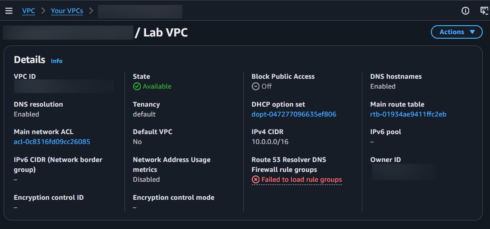
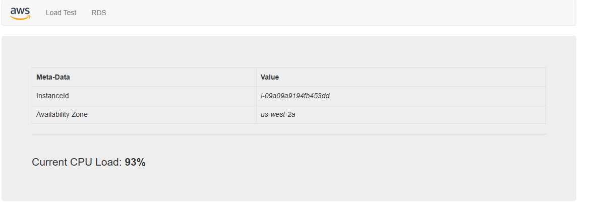

# Lab 01 — VPC, Subnet, Security Group e EC2

## Objetivo

Este laboratório teve como objetivo praticar a criação e configuração de uma infraestrutura básica na AWS, utilizando uma VPC, subnet, Security Group e uma instância EC2.

Ao final, a instância EC2 foi configurada para hospedar um Web Server, permitindo o acesso à página através de um navegador.

## Arquitetura

A infraestrutura foi construída utilizando uma VPC com CIDR 10.0.0.0/16, distribuída em duas Availability Zones.

Foram configuradas quatro subnets:

Public Subnet 1 — 10.0.0.0/24
Private Subnet 1 — 10.0.1.0/24
Public Subnet 2 — 10.0.2.0/24
Private Subnet 2 — 10.0.3.0/24

As subnets públicas foram associadas à Public Route Table, enquanto as subnets privadas foram associadas à Private Route Table.

A infraestrutura também possui um Internet Gateway e um NAT Gateway para permitir a comunicação necessária entre os recursos da VPC e a internet.

A instância EC2 foi lançada na Public Subnet 2, utilizando o Web Security Group, e configurada para executar um Web Server.

## Serviços utilizados

* Amazon VPC — criação da rede virtual
* Amazon EC2 — criação do servidor
* Security Group — controle do tráfego de entrada e saída
* Subnet — organização da instância dentro da VPC

## Etapas realizadas

1. Criação da VPC

Foi criada a VPC Lab VPC utilizando o bloco CIDR 10.0.0.0/16.

A configuração inicial também criou um Internet Gateway, um NAT Gateway, uma public subnet e uma private subnet.

2. Criação das subnets adicionais

Foram criadas duas subnets adicionais em uma segunda Availability Zone:

Public Subnet 2 — 10.0.2.0/24
Private Subnet 2 — 10.0.3.0/24

3. Associação das subnets e configuração das rotas

A Public Subnet 2 foi associada à Public Route Table.

A Private Subnet 2 foi associada à Private Route Table.

Com isso, a VPC passou a possuir subnets públicas e privadas distribuídas em duas Availability Zones.

4. Criação do Security Group

Foi criado o Security Group Web Security Group para a VPC Lab VPC.

Foi configurada uma regra de entrada permitindo tráfego HTTP (porta 80) proveniente de Anywhere IPv4, possibilitando o acesso ao Web Server através da internet.

5. Criação da instância EC2

Foi criada a instância Web Server 1 utilizando:

Amazon Linux 2 AMI
Tipo de instância: t3.micro
Key pair: vockey
VPC: Lab VPC
Subnet: Public Subnet 2
IP público: habilitado
Security Group: Web Security Group

6. Configuração do Web Server

A instância foi configurada através de User Data para instalar e iniciar o Apache HTTP Server, além dos pacotes PHP e MySQL.

Os arquivos da aplicação fornecidos pelo laboratório foram baixados e disponibilizados no diretório do Web Server.

7. Teste de acesso

Após a inicialização da instância e a aprovação dos status checks, o endereço IPv4 público da EC2 foi utilizado para acessar o Web Server através do navegador.

O acesso foi realizado com sucesso.

## Evidências

### VPC

Print da configuração da VPC criada durante o laboratório.

### Web Server

Print do Web Server funcionando após a configuração da instância EC2.

Ao final do laboratório, foi possível criar uma infraestrutura básica de rede na AWS e utilizar uma instância EC2 para hospedar um web server, permitindo o acesso à página através do navegador.
