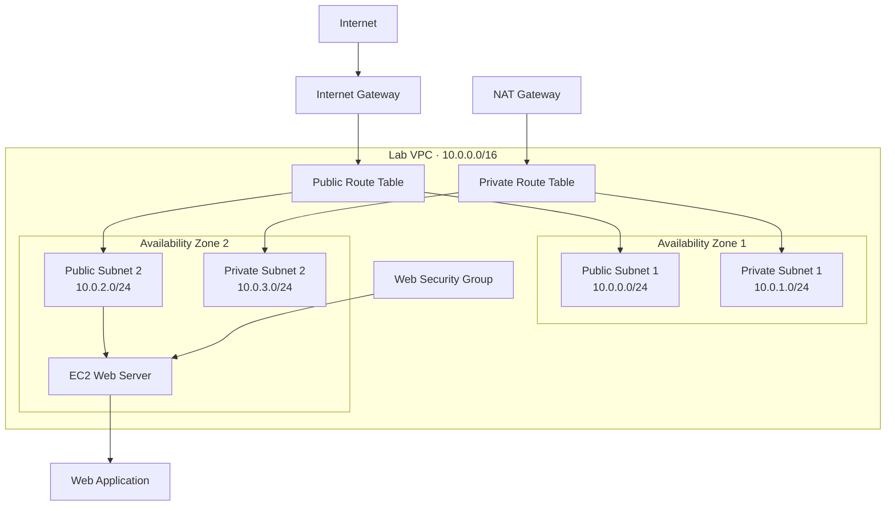

# Lab — VPC, Subnets, Security Groups, and EC2

[English](#english) · [Português](#português)

---

## English

## Objective

The objective of this lab was to build a foundational AWS network environment and deploy an EC2 instance capable of hosting a web application.

The lab provided practical exposure to **VPC networking, subnet segmentation, routing, internet connectivity, security controls, and EC2 configuration**.

---

## Architecture

The infrastructure was built around a `10.0.0.0/16` VPC distributed across two Availability Zones, with separate public and private subnets.

```mermaid
flowchart TB
    Internet["Internet"]

    IGW["Internet Gateway"]
    NAT["NAT Gateway"]

    subgraph VPC["Lab VPC · 10.0.0.0/16"]

        subgraph AZ1["Availability Zone 1"]
            Pub1["Public Subnet 1<br/>10.0.0.0/24"]
            Priv1["Private Subnet 1<br/>10.0.1.0/24"]
        end

        subgraph AZ2["Availability Zone 2"]
            Pub2["Public Subnet 2<br/>10.0.2.0/24"]
            Priv2["Private Subnet 2<br/>10.0.3.0/24"]
            EC2["EC2 Web Server"]
        end

        PublicRT["Public Route Table"]
        PrivateRT["Private Route Table"]
        SG["Web Security Group"]
    end

    Internet --> IGW
    IGW --> PublicRT
    PublicRT --> Pub1
    PublicRT --> Pub2

    NAT --> PrivateRT
    PrivateRT --> Priv1
    PrivateRT --> Priv2

    Pub2 --> EC2
    SG --> EC2

    EC2 --> App["Web Application"]
```

### Network Design

| Component             | Configuration                  |
| --------------------- | ------------------------------ |
| VPC                   | `10.0.0.0/16`                  |
| Availability Zones    | 2                              |
| Public Subnets        | `10.0.0.0/24`, `10.0.2.0/24`   |
| Private Subnets       | `10.0.1.0/24`, `10.0.3.0/24`   |
| Internet Connectivity | Internet Gateway + NAT Gateway |
| Web Server            | EC2 in Public Subnet 2         |
| HTTP Access           | TCP `80`                       |

---

## Services & Resources

| AWS Service / Resource | Purpose                                        |
| ---------------------- | ---------------------------------------------- |
| **Amazon VPC**         | Virtual network for the infrastructure         |
| **Subnets**            | Network segmentation across Availability Zones |
| **Route Tables**       | Traffic routing for public and private subnets |
| **Internet Gateway**   | Internet connectivity for public resources     |
| **NAT Gateway**        | Outbound internet access for private resources |
| **Amazon EC2**         | Web server host                                |
| **Security Groups**    | Instance-level network access control          |
| **User Data**          | Automated instance configuration               |

---

## Implementation

### 1. Network Infrastructure

A `Lab VPC` was created using the `10.0.0.0/16` CIDR block.

The environment was expanded to include four subnets across two Availability Zones:

* 2 public subnets
* 2 private subnets

Public and private route tables were associated with their respective subnets.

### 2. Security

A `Web Security Group` was created and configured to allow inbound HTTP traffic on TCP port `80`.

This provided controlled internet access to the web server while keeping the network configuration organized around the VPC design.

### 3. EC2 Deployment

A `Web Server 1` EC2 instance was deployed in **Public Subnet 2** with a public IPv4 address.

**Instance configuration:**

* **AMI:** Amazon Linux 2
* **Instance type:** `t3.micro`
* **VPC:** `Lab VPC`
* **Subnet:** Public Subnet 2
* **Security Group:** Web Security Group
* **Key pair:** `vockey`

### 4. Application Configuration

EC2 User Data was used to automate the initial server configuration.

The instance was configured with:

* Apache HTTP Server (`httpd`)
* PHP
* MariaDB
* Application files under `/var/www/html/`

The Apache service was enabled to start automatically and started during instance initialization.

### 5. Validation

After the EC2 instance completed its initialization and passed its status checks, the public IPv4 address was used to access the web application from a browser.

---

## Result

The lab resulted in a functional AWS environment containing:

* A VPC with public and private network segmentation
* Subnets distributed across two Availability Zones
* Public and private routing
* Internet Gateway and NAT Gateway
* Security Group controlling HTTP access
* EC2 instance running a web server
* Automated server configuration through User Data

The web application was successfully accessed through the EC2 instance's public IPv4 address.

---

## Key Takeaways

This lab provided practical exposure to the foundational building blocks of AWS networking and compute, particularly:

* Designing a basic **VPC network**
* Understanding **public vs. private subnets**
* Associating **route tables** with subnets
* Using **Internet Gateway and NAT Gateway**
* Controlling traffic with **Security Groups**
* Deploying and configuring **EC2**
* Automating instance initialization with **User Data**

---

## Português

## Objetivo

O objetivo deste laboratório foi construir uma infraestrutura de rede básica na AWS e realizar o deploy de uma instância EC2 capaz de hospedar uma aplicação web.

O laboratório proporcionou contato prático com **networking em VPC, segmentação de subnets, roteamento, conectividade com a internet, controles de segurança e configuração de instâncias EC2**.

---

## Arquitetura

A infraestrutura foi construída a partir de uma VPC `10.0.0.0/16`, distribuída entre duas Availability Zones, com subnets públicas e privadas separadas.

```mermaid
flowchart TB
    Internet["Internet"]

    IGW["Internet Gateway"]
    NAT["NAT Gateway"]

    subgraph VPC["Lab VPC · 10.0.0.0/16"]

        subgraph AZ1["Availability Zone 1"]
            Pub1["Public Subnet 1<br/>10.0.0.0/24"]
            Priv1["Private Subnet 1<br/>10.0.1.0/24"]
        end

        subgraph AZ2["Availability Zone 2"]
            Pub2["Public Subnet 2<br/>10.0.2.0/24"]
            Priv2["Private Subnet 2<br/>10.0.3.0/24"]
            EC2["EC2 Web Server"]
        end

        PublicRT["Public Route Table"]
        PrivateRT["Private Route Table"]
        SG["Web Security Group"]
    end

    Internet --> IGW
    IGW --> PublicRT
    PublicRT --> Pub1
    PublicRT --> Pub2

    NAT --> PrivateRT
    PrivateRT --> Priv1
    PrivateRT --> Priv2

    Pub2 --> EC2
    SG --> EC2

    EC2 --> App["Web Application"]
```

### Estrutura de Rede

| Componente         | Configuração                   |
| ------------------ | ------------------------------ |
| VPC                | `10.0.0.0/16`                  |
| Availability Zones | 2                              |
| Public Subnets     | `10.0.0.0/24`, `10.0.2.0/24`   |
| Private Subnets    | `10.0.1.0/24`, `10.0.3.0/24`   |
| Conectividade      | Internet Gateway + NAT Gateway |
| Web Server         | EC2 na Public Subnet 2         |
| Acesso HTTP        | TCP `80`                       |

---

## Serviços e Recursos

| Serviço / Recurso AWS | Finalidade                                          |
| --------------------- | --------------------------------------------------- |
| **Amazon VPC**        | Rede virtual da infraestrutura                      |
| **Subnets**           | Segmentação da rede entre Availability Zones        |
| **Route Tables**      | Roteamento do tráfego das subnets                   |
| **Internet Gateway**  | Conectividade com a internet para recursos públicos |
| **NAT Gateway**       | Acesso de saída à internet para recursos privados   |
| **Amazon EC2**        | Hospedagem do web server                            |
| **Security Groups**   | Controle de acesso à instância                      |
| **User Data**         | Configuração automatizada da instância              |

---

## Implementação

### 1. Infraestrutura de Rede

Foi criada uma `Lab VPC` utilizando o bloco CIDR `10.0.0.0/16`.

O ambiente foi expandido para incluir quatro subnets distribuídas entre duas Availability Zones:

* 2 public subnets
* 2 private subnets

As public e private route tables foram associadas às suas respectivas subnets.

### 2. Segurança

Foi criado um `Web Security Group` com uma regra de entrada permitindo tráfego HTTP na porta TCP `80`.

Dessa forma, o web server poderia ser acessado pela internet de maneira controlada dentro da configuração da VPC.

### 3. Deploy da EC2

Foi criada a instância `Web Server 1` na **Public Subnet 2**, com endereço IPv4 público.

**Configuração da instância:**

* **AMI:** Amazon Linux 2
* **Tipo de instância:** `t3.micro`
* **VPC:** `Lab VPC`
* **Subnet:** Public Subnet 2
* **Security Group:** Web Security Group
* **Key pair:** `vockey`

### 4. Configuração da Aplicação

O **EC2 User Data** foi utilizado para automatizar a configuração inicial do servidor.

A instância foi configurada com:

* Apache HTTP Server (`httpd`)
* PHP
* MariaDB
* Arquivos da aplicação em `/var/www/html/`

O serviço Apache foi habilitado para inicialização automática e iniciado durante a configuração da instância.

### 5. Validação

Após a inicialização da instância EC2 e a aprovação dos status checks, o endereço IPv4 público foi utilizado para acessar a aplicação web pelo navegador.

---

## Resultado

O laboratório resultou em um ambiente AWS funcional contendo:

* VPC com segmentação entre redes públicas e privadas
* Subnets distribuídas entre duas Availability Zones
* Roteamento público e privado
* Internet Gateway e NAT Gateway
* Security Group controlando o acesso HTTP
* Instância EC2 executando um web server
* Configuração automatizada da instância através de User Data

A aplicação web foi acessada com sucesso através do endereço IPv4 público da instância EC2.

---

## Principais Aprendizados

Este laboratório proporcionou contato prático com os principais componentes de networking e compute da AWS, especialmente:

* Criação de uma **VPC**
* Diferença entre **public e private subnets**
* Associação de **route tables**
* Utilização de **Internet Gateway e NAT Gateway**
* Controle de tráfego com **Security Groups**
* Deploy e configuração de **EC2**
* Automação da inicialização utilizando **User Data**
