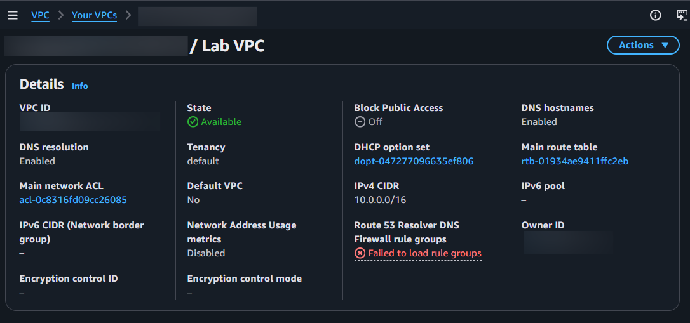
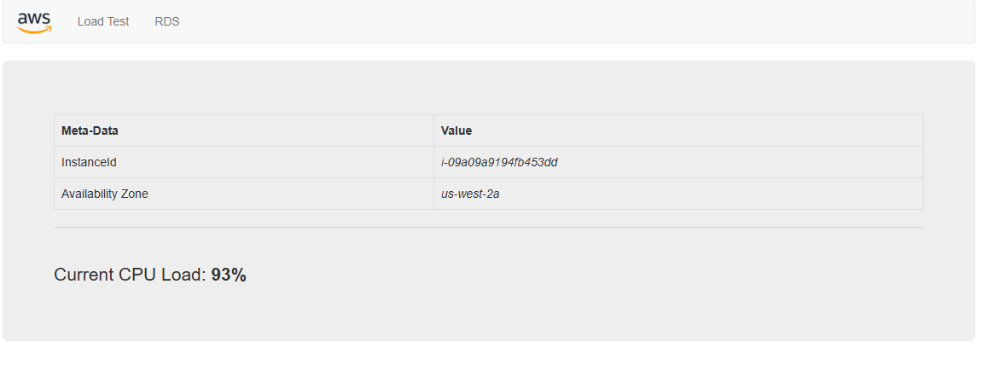

# Lab — VPC, Subnets, Security Groups, and EC2

[English](#english) · [Português](#português)

---

## English

## Objective

The objective of this lab was to practice creating and configuring a basic AWS network infrastructure using a VPC, subnets, Security Groups, and an EC2 instance.

At the end of the lab, the EC2 instance was configured to host a web server, allowing the application to be accessed through a web browser.

## Architecture

The infrastructure was built using a VPC with the CIDR block `10.0.0.0/16`, distributed across two Availability Zones.

Four subnets were configured:

* Public Subnet 1 — `10.0.0.0/24`
* Private Subnet 1 — `10.0.1.0/24`
* Public Subnet 2 — `10.0.2.0/24`
* Private Subnet 2 — `10.0.3.0/24`

The public subnets were associated with the Public Route Table, while the private subnets were associated with the Private Route Table.

The infrastructure also includes an Internet Gateway and a NAT Gateway to provide the required internet connectivity for resources within the VPC.

The EC2 instance was launched in Public Subnet 2, using the Web Security Group, and configured to run a web server.

## Services and Resources Used

* **Amazon VPC** — creation of the virtual network
* **Amazon EC2** — creation of the web server
* **Security Groups** — control of inbound and outbound traffic
* **Subnets** — organization of resources within the VPC
* **Internet Gateway** — communication between the VPC and the internet
* **NAT Gateway** — internet access for resources in private subnets
* **Route Tables** — definition of traffic routes for the subnets

## Steps Performed

### 1. VPC Creation

The `Lab VPC` was created using the CIDR block `10.0.0.0/16`.

The initial configuration also created an Internet Gateway, a NAT Gateway, one public subnet, and one private subnet.

### 2. Additional Subnet Creation

Two additional subnets were created in a second Availability Zone:

* Public Subnet 2 — `10.0.2.0/24`
* Private Subnet 2 — `10.0.3.0/24`

### 3. Subnet Association and Route Configuration

Public Subnet 2 was associated with the Public Route Table.

Private Subnet 2 was associated with the Private Route Table.

As a result, the VPC had public and private subnets distributed across two Availability Zones.

### 4. Security Group Creation

The `Web Security Group` was created for the `Lab VPC`.

An inbound rule was configured to allow HTTP traffic on port 80 from Anywhere IPv4, enabling access to the web server over the internet.

### 5. EC2 Instance Creation

The `Web Server 1` instance was created using the following configuration:

* **AMI:** Amazon Linux 2
* **Instance type:** `t3.micro`
* **Key pair:** `vockey`
* **VPC:** `Lab VPC`
* **Subnet:** Public Subnet 2
* **Public IP:** Enabled
* **Security Group:** Web Security Group

### 6. Web Server Configuration

The instance was configured using User Data to install Apache HTTP Server (`httpd`), PHP, and MariaDB.

The application files provided by the lab were then downloaded, extracted, and placed in the `/var/www/html/` directory.

Finally, the `httpd` service was enabled to start automatically and started on the instance.

### 7. Access Test

After the instance was initialized and the status checks passed, the EC2 public IPv4 address was used to access the web server through a browser.

The web page was successfully accessed.

## Result

At the end of the lab, a basic AWS network infrastructure was successfully created, and an EC2 instance was used to host a web server, allowing the application to be accessed through a browser.

---

## Português

## Objetivo

Este laboratório teve como objetivo praticar a criação e configuração de uma infraestrutura básica de rede na AWS, utilizando uma VPC, subnets, Security Groups e uma instância EC2.

Ao final do laboratório, a instância EC2 foi configurada para hospedar um web server, permitindo o acesso à aplicação através de um navegador.

## Arquitetura

A infraestrutura foi construída utilizando uma VPC com o bloco CIDR `10.0.0.0/16`, distribuída em duas Availability Zones.

Foram configuradas quatro subnets:

* Public Subnet 1 — `10.0.0.0/24`
* Private Subnet 1 — `10.0.1.0/24`
* Public Subnet 2 — `10.0.2.0/24`
* Private Subnet 2 — `10.0.3.0/24`

As subnets públicas foram associadas à Public Route Table, enquanto as subnets privadas foram associadas à Private Route Table.

A infraestrutura também possui um Internet Gateway e um NAT Gateway para fornecer a conectividade necessária com a internet aos recursos dentro da VPC.

A instância EC2 foi lançada na Public Subnet 2, utilizando o Web Security Group, e configurada para executar um web server.

## Serviços e Recursos Utilizados

* **Amazon VPC** — criação da rede virtual
* **Amazon EC2** — criação do web server
* **Security Groups** — controle do tráfego de entrada e saída
* **Subnets** — organização dos recursos dentro da VPC
* **Internet Gateway** — comunicação entre a VPC e a internet
* **NAT Gateway** — acesso à internet para recursos em subnets privadas
* **Route Tables** — definição das rotas de tráfego das subnets

## Etapas Realizadas

### 1. Criação da VPC

Foi criada a VPC `Lab VPC` utilizando o bloco CIDR `10.0.0.0/16`.

A configuração inicial também criou um Internet Gateway, um NAT Gateway, uma public subnet e uma private subnet.

### 2. Criação das Subnets Adicionais

Foram criadas duas subnets adicionais em uma segunda Availability Zone:

* Public Subnet 2 — `10.0.2.0/24`
* Private Subnet 2 — `10.0.3.0/24`

### 3. Associação das Subnets e Configuração das Rotas

A Public Subnet 2 foi associada à Public Route Table.

A Private Subnet 2 foi associada à Private Route Table.

Com isso, a VPC passou a possuir subnets públicas e privadas distribuídas em duas Availability Zones.

### 4. Criação do Security Group

Foi criado o Security Group `Web Security Group` para a `Lab VPC`.

Foi configurada uma regra de entrada permitindo tráfego HTTP na porta 80 proveniente de Anywhere IPv4, possibilitando o acesso ao web server através da internet.

### 5. Criação da Instância EC2

Foi criada a instância `Web Server 1` utilizando a seguinte configuração:

* **AMI:** Amazon Linux 2
* **Tipo de instância:** `t3.micro`
* **Key pair:** `vockey`
* **VPC:** `Lab VPC`
* **Subnet:** Public Subnet 2
* **IP público:** Habilitado
* **Security Group:** Web Security Group

### 6. Configuração do Web Server

A instância foi configurada através de User Data para instalar o Apache HTTP Server (`httpd`), PHP e MariaDB.

Em seguida, os arquivos da aplicação fornecidos pelo laboratório foram baixados, descompactados e disponibilizados no diretório `/var/www/html/`.

Por fim, o serviço `httpd` foi habilitado para iniciar automaticamente e iniciado na própria instância.

### 7. Teste de Acesso

Após a inicialização da instância e a aprovação dos status checks, o endereço IPv4 público da EC2 foi utilizado para acessar o web server através do navegador.

A página foi acessada com sucesso.

## Resultado

Ao final do laboratório, foi possível criar uma infraestrutura básica de rede na AWS e utilizar uma instância EC2 para hospedar um web server, permitindo o acesso à aplicação através de um navegador.
