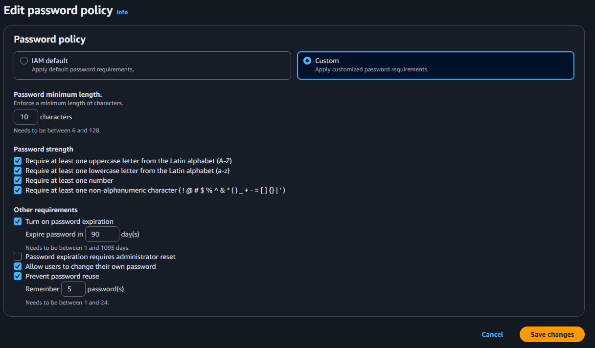
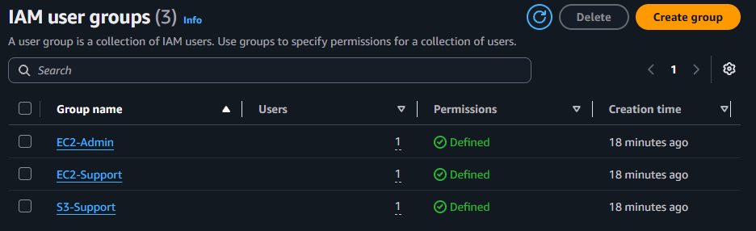

# Lab — IAM, Usuários, Grupos e Políticas

## Objetivo

Explorar o serviço AWS Identity and Access Management (IAM), trabalhando com
usuários, grupos e políticas de acesso.

Durante o laboratório, foi configurada uma política de senha, analisadas as
permissões de diferentes grupos e testado o acesso dos usuários aos serviços
Amazon S3 e Amazon EC2.

## Serviços utilizados

- AWS Identity and Access Management (IAM)
- Amazon S3
- Amazon EC2

## 1. Configuração da política de senha

Foi criada uma política de senha personalizada para a conta AWS.

As configurações aplicadas foram:

| Configuração | Valor |
|---|---|
| Comprimento mínimo | 10 caracteres |
| Letra maiúscula | Obrigatória |
| Letra minúscula | Obrigatória |
| Número | Obrigatório |
| Caractere especial | Obrigatório |
| Expiração da senha | 90 dias |
| Prevenção de reutilização | Últimas 5 senhas |
| Reset obrigatório pelo administrador | Desativado |

## 2. Usuários e grupos IAM

O ambiente do laboratório possui três usuários e três grupos IAM.

| Usuário | Grupo | Função |
|---|---|---|
| `user-1` | `S3-Support` | Suporte ao Amazon S3 |
| `user-2` | `EC2-Support` | Suporte ao Amazon EC2 |
| `user-3` | `EC2-Admin` | Administração do Amazon EC2 |

Os grupos permitem centralizar as permissões dos usuários de acordo com suas
respectivas funções.

## 3. Políticas e permissões

### S3-Support

O grupo `S3-Support` possui a política gerenciada
`AmazonS3ReadOnlyAccess`.

Essa política permite visualizar e listar recursos do Amazon S3, sem permitir
alterações.

### EC2-Support

O grupo `EC2-Support` possui a política gerenciada
`AmazonEC2ReadOnlyAccess`.

Essa política permite visualizar informações sobre recursos do Amazon EC2,
mas não permite modificá-los.

### EC2-Admin

O grupo `EC2-Admin` possui uma política inline chamada
`EC2-Admin-Policy`.

Essa política permite visualizar informações sobre instâncias EC2 e também
iniciar e parar instâncias.

## 4. Teste das permissões

As permissões foram testadas utilizando cada um dos usuários.

### user-1 — S3-Support

O `user-1` conseguiu acessar o Amazon S3 e visualizar os buckets e seus
conteúdos.

Por outro lado, não conseguiu acessar as instâncias do Amazon EC2, pois o
grupo `S3-Support` não possui permissões para esse serviço.

### user-2 — EC2-Support

O `user-2` conseguiu visualizar as instâncias do Amazon EC2.

Ao tentar parar uma instância, a operação foi negada, demonstrando que a
política fornece acesso somente para leitura.

O usuário também não conseguiu listar os buckets do Amazon S3.

### user-3 — EC2-Admin

O `user-3` conseguiu visualizar as instâncias do Amazon EC2 e realizar a
operação de parar uma instância.

Isso demonstrou a diferença entre as permissões de suporte somente para
leitura e as permissões administrativas.

## Conclusão

Este laboratório permitiu compreender como o AWS IAM pode ser utilizado para
controlar o acesso aos recursos da AWS.

Foi possível observar, na prática, como usuários podem receber permissões
por meio de grupos e como diferentes políticas determinam quais ações cada
usuário pode realizar.
