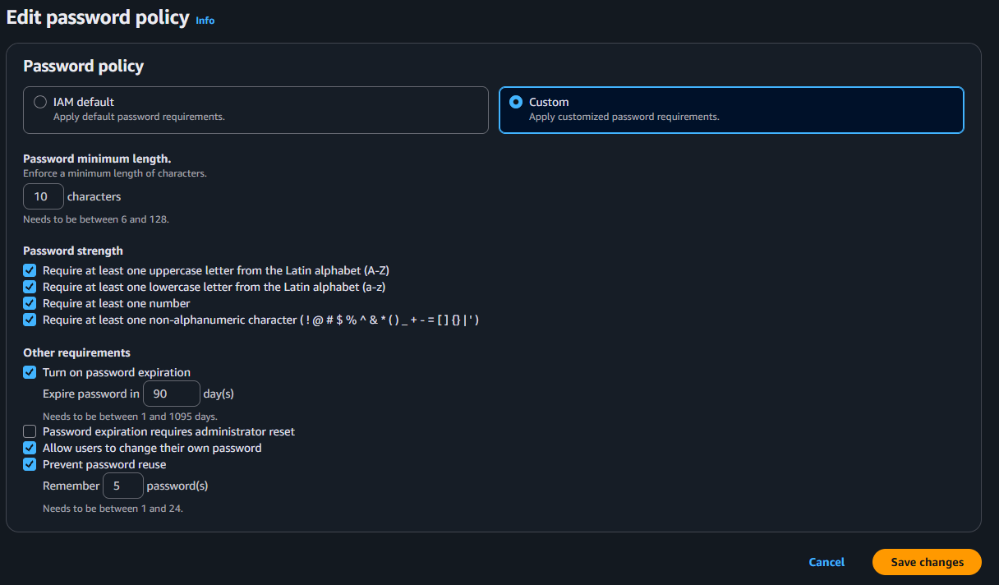
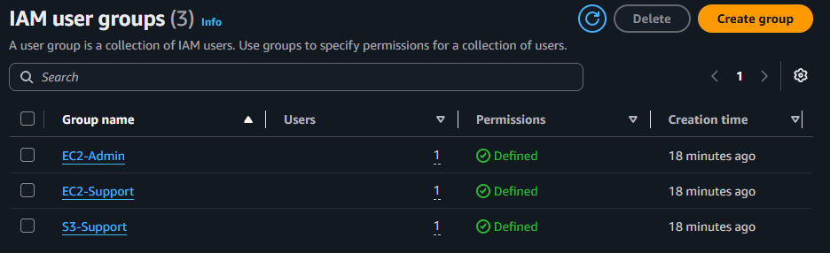

# Lab — IAM, Users, Groups, and Policies

[English](#english) · [Português](#português)

---

## English

## Objective

The objective of this lab was to explore the AWS Identity and Access Management (IAM) service by working with users, groups, and access policies.

During the lab, a password policy was configured, the permissions assigned to different groups were analyzed, and user access to Amazon S3 and Amazon EC2 was tested.

## Services and Resources Used

* AWS Identity and Access Management (IAM)
* Amazon S3
* Amazon EC2

## 1. Password Policy Configuration

A custom password policy was created for the AWS account.

The following settings were applied:

| Setting                               | Value            |
| ------------------------------------- | ---------------- |
| Minimum password length               | 10 characters    |
| Uppercase letter                      | Required         |
| Lowercase letter                      | Required         |
| Number                                | Required         |
| Special character                     | Required         |
| Password expiration                   | 90 days          |
| Password reuse prevention             | Last 5 passwords |
| Administrator-required password reset | Disabled         |

## 2. IAM Users and Groups

The lab environment contains three IAM users and three IAM groups.

| User     | Group         | Role                      |
| -------- | ------------- | ------------------------- |
| `user-1` | `S3-Support`  | Amazon S3 support         |
| `user-2` | `EC2-Support` | Amazon EC2 support        |
| `user-3` | `EC2-Admin`   | Amazon EC2 administration |

The groups allow user permissions to be centrally managed according to their respective roles.

## 3. Policies and Permissions

### S3-Support

The `S3-Support` group has the managed policy `AmazonS3ReadOnlyAccess`.

This policy allows users to view and list Amazon S3 resources without allowing modifications.

### EC2-Support

The `EC2-Support` group has the managed policy `AmazonEC2ReadOnlyAccess`.

This policy allows users to view information about Amazon EC2 resources but does not allow them to modify those resources.

### EC2-Admin

The `EC2-Admin` group has an inline policy named `EC2-Admin-Policy`.

This policy allows users to view information about EC2 instances and also start and stop instances.

## 4. Permission Testing

The permissions were tested using each of the users.

### user-1 — S3-Support

`user-1` was able to access Amazon S3 and view the buckets and their contents.

However, the user was unable to access Amazon EC2 instances because the `S3-Support` group does not have permissions for that service.

### user-2 — EC2-Support

`user-2` was able to view Amazon EC2 instances.

When attempting to stop an instance, the operation was denied, demonstrating that the policy provides read-only access.

The user was also unable to list Amazon S3 buckets.

### user-3 — EC2-Admin

`user-3` was able to view Amazon EC2 instances and successfully stop an instance.

This demonstrated the difference between read-only support permissions and administrative permissions.

## Conclusion

This lab provided practical experience with how AWS IAM can be used to control access to AWS resources.

It demonstrated how users can receive permissions through groups and how different policies determine which actions each user can perform.

---

## Português

## Objetivo

O objetivo deste laboratório foi explorar o serviço AWS Identity and Access Management (IAM), trabalhando com usuários, grupos e políticas de acesso.

Durante o laboratório, foi configurada uma política de senha, analisadas as permissões atribuídas a diferentes grupos e testado o acesso dos usuários aos serviços Amazon S3 e Amazon EC2.

## Serviços e Recursos Utilizados

* AWS Identity and Access Management (IAM)
* Amazon S3
* Amazon EC2

## 1. Configuração da Política de Senha

Foi criada uma política de senha personalizada para a conta AWS.

As seguintes configurações foram aplicadas:

| Configuração                         | Valor            |
| ------------------------------------ | ---------------- |
| Comprimento mínimo da senha          | 10 caracteres    |
| Letra maiúscula                      | Obrigatória      |
| Letra minúscula                      | Obrigatória      |
| Número                               | Obrigatório      |
| Caractere especial                   | Obrigatório      |
| Expiração da senha                   | 90 dias          |
| Prevenção de reutilização            | Últimas 5 senhas |
| Reset obrigatório pelo administrador | Desativado       |

## 2. Usuários e Grupos IAM

O ambiente do laboratório possui três usuários IAM e três grupos IAM.

| Usuário  | Grupo         | Função                      |
| -------- | ------------- | --------------------------- |
| `user-1` | `S3-Support`  | Suporte ao Amazon S3        |
| `user-2` | `EC2-Support` | Suporte ao Amazon EC2       |
| `user-3` | `EC2-Admin`   | Administração do Amazon EC2 |

Os grupos permitem que as permissões dos usuários sejam gerenciadas de forma centralizada, de acordo com suas respectivas funções.

## 3. Políticas e Permissões

### S3-Support

O grupo `S3-Support` possui a política gerenciada `AmazonS3ReadOnlyAccess`.

Essa política permite visualizar e listar recursos do Amazon S3, sem permitir alterações.

### EC2-Support

O grupo `EC2-Support` possui a política gerenciada `AmazonEC2ReadOnlyAccess`.

Essa política permite visualizar informações sobre recursos do Amazon EC2, mas não permite modificá-los.

### EC2-Admin

O grupo `EC2-Admin` possui uma política inline chamada `EC2-Admin-Policy`.

Essa política permite visualizar informações sobre instâncias EC2 e também iniciar e parar instâncias.

## 4. Teste das Permissões

As permissões foram testadas utilizando cada um dos usuários.

### user-1 — S3-Support

O `user-1` conseguiu acessar o Amazon S3 e visualizar os buckets e seus conteúdos.

Por outro lado, não conseguiu acessar as instâncias do Amazon EC2, pois o grupo `S3-Support` não possui permissões para esse serviço.

### user-2 — EC2-Support

O `user-2` conseguiu visualizar as instâncias do Amazon EC2.

Ao tentar parar uma instância, a operação foi negada, demonstrando que a política fornece acesso somente para leitura.

O usuário também não conseguiu listar os buckets do Amazon S3.

### user-3 — EC2-Admin

O `user-3` conseguiu visualizar as instâncias do Amazon EC2 e realizar a operação de parar uma instância.

Isso demonstrou a diferença entre as permissões de suporte somente para leitura e as permissões administrativas.

## Conclusão

Este laboratório proporcionou uma experiência prática sobre como o AWS IAM pode ser utilizado para controlar o acesso aos recursos da AWS.

Foi possível observar como usuários podem receber permissões por meio de grupos e como diferentes políticas determinam quais ações cada usuário pode realizar.
