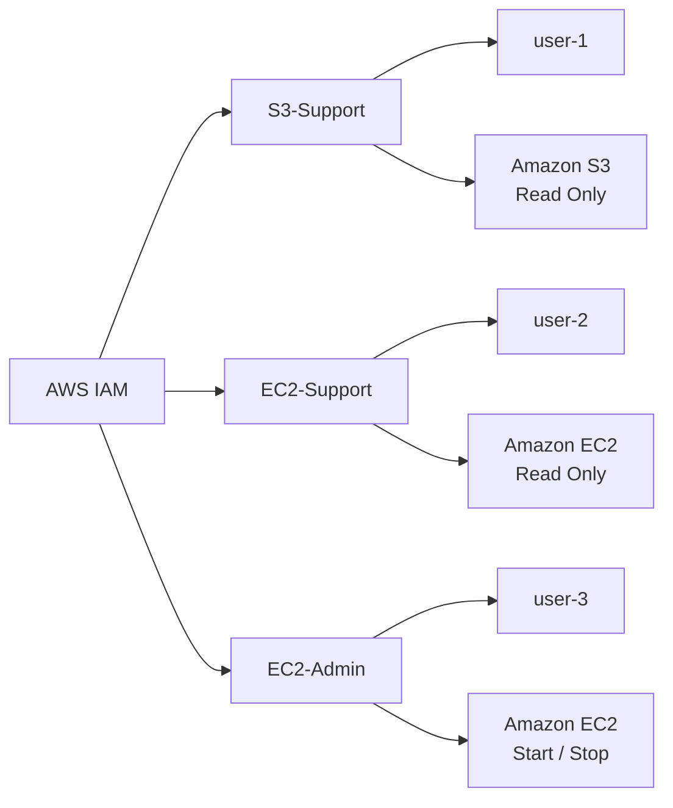
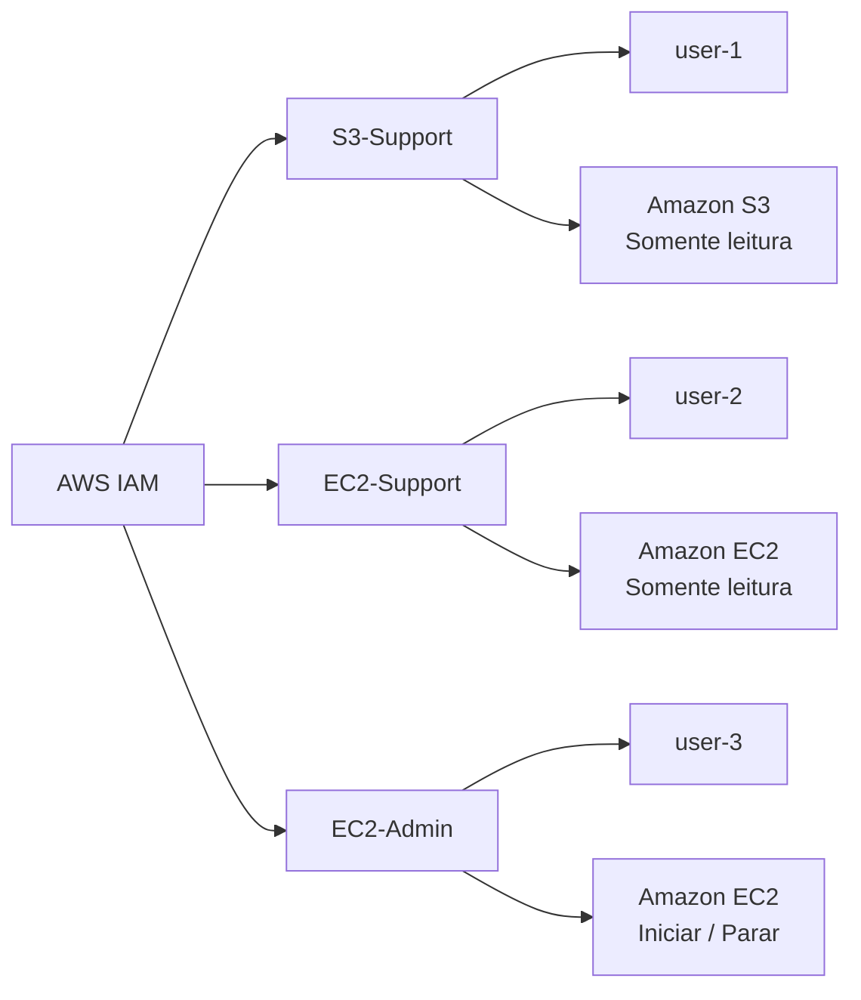

# Lab — IAM, Users, Groups, and Policies

[English](#english) · [Português](#português)

---

## English

## Objective

The objective of this lab was to practice **AWS Identity and Access Management (IAM)** by creating users, groups, password policies, and role-based permissions.

The lab also included hands-on permission testing with different IAM users to verify how access policies affect interactions with **Amazon S3 and Amazon EC2**.

---

## Access Model

The environment was structured around three IAM groups representing different access requirements.


```mermaid
flowchart LR
    IAM["AWS IAM"]

    IAM --> S3G["S3-Support"]
    IAM --> EC2G["EC2-Support"]
    IAM --> ADMG["EC2-Admin"]

    S3G --> U1["user-1"]
    EC2G --> U2["user-2"]
    ADMG --> U3["user-3"]

    S3G --> S3["Amazon S3<br/>Read Only"]
    EC2G --> EC2R["Amazon EC2<br/>Read Only"]
    ADMG --> EC2A["Amazon EC2<br/>Start / Stop"]
```

### Access Structure

| IAM User | Group         | Access Level           | Main Resource |
| -------- | ------------- | ---------------------- | ------------- |
| `user-1` | `S3-Support`  | Read-only              | Amazon S3     |
| `user-2` | `EC2-Support` | Read-only              | Amazon EC2    |
| `user-3` | `EC2-Admin`   | Administrative actions | Amazon EC2    |

---

## Services & Resources

| AWS Service / Resource | Purpose                                                     |
| ---------------------- | ----------------------------------------------------------- |
| **AWS IAM**            | Identity, users, groups, policies, and access control       |
| **Amazon S3**          | Permission testing for read-only access                     |
| **Amazon EC2**         | Permission testing for read-only and administrative actions |

---

## Implementation

### 1. Password Policy

A custom account password policy was configured to strengthen authentication requirements.

| Setting                      | Configuration    |
| ---------------------------- | ---------------- |
| Minimum length               | 10 characters    |
| Uppercase                    | Required         |
| Lowercase                    | Required         |
| Number                       | Required         |
| Special character            | Required         |
| Expiration                   | 90 days          |
| Password reuse prevention    | Last 5 passwords |
| Administrator-required reset | Disabled         |


### 2. IAM Users and Groups

Three users and three groups were created to represent different access requirements.

Users were assigned to groups according to their intended responsibilities, allowing permissions to be managed at the group level rather than individually.


### 3. Policies and Permissions

#### S3-Support

The `S3-Support` group received the managed policy:

```text
AmazonS3ReadOnlyAccess
```

This provided `user-1` with read-only access to Amazon S3 resources.

#### EC2-Support

The `EC2-Support` group received:

```text
AmazonEC2ReadOnlyAccess
```

This provided `user-2` with read-only access to Amazon EC2 resources.

#### EC2-Admin

The `EC2-Admin` group received an inline policy named:

```text
EC2-Admin-Policy
```

The policy allowed `user-3` to view EC2 instances and perform start and stop actions.

---

## Permission Validation

The permissions were validated by performing actions with each IAM user.

| User     | Expected Access            | Validation                                                  |
| -------- | -------------------------- | ----------------------------------------------------------- |
| `user-1` | S3 read-only               | S3 resources accessible; EC2 access denied                  |
| `user-2` | EC2 read-only              | EC2 resources visible; stop action denied; S3 access denied |
| `user-3` | EC2 administrative actions | EC2 resources visible; instance stop action successful      |

This testing demonstrated how IAM policies directly determine which AWS API actions a user is allowed to perform.

---

## Result

The lab successfully implemented a basic **role-based access model** using IAM groups and policies.

The permission tests confirmed three distinct access scenarios:

* **S3 read-only access.**
* **EC2 read-only access.**
* **EC2 access with resource actions.**

The lab also provided practical experience with the relationship between **users, groups, policies, and permissions** in AWS.

---

## Key Takeaways

This lab provided practical exposure to foundational AWS identity and access management concepts:

* Creating and managing **IAM users and groups**.
* Applying permissions through **managed and inline policies**.
* Understanding **read-only vs. action-based permissions**.
* Configuring an account-level **password policy**.
* Testing permissions through real AWS resource interactions.
* Understanding how IAM policies control access to AWS resources.

---

## Português

## Objetivo

O objetivo deste laboratório foi praticar o **AWS Identity and Access Management (IAM)** por meio da criação de usuários, grupos, política de senha e permissões baseadas em função.

O laboratório também incluiu testes práticos de permissões com diferentes usuários IAM para verificar como as políticas de acesso afetam a interação com **Amazon S3 e Amazon EC2**.

---

## Modelo de Acesso

O ambiente foi estruturado a partir de três grupos IAM representando diferentes necessidades de acesso.


```mermaid
flowchart LR
    IAM["AWS IAM"]

    IAM --> S3G["S3-Support"]
    IAM --> EC2G["EC2-Support"]
    IAM --> ADMG["EC2-Admin"]

    S3G --> U1["user-1"]
    EC2G --> U2["user-2"]
    ADMG --> U3["user-3"]

    S3G --> S3["Amazon S3<br/>Somente leitura"]
    EC2G --> EC2R["Amazon EC2<br/>Somente leitura"]
    ADMG --> EC2A["Amazon EC2<br/>Iniciar / Parar"]
```

### Estrutura de Acesso

| Usuário IAM | Grupo         | Nível de Acesso       | Recurso Principal |
| ----------- | ------------- | --------------------- | ----------------- |
| `user-1`    | `S3-Support`  | Somente leitura       | Amazon S3         |
| `user-2`    | `EC2-Support` | Somente leitura       | Amazon EC2        |
| `user-3`    | `EC2-Admin`   | Ações administrativas | Amazon EC2        |

---

## Serviços e Recursos

| Serviço / Recurso AWS | Finalidade                                                    |
| --------------------- | ------------------------------------------------------------- |
| **AWS IAM**           | Identidades, usuários, grupos, políticas e controle de acesso |
| **Amazon S3**         | Testes de permissões de leitura                               |
| **Amazon EC2**        | Testes de permissões de leitura e ações administrativas       |

---

## Implementação

### 1. Política de Senha

Foi configurada uma política de senha personalizada para fortalecer os requisitos de autenticação da conta.

| Configuração                         | Valor            |
| ------------------------------------ | ---------------- |
| Comprimento mínimo                   | 10 caracteres    |
| Letra maiúscula                      | Obrigatória      |
| Letra minúscula                      | Obrigatória      |
| Número                               | Obrigatório      |
| Caractere especial                   | Obrigatório      |
| Expiração                            | 90 dias          |
| Prevenção de reutilização            | Últimas 5 senhas |
| Reset obrigatório pelo administrador | Desativado       |


### 2. Usuários e Grupos IAM

Foram criados três usuários e três grupos para representar diferentes necessidades de acesso.

Os usuários foram associados aos grupos de acordo com suas respectivas funções, permitindo que as permissões fossem administradas no nível dos grupos em vez de individualmente.


### 3. Políticas e Permissões

#### S3-Support

O grupo `S3-Support` recebeu a política gerenciada:

```text
AmazonS3ReadOnlyAccess
```

Essa política forneceu ao `user-1` acesso somente para leitura aos recursos do Amazon S3.

#### EC2-Support

O grupo `EC2-Support` recebeu:

```text
AmazonEC2ReadOnlyAccess
```

Essa política forneceu ao `user-2` acesso somente para leitura aos recursos do Amazon EC2.

#### EC2-Admin

O grupo `EC2-Admin` recebeu uma política inline chamada:

```text
EC2-Admin-Policy
```

A política permitiu que o `user-3` visualizasse instâncias EC2 e realizasse ações de iniciar e parar instâncias.

---

## Validação das Permissões

As permissões foram validadas realizando ações com cada usuário IAM.

| Usuário  | Acesso Esperado              | Validação                                                            |
| -------- | ---------------------------- | -------------------------------------------------------------------- |
| `user-1` | S3 somente leitura           | Recursos S3 acessíveis; acesso ao EC2 negado                         |
| `user-2` | EC2 somente leitura          | Recursos EC2 visíveis; ação de parar negada; acesso ao S3 negado     |
| `user-3` | Ações administrativas no EC2 | Recursos EC2 visíveis; ação de parar instância realizada com sucesso |

Os testes demonstraram, na prática, como as políticas IAM determinam quais ações cada usuário pode executar sobre os recursos da AWS.

---

## Resultado

O laboratório implementou com sucesso um modelo básico de **controle de acesso baseado em funções**, utilizando grupos e políticas IAM.

Os testes de permissões confirmaram três cenários distintos:

* **Acesso somente para leitura ao S3.**
* **Acesso somente para leitura ao EC2.**
* **Acesso ao EC2 com permissão para realizar ações sobre recursos.**

O laboratório também proporcionou contato prático com a relação entre **usuários, grupos, políticas e permissões** na AWS.

---

## Principais Aprendizados

Este laboratório proporcionou contato prático com conceitos fundamentais de gerenciamento de identidade e acesso na AWS:

* Criação e gerenciamento de **usuários e grupos IAM**.
* Aplicação de permissões por meio de **políticas gerenciadas e inline**.
* Compreensão da diferença entre **acesso somente para leitura e permissões de ação**.
* Configuração de uma **política de senha** para a conta.
* Validação de permissões através de interações reais com recursos AWS.
* Compreensão de como as políticas IAM controlam o acesso aos recursos da AWS.
