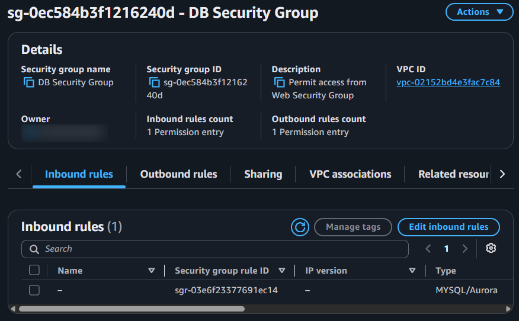
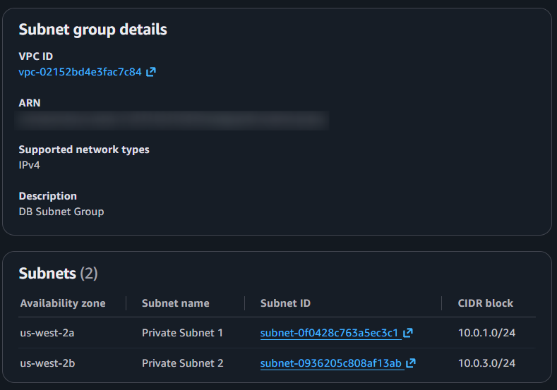
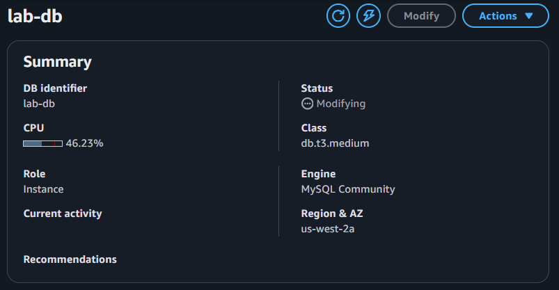
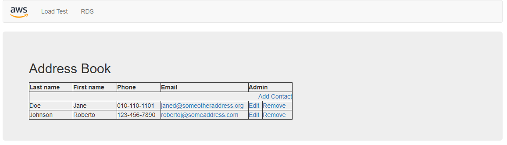

# Lab — Amazon RDS e Address Book
## Objetivo

Este laboratório teve como objetivo praticar a criação e configuração de um banco de dados relacional utilizando o Amazon RDS e sua integração com uma aplicação web.

A partir da infraestrutura de rede criada anteriormente, foram configurados um Security Group específico para o banco de dados, um DB Subnet Group e uma instância Amazon RDS for MySQL com implantação Multi-AZ.

Ao final, a aplicação Address Book foi configurada para utilizar o banco de dados e testada através do navegador.

## Arquitetura

O laboratório utiliza a infraestrutura de rede criada anteriormente na `Lab VPC`, que possui subnets públicas e privadas distribuídas em duas Availability Zones.

Para o banco de dados, foram utilizadas as duas subnets privadas:

* Private Subnet 1 — `10.0.1.0/24`
* Private Subnet 2 — `10.0.3.0/24`

As duas subnets foram associadas ao `DB Subnet Group`, permitindo que o Amazon RDS utilize recursos de rede em diferentes Availability Zones.

Foi criado o `DB Security Group`, configurado para permitir conexões MySQL na porta `3306` somente a partir de recursos associados ao `Web Security Group`.

A instância RDS foi configurada sem acesso público e utilizando o `DB Security Group`.

A implantação Multi-AZ cria uma instância primária e uma instância standby em outra Availability Zone, com replicação síncrona dos dados.

De forma simplificada:

```text
                    Lab VPC
                       |
          +------------+-------------+
          |                          |
   Public Subnets              Private Subnets
          |                          |
   Web Server / EC2          +-------+-------+
          |                  |               |
          |           Private Subnet 1  Private Subnet 2
          |                  |               |
          |                  +-------+-------+
          |                          |
          |                  DB Subnet Group
          |                          |
          +------ port 3306 -------->|
                                  Amazon RDS
                                MySQL / Multi-AZ
```

## Serviços utilizados

* **Amazon RDS** — criação e execução do banco de dados MySQL
* **DB Subnet Group** — definição das subnets privadas utilizadas pelo RDS
* **Security Group** — controle do tráfego de entrada do banco de dados
* **Amazon VPC** — rede virtual onde os recursos do laboratório estão configurados
* **Amazon EC2** — servidor que hospeda a aplicação web utilizada no laboratório
* **Address Book** — aplicação utilizada para validar a conexão e persistência dos dados

## Etapas realizadas

### 1. Criação do Security Group do banco de dados

Foi criado o Security Group `DB Security Group` na `Lab VPC`.

Foi configurada uma regra de entrada para permitir tráfego **MySQL/Aurora na porta `3306`**, tendo como origem o `Web Security Group`.

Dessa forma, apenas recursos associados ao `Web Security Group` podem realizar conexões de entrada com o banco de dados através da regra configurada.



### 2. Criação do DB Subnet Group

Foi criado o `DB Subnet Group` na `Lab VPC`.

O grupo foi configurado utilizando subnets privadas distribuídas em duas Availability Zones:

* Private Subnet 1 — `10.0.1.0/24`
* Private Subnet 2 — `10.0.3.0/24`

Essa configuração permite que o Amazon RDS utilize as subnets selecionadas para a implantação do banco de dados.



### 3. Criação e configuração da instância RDS

Foi criada a instância `lab-db` utilizando o **Amazon RDS for MySQL**.

As principais configurações utilizadas foram:

* **Engine:** MySQL
* **Template:** Dev/Test
* **Deployment:** Multi-AZ DB instance deployment — 2 instâncias
* **DB instance identifier:** `lab-db`
* **Master username:** `main`
* **Instance class:** `db.t3.medium`
* **Storage type:** General Purpose SSD (gp3)
* **Allocated storage:** `20 GiB`
* **VPC:** `Lab VPC`
* **DB Subnet Group:** `DB Subnet Group`
* **Public access:** No
* **Security Group:** `DB Security Group`
* **Initial database name:** `lab`

A instância foi criada sem acesso público e configurada para utilizar o Security Group específico do banco de dados.

Após a criação, a instância foi acompanhada até ficar disponível para utilização. Em seguida, o endpoint da instância foi obtido para configurar a aplicação.



### 4. Configuração e teste da aplicação Address Book

A aplicação web hospedada no Web Server foi acessada através do navegador e configurada para utilizar a instância RDS criada anteriormente.

Foram informados na aplicação:

* **Endpoint:** endpoint da instância `lab-db`
* **Database:** `lab`
* **Username:** `main`

Após o envio das configurações, a aplicação passou a utilizar o banco de dados RDS para armazenar as informações do Address Book.



## Resultado

Ao final do laboratório, foi possível configurar uma instância Amazon RDS for MySQL em uma implantação Multi-AZ, utilizando um DB Subnet Group com subnets privadas distribuídas em duas Availability Zones e um Security Group específico para controlar o acesso ao banco de dados. Também foi possível configurar a aplicação Address Book para utilizar o banco de dados RDS.

O laboratório permitiu praticar conceitos relacionados a:

* Amazon RDS;
* MySQL na AWS;
* DB Subnet Groups;
* Security Groups;
* comunicação entre aplicação e banco de dados;
* ambientes Multi-AZ;
* persistência de dados;
* integração entre serviços AWS.
