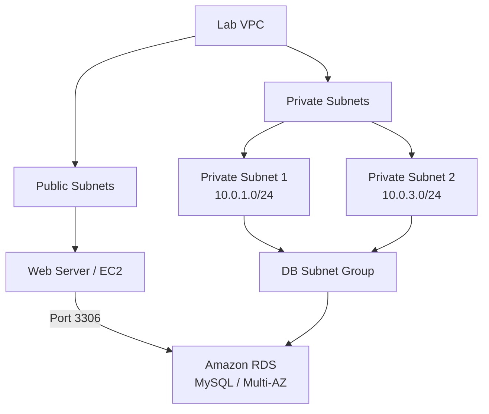

# Lab — Amazon RDS and Address Book

[🇺🇸 English](#-english) | [🇧🇷 Português](#-português)

---

## 🇺🇸 English

## Objective

The objective of this lab was to practice creating and configuring a relational database using Amazon RDS and integrating it with a web application.

Building on the network infrastructure created in the previous lab, a dedicated Security Group for the database, a DB Subnet Group, and an Amazon RDS for MySQL instance with a Multi-AZ deployment were configured.

At the end of the lab, the Address Book application was configured to use the database and tested through a web browser.

## Architecture

The lab uses the network infrastructure previously created in the `Lab VPC`, which contains public and private subnets distributed across two Availability Zones.

The two private subnets were used for the database:

* Private Subnet 1 — `10.0.1.0/24`
* Private Subnet 2 — `10.0.3.0/24`

Both subnets were associated with the `DB Subnet Group`, allowing Amazon RDS to use network resources across different Availability Zones.

The `DB Security Group` was created and configured to allow MySQL connections on port `3306` only from resources associated with the `Web Security Group`.

The RDS instance was configured without public access and using the `DB Security Group`.

The Multi-AZ deployment creates a primary instance and a standby instance in another Availability Zone, with synchronous data replication between them.

In simplified form:

```mermaid
flowchart TD
    VPC["Lab VPC"]

    VPC --> PUBLIC["Public Subnets"]
    VPC --> PRIVATE["Private Subnets"]

    PUBLIC --> EC2["Web Server / EC2"]

    PRIVATE --> SUB1["Private Subnet 1<br/>10.0.1.0/24"]
    PRIVATE --> SUB2["Private Subnet 2<br/>10.0.3.0/24"]

    SUB1 --> DBGROUP["DB Subnet Group"]
    SUB2 --> DBGROUP

    EC2 -->|"Port 3306"| RDS["Amazon RDS<br/>MySQL / Multi-AZ"]

    DBGROUP --> RDS
```

## Services and Resources Used

* **Amazon RDS** — creation and operation of the MySQL database
* **DB Subnet Group** — definition of the private subnets used by RDS
* **Security Group** — control of inbound database traffic
* **Amazon VPC** — virtual network where the lab resources are configured
* **Amazon EC2** — server hosting the web application used in the lab
* **Address Book** — application used to validate database connectivity and data persistence

## Steps Performed

### 1. Database Security Group Creation

The `DB Security Group` was created in the `Lab VPC`.

An inbound rule was configured to allow **MySQL/Aurora traffic on port `3306`**, with the `Web Security Group` specified as the source.

This configuration allows only resources associated with the `Web Security Group` to establish inbound connections to the database through the configured rule.

### 2. DB Subnet Group Creation

The `DB Subnet Group` was created in the `Lab VPC`.

The group was configured using private subnets distributed across two Availability Zones:

* Private Subnet 1 — `10.0.1.0/24`
* Private Subnet 2 — `10.0.3.0/24`

This configuration allows Amazon RDS to use the selected subnets for database deployment.

### 3. RDS Instance Creation and Configuration

The `lab-db` instance was created using **Amazon RDS for MySQL**.

The main configuration settings were:

* **Engine:** MySQL
* **Template:** Dev/Test
* **Deployment:** Multi-AZ DB instance deployment — 2 instances
* **DB instance identifier:** `lab-db`
* **Master username:** `main`
* **Instance class:** `db.t3.medium`
* **Storage type:** General Purpose SSD (gp3)
* **Allocated storage:** `20 GiB`
* **VPC:** `Lab VPC`
* **DB Subnet Group:** `DB Subnet Group`
* **Public access:** No
* **Security Group:** `DB Security Group`
* **Initial database name:** `lab`

The instance was created without public access and configured to use the dedicated database Security Group.

After the instance was created, its status was monitored until it became available. The instance endpoint was then obtained to configure the application.

### 4. Address Book Application Configuration and Testing

The web application hosted on the Web Server was accessed through a browser and configured to use the previously created RDS instance.

The following information was provided in the application:

* **Endpoint:** endpoint of the `lab-db` instance
* **Database:** `lab`
* **Username:** `main`

After the configuration was submitted, the application began using the RDS database to store Address Book information.

## Result

At the end of the lab, an Amazon RDS for MySQL instance was successfully configured using a Multi-AZ deployment, a DB Subnet Group with private subnets distributed across two Availability Zones, and a dedicated Security Group to control database access. The Address Book application was also configured to use the RDS database.

The lab provided hands-on practice with the following concepts:

* Amazon RDS
* MySQL on AWS
* DB Subnet Groups
* Security Groups
* Application-to-database communication
* Multi-AZ environments
* Data persistence
* Integration between AWS services

---

## 🇧🇷 Português

## Objetivo

Este laboratório teve como objetivo praticar a criação e configuração de um banco de dados relacional utilizando o Amazon RDS e sua integração com uma aplicação web.

A partir da infraestrutura de rede criada no laboratório anterior, foram configurados um Security Group específico para o banco de dados, um DB Subnet Group e uma instância Amazon RDS for MySQL com implantação Multi-AZ.

Ao final do laboratório, a aplicação Address Book foi configurada para utilizar o banco de dados e testada através de um navegador.

## Arquitetura

O laboratório utiliza a infraestrutura de rede criada anteriormente na `Lab VPC`, que possui subnets públicas e privadas distribuídas em duas Availability Zones.

Para o banco de dados, foram utilizadas as duas subnets privadas:

* Private Subnet 1 — `10.0.1.0/24`
* Private Subnet 2 — `10.0.3.0/24`

As duas subnets foram associadas ao `DB Subnet Group`, permitindo que o Amazon RDS utilize recursos de rede em diferentes Availability Zones.

Foi criado o `DB Security Group`, configurado para permitir conexões MySQL na porta `3306` somente a partir de recursos associados ao `Web Security Group`.

A instância RDS foi configurada sem acesso público e utilizando o `DB Security Group`.

A implantação Multi-AZ cria uma instância primária e uma instância standby em outra Availability Zone, com replicação síncrona dos dados entre elas.

De forma simplificada:

```mermaid
flowchart TD
    VPC["Lab VPC"]

    VPC --> PUBLIC["Public Subnets"]
    VPC --> PRIVATE["Private Subnets"]

    PUBLIC --> EC2["Web Server / EC2"]

    PRIVATE --> SUB1["Private Subnet 1<br/>10.0.1.0/24"]
    PRIVATE --> SUB2["Private Subnet 2<br/>10.0.3.0/24"]

    SUB1 --> DBGROUP["DB Subnet Group"]
    SUB2 --> DBGROUP

    EC2 -->|"Port 3306"| RDS["Amazon RDS<br/>MySQL / Multi-AZ"]

    DBGROUP --> RDS
```

## Serviços e Recursos Utilizados

* **Amazon RDS** — criação e execução do banco de dados MySQL
* **DB Subnet Group** — definição das subnets privadas utilizadas pelo RDS
* **Security Group** — controle do tráfego de entrada do banco de dados
* **Amazon VPC** — rede virtual onde os recursos do laboratório estão configurados
* **Amazon EC2** — servidor que hospeda a aplicação web utilizada no laboratório
* **Address Book** — aplicação utilizada para validar a conexão com o banco de dados e a persistência dos dados

## Etapas Realizadas

### 1. Criação do Security Group do Banco de Dados

Foi criado o `DB Security Group` na `Lab VPC`.

Foi configurada uma regra de entrada para permitir tráfego **MySQL/Aurora na porta `3306`**, tendo como origem o `Web Security Group`.

Essa configuração permite que apenas recursos associados ao `Web Security Group` estabeleçam conexões de entrada com o banco de dados por meio da regra configurada.

### 2. Criação do DB Subnet Group

Foi criado o `DB Subnet Group` na `Lab VPC`.

O grupo foi configurado utilizando subnets privadas distribuídas em duas Availability Zones:

* Private Subnet 1 — `10.0.1.0/24`
* Private Subnet 2 — `10.0.3.0/24`

Essa configuração permite que o Amazon RDS utilize as subnets selecionadas para a implantação do banco de dados.

### 3. Criação e Configuração da Instância RDS

Foi criada a instância `lab-db` utilizando o **Amazon RDS for MySQL**.

As principais configurações utilizadas foram:

* **Engine:** MySQL
* **Template:** Dev/Test
* **Deployment:** Multi-AZ DB instance deployment — 2 instances
* **DB instance identifier:** `lab-db`
* **Master username:** `main`
* **Instance class:** `db.t3.medium`
* **Storage type:** General Purpose SSD (gp3)
* **Allocated storage:** `20 GiB`
* **VPC:** `Lab VPC`
* **DB Subnet Group:** `DB Subnet Group`
* **Public access:** No
* **Security Group:** `DB Security Group`
* **Initial database name:** `lab`

A instância foi criada sem acesso público e configurada para utilizar o Security Group específico do banco de dados.

Após a criação, a instância foi acompanhada até ficar disponível para utilização. Em seguida, o endpoint da instância foi obtido para configurar a aplicação.

### 4. Configuração e Teste da Aplicação Address Book

A aplicação web hospedada no Web Server foi acessada através do navegador e configurada para utilizar a instância RDS criada anteriormente.

Foram informados na aplicação:

* **Endpoint:** endpoint da instância `lab-db`
* **Database:** `lab`
* **Username:** `main`

Após o envio das configurações, a aplicação passou a utilizar o banco de dados RDS para armazenar as informações do Address Book.

## Resultado

Ao final do laboratório, foi possível configurar uma instância Amazon RDS for MySQL em uma implantação Multi-AZ, utilizando um DB Subnet Group com subnets privadas distribuídas em duas Availability Zones e um Security Group específico para controlar o acesso ao banco de dados. Também foi possível configurar a aplicação Address Book para utilizar o banco de dados RDS.

O laboratório permitiu praticar os seguintes conceitos:

* Amazon RDS
* MySQL na AWS
* DB Subnet Groups
* Security Groups
* Comunicação entre aplicação e banco de dados
* Ambientes Multi-AZ
* Persistência de dados
* Integração entre serviços AWS
