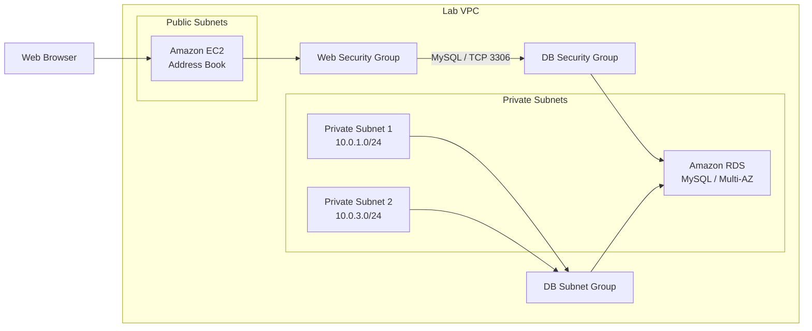
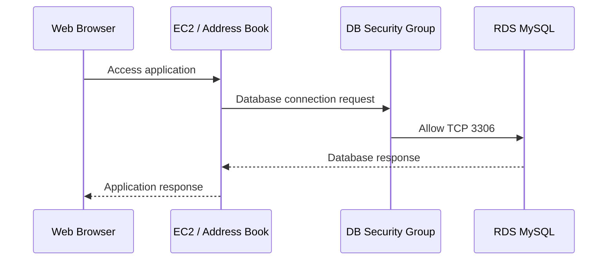
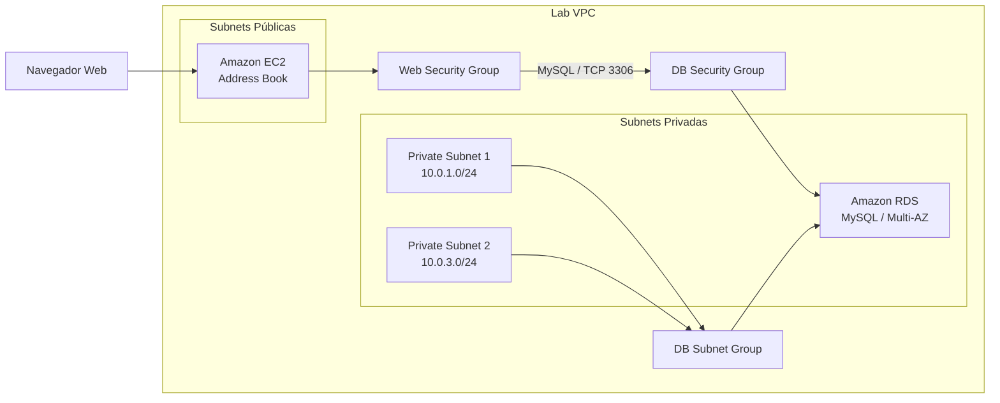
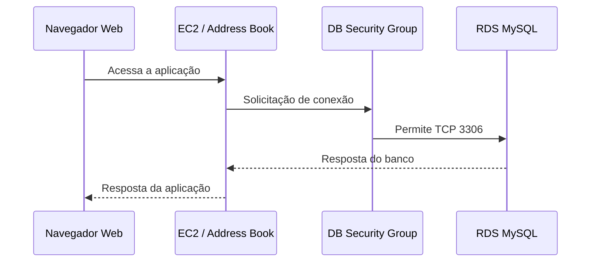

# Lab — Amazon RDS and Address Book

[English](#english) · [Português](#português)

---

## English

## Objective

Practice deploying a relational database with **Amazon RDS for MySQL** and integrating it with a web application running on Amazon EC2.

The lab extends the VPC architecture from the previous lab by introducing a private database tier, controlled database access, and a Multi-AZ RDS deployment.

## Architecture

The database layer was designed to remain private, while the EC2 web server remained in the public tier.

```mermaid
flowchart LR
    USER["Web Browser"]

    subgraph VPC["Lab VPC"]
        subgraph PUBLIC["Public Subnets"]
            EC2["Amazon EC2<br/>Address Book"]
        end

        subgraph PRIVATE["Private Subnets"]
            SUB1["Private Subnet 1<br/>10.0.1.0/24"]
            SUB2["Private Subnet 2<br/>10.0.3.0/24"]
            DB["Amazon RDS<br/>MySQL / Multi-AZ"]
        end

        WSG["Web Security Group"]
        DBSG["DB Security Group"]
        DBGROUP["DB Subnet Group"]
    end

    USER --> EC2
    EC2 --> WSG
    WSG -->|"MySQL / TCP 3306"| DBSG
    DBSG --> DB
    SUB1 --> DBGROUP
    SUB2 --> DBGROUP
    DBGROUP --> DB
```

### Network and Access Model

| Component                | Configuration                           |
| ------------------------ | --------------------------------------- |
| Web tier                 | Amazon EC2 in a public subnet           |
| Database tier            | Amazon RDS for MySQL in private subnets |
| DB Subnet Group          | Private Subnet 1 + Private Subnet 2     |
| Database access          | TCP `3306`                              |
| DB Security Group source | Web Security Group                      |
| Public database access   | Disabled                                |
| Availability             | Multi-AZ, 2 DB instances                |

This configuration separates the web and database layers and restricts database connectivity to the application tier.

## Services & Resources

| Service / Resource   | Purpose                                           |
| -------------------- | ------------------------------------------------- |
| Amazon VPC           | Network infrastructure                            |
| Amazon EC2           | Hosts the Address Book application                |
| Amazon RDS for MySQL | Managed relational database                       |
| DB Subnet Group      | Defines the private subnets available to RDS      |
| Security Groups      | Controls application-to-database traffic          |
| Address Book         | Application used to validate database integration |

## Implementation

### 1. Database Security

A dedicated `DB Security Group` was created in the `Lab VPC`.

The inbound rule allows MySQL/Aurora traffic on TCP `3306`, with the `Web Security Group` as the source rather than allowing unrestricted network access.

### 2. DB Subnet Group

The `DB Subnet Group` was configured with two private subnets distributed across Availability Zones:

* Private Subnet 1 — `10.0.1.0/24`.
* Private Subnet 2 — `10.0.3.0/24`.

### 3. RDS Deployment

The `lab-db` database was deployed using **Amazon RDS for MySQL**.

| Setting                | Value                                         |
| ---------------------- | --------------------------------------------- |
| Engine                 | MySQL                                         |
| Template               | Dev/Test                                      |
| Deployment             | Multi-AZ DB instance deployment — 2 instances |
| DB instance identifier | `lab-db`                                      |
| Master username        | `main`                                        |
| Instance class         | `db.t3.medium`                                |
| Storage                | 20 GiB, General Purpose SSD (gp3)             |
| VPC                    | `Lab VPC`                                     |
| DB Subnet Group        | `DB Subnet Group`                             |
| Public access          | No                                            |
| Security Group         | `DB Security Group`                           |
| Initial database       | `lab`                                         |

The instance was monitored until it reached the **Available** state. Its endpoint was then used by the web application.

### 4. Application Integration

The Address Book application running on EC2 was configured with the RDS connection information.

| Parameter     | Configuration         |
| ------------- | --------------------- |
| Endpoint      | `lab-db` RDS endpoint |
| Database      | `lab`                 |
| Username      | `main`                |
| Database port | `3306`                |

The application successfully connected to the RDS database and used it to store Address Book information.

## Validation

The final validation confirmed the complete application-to-database path:

```mermaid
sequenceDiagram
    participant User as Web Browser
    participant EC2 as EC2 / Address Book
    participant SG as DB Security Group
    participant RDS as RDS MySQL

    User->>EC2: Access application
    EC2->>SG: Database connection request
    SG->>RDS: Allow TCP 3306
    RDS-->>EC2: Database response
    EC2-->>User: Application response
```

The successful application test demonstrated that:

* EC2 could reach the RDS database.
* Database access was restricted to the application security group.
* The RDS instance operated without public access.
* The Address Book application could persist data through MySQL.

## Result

A private **Amazon RDS for MySQL** database was successfully integrated with the Address Book application running on EC2.

The lab introduced a dedicated database tier with **private subnets, DB Subnet Groups, Security Group-based access control, and Multi-AZ deployment**, extending the network architecture created in the previous lab.

## Key Takeaways

* Deploying a managed relational database with Amazon RDS.
* Designing a private database tier within a VPC.
* Using DB Subnet Groups across Availability Zones.
* Restricting database access through Security Groups.
* Connecting an EC2-hosted application to RDS over TCP `3306`.
* Understanding the role of Multi-AZ deployment in database availability.
* Validating application-to-database connectivity.

---

## Português

## Objetivo

Praticar a implantação de um banco de dados relacional utilizando o **Amazon RDS for MySQL** e sua integração com uma aplicação web executada em uma instância Amazon EC2.

O laboratório amplia a arquitetura de VPC dos laboratórios anteriores ao introduzir uma camada de banco de dados privada, controle de acesso ao banco e uma implantação RDS Multi-AZ.

## Arquitetura

A camada de banco de dados foi projetada para permanecer privada, enquanto o servidor EC2 da aplicação permanece na camada pública.

```mermaid
flowchart LR
    USER["Navegador Web"]

    subgraph VPC["Lab VPC"]
        subgraph PUBLIC["Subnets Públicas"]
            EC2["Amazon EC2<br/>Address Book"]
        end

        subgraph PRIVATE["Subnets Privadas"]
            SUB1["Private Subnet 1<br/>10.0.1.0/24"]
            SUB2["Private Subnet 2<br/>10.0.3.0/24"]
            DB["Amazon RDS<br/>MySQL / Multi-AZ"]
        end

        WSG["Web Security Group"]
        DBSG["DB Security Group"]
        DBGROUP["DB Subnet Group"]
    end

    USER --> EC2
    EC2 --> WSG
    WSG -->|"MySQL / TCP 3306"| DBSG
    DBSG --> DB
    SUB1 --> DBGROUP
    SUB2 --> DBGROUP
    DBGROUP --> DB
```

### Modelo de Rede e Acesso

| Componente                  | Configuração                             |
| --------------------------- | ---------------------------------------- |
| Camada web                  | Amazon EC2 em uma subnet pública         |
| Camada de banco             | Amazon RDS for MySQL em subnets privadas |
| DB Subnet Group             | Private Subnet 1 + Private Subnet 2      |
| Acesso ao banco             | TCP `3306`                               |
| Origem no DB Security Group | Web Security Group                       |
| Acesso público ao banco     | Desabilitado                             |
| Disponibilidade             | Multi-AZ, 2 instâncias de banco          |

Essa configuração separa as camadas web e de banco e restringe a conectividade do banco à camada da aplicação.

## Serviços e Recursos

| Serviço / Recurso    | Finalidade                                                |
| -------------------- | --------------------------------------------------------- |
| Amazon VPC           | Infraestrutura de rede                                    |
| Amazon EC2           | Hospeda a aplicação Address Book                          |
| Amazon RDS for MySQL | Banco de dados relacional gerenciado                      |
| DB Subnet Group      | Define as subnets privadas disponíveis para o RDS         |
| Security Groups      | Controlam o tráfego entre aplicação e banco               |
| Address Book         | Aplicação utilizada para validar a integração com o banco |

## Implementação

### 1. Segurança do Banco de Dados

Foi criado um `DB Security Group` dedicado na `Lab VPC`.

A regra de entrada permite tráfego MySQL/Aurora na porta TCP `3306`, utilizando o `Web Security Group` como origem em vez de permitir acesso irrestrito à rede.

### 2. DB Subnet Group

O `DB Subnet Group` foi configurado utilizando duas subnets privadas distribuídas entre Availability Zones:

* Private Subnet 1 — `10.0.1.0/24`.
* Private Subnet 2 — `10.0.3.0/24`.

### 3. Implantação do RDS

O banco `lab-db` foi criado utilizando o **Amazon RDS for MySQL**.

| Configuração           | Valor                                         |
| ---------------------- | --------------------------------------------- |
| Engine                 | MySQL                                         |
| Template               | Dev/Test                                      |
| Deployment             | Multi-AZ DB instance deployment — 2 instances |
| DB instance identifier | `lab-db`                                      |
| Master username        | `main`                                        |
| Instance class         | `db.t3.medium`                                |
| Storage                | 20 GiB, General Purpose SSD (gp3)             |
| VPC                    | `Lab VPC`                                     |
| DB Subnet Group        | `DB Subnet Group`                             |
| Public access          | No                                            |
| Security Group         | `DB Security Group`                           |
| Banco inicial          | `lab`                                         |

A instância foi acompanhada até atingir o estado **Available**. Em seguida, seu endpoint foi utilizado pela aplicação web.

### 4. Integração com a Aplicação

A aplicação Address Book executada na EC2 foi configurada utilizando as informações de conexão do RDS.

| Parâmetro      | Configuração             |
| -------------- | ------------------------ |
| Endpoint       | Endpoint RDS de `lab-db` |
| Database       | `lab`                    |
| Username       | `main`                   |
| Porta do banco | `3306`                   |

A aplicação conseguiu se conectar ao banco RDS e utilizá-lo para armazenar as informações do Address Book.

## Validação

A validação final confirmou o fluxo completo entre a aplicação e o banco de dados:

```mermaid
sequenceDiagram
    participant User as Navegador Web
    participant EC2 as EC2 / Address Book
    participant SG as DB Security Group
    participant RDS as RDS MySQL

    User->>EC2: Acessa a aplicação
    EC2->>SG: Solicitação de conexão
    SG->>RDS: Permite TCP 3306
    RDS-->>EC2: Resposta do banco
    EC2-->>User: Resposta da aplicação
```

O teste bem-sucedido demonstrou que:

* A EC2 conseguiu acessar o banco RDS.
* O acesso ao banco foi restringido ao Security Group da aplicação.
* A instância RDS operou sem acesso público.
* A aplicação Address Book conseguiu persistir dados utilizando MySQL.

## Resultado

Um banco **Amazon RDS for MySQL** privado foi integrado com sucesso à aplicação Address Book executada na EC2.

O laboratório introduziu uma camada de banco de dados utilizando **subnets privadas, DB Subnet Groups, controle de acesso por Security Groups e implantação Multi-AZ**, ampliando a arquitetura de rede desenvolvida nos laboratórios anteriores.

## Principais Aprendizados

* Implantação de banco relacional gerenciado com Amazon RDS.
* Estruturação de uma camada de banco privada dentro de uma VPC.
* Utilização de DB Subnet Groups em diferentes Availability Zones.
* Restrição do acesso ao banco por meio de Security Groups.
* Conexão entre uma aplicação em EC2 e RDS utilizando TCP `3306`.
* Compreensão do uso de Multi-AZ para disponibilidade do banco.
* Validação da conectividade entre aplicação e banco de dados.
