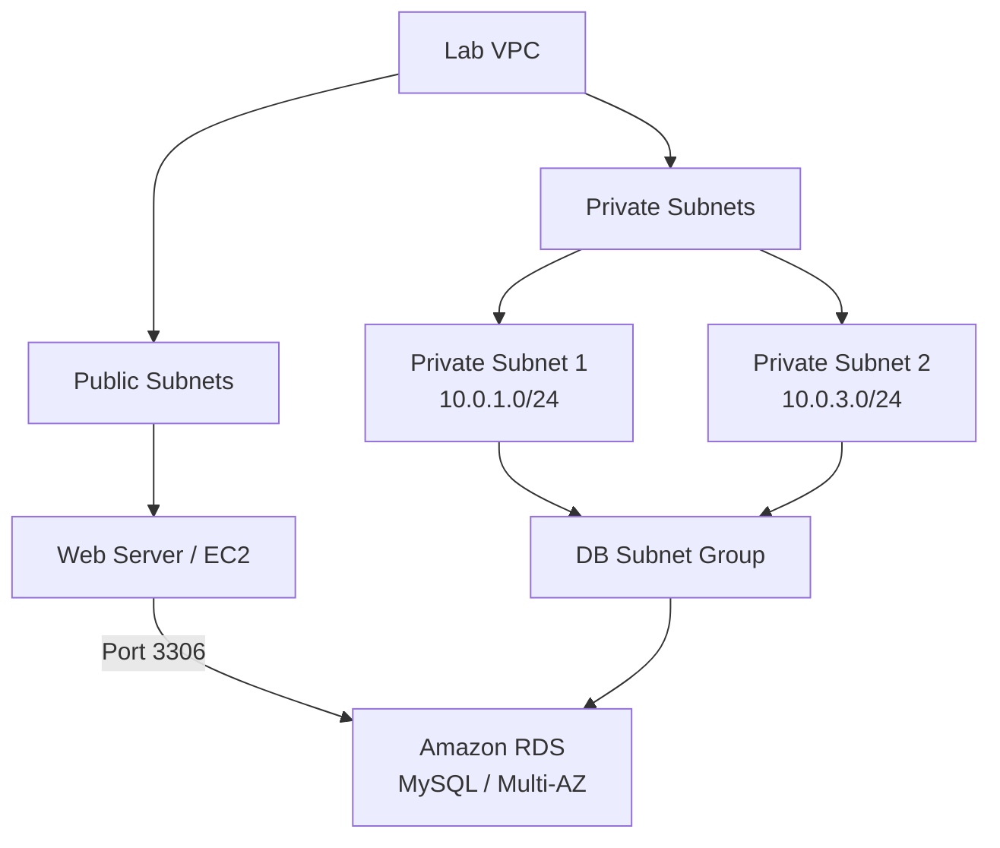
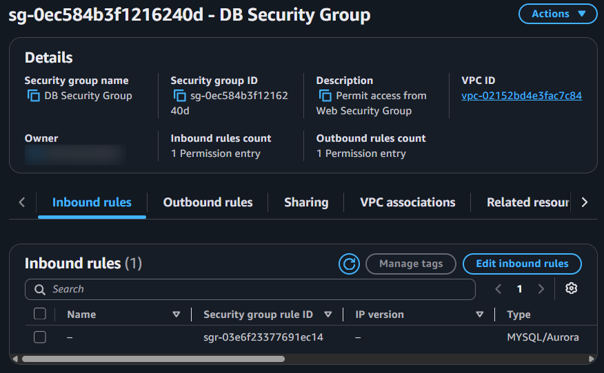
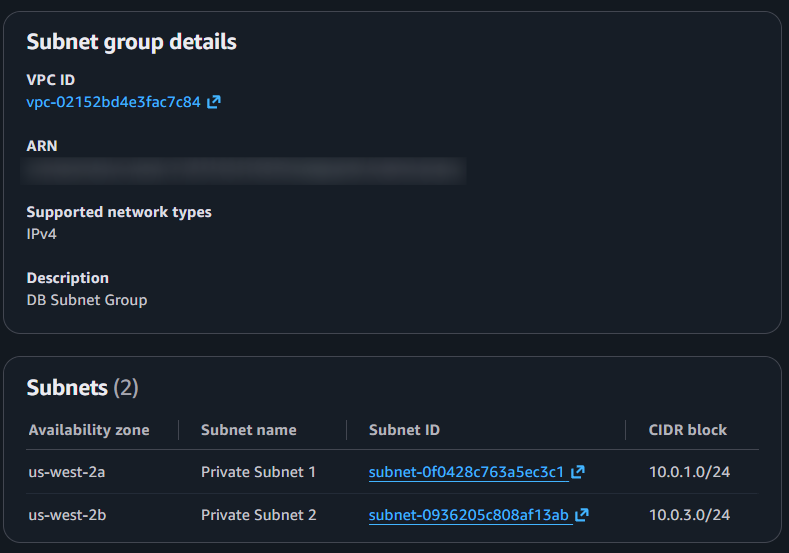
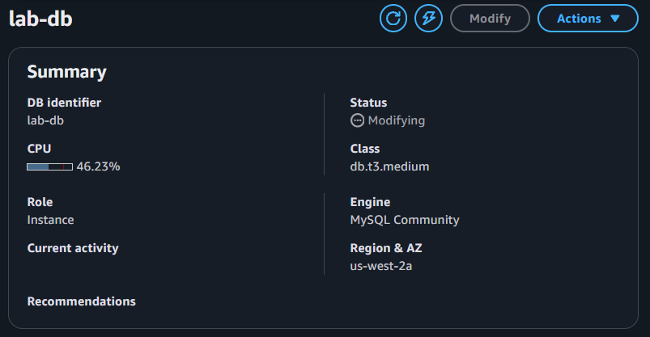
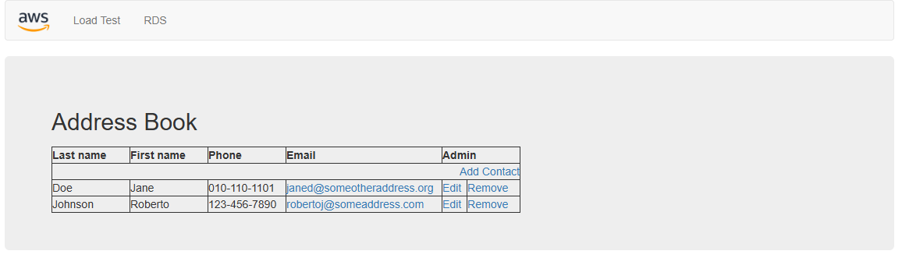

# Lab — Amazon RDS and Address Book

[English](#english) · [Português](#português)

---

## English

## Objective

The objective of this lab was to practice creating and configuring a relational database using Amazon RDS and integrating it with a web application.

Building on the network infrastructure created in the previous lab, a dedicated Security Group, a DB Subnet Group, and an Amazon RDS for MySQL instance were configured.

At the end of the lab, the Address Book application was configured to use the RDS database and tested through a web browser.

## Architecture

The lab uses the `Lab VPC` created in the previous lab, with public and private subnets distributed across two Availability Zones.

The two private subnets were used for the database:

* Private Subnet 1 — `10.0.1.0/24`
* Private Subnet 2 — `10.0.3.0/24`

Both private subnets were added to the `DB Subnet Group`.

The `DB Security Group` was configured to allow MySQL connections on port `3306` from resources associated with the `Web Security Group`.

The RDS instance was configured without public access and associated with the `DB Security Group`.

The database was configured using a Multi-AZ deployment with two database instances.

The application running on the EC2 instance communicates with the RDS database through port `3306`.

```mermaid
flowchart TD
    VPC["Lab VPC"]

    VPC --> PUBLIC["Public Subnets"]
    VPC --> PRIVATE["Private Subnets"]

    PUBLIC --> EC2["Web Server / EC2"]

    PRIVATE --> SUB1["Private Subnet 1<br/>10.0.1.0/24"]
    PRIVATE --> SUB2["Private Subnet 2<br/>10.0.3.0/24"]

    SUB1 --> DBGROUP["DB Subnet Group"]
    SUB2 --> DBGROUP

    EC2 -->|"Port 3306"| RDS["Amazon RDS<br/>MySQL / Multi-AZ"]

    DBGROUP --> RDS
```

## Services and Resources Used

* **Amazon RDS** — used to create and run the MySQL database
* **DB Subnet Group** — used to define the private subnets for the RDS instance
* **Security Groups** — used to control application and database traffic
* **Amazon VPC** — network used by the lab resources
* **Amazon EC2** — server hosting the web application
* **Address Book** — web application used to test the database connection and data storage

## Steps Performed

### 1. Database Security Group

The `DB Security Group` was created in the `Lab VPC`.

An inbound rule was configured to allow **MySQL/Aurora traffic on port `3306`**, with the `Web Security Group` specified as the source.

### 2. DB Subnet Group

The `DB Subnet Group` was created using the two private subnets:

* Private Subnet 1 — `10.0.1.0/24`
* Private Subnet 2 — `10.0.3.0/24`

The subnets are distributed across two Availability Zones.

### 3. RDS Instance

The `lab-db` instance was created using **Amazon RDS for MySQL**.

Main configuration:

| Setting                | Value                                         |
| ---------------------- | --------------------------------------------- |
| Engine                 | MySQL                                         |
| Template               | Dev/Test                                      |
| Deployment             | Multi-AZ DB instance deployment — 2 instances |
| DB instance identifier | `lab-db`                                      |
| Master username        | `main`                                        |
| Instance class         | `db.t3.medium`                                |
| Storage type           | General Purpose SSD (gp3)                     |
| Allocated storage      | `20 GiB`                                      |
| VPC                    | `Lab VPC`                                     |
| DB Subnet Group        | `DB Subnet Group`                             |
| Public access          | No                                            |
| Security Group         | `DB Security Group`                           |
| Initial database name  | `lab`                                         |

After the database was created, the instance was monitored until it became available.

The instance endpoint was then obtained to configure the Address Book application.

### 4. Address Book Configuration and Testing

The Address Book application running on the EC2 instance was accessed through a web browser.

The application was configured using the RDS connection information:

| Setting  | Value                             |
| -------- | --------------------------------- |
| Endpoint | Endpoint of the `lab-db` instance |
| Database | `lab`                             |
| Username | `main`                            |

After the configuration was submitted, the application was able to use the RDS database to store Address Book information.

## Result

The lab was completed by configuring an Amazon RDS for MySQL database with a Multi-AZ deployment, a DB Subnet Group using private subnets, and a dedicated Security Group.

The Address Book application running on EC2 was successfully configured to use the RDS database.

The final test confirmed communication between the web application and the database.

---

## Português

## Objetivo

O objetivo deste laboratório foi praticar a criação e configuração de um banco de dados relacional utilizando o Amazon RDS e sua integração com uma aplicação web.

A partir da infraestrutura de rede criada no laboratório anterior, foram configurados um Security Group específico, um DB Subnet Group e uma instância Amazon RDS for MySQL.

Ao final do laboratório, a aplicação Address Book foi configurada para utilizar o banco de dados RDS e testada através de um navegador.

## Arquitetura

O laboratório utiliza a `Lab VPC` criada no laboratório anterior, com subnets públicas e privadas distribuídas em duas Availability Zones.

As duas subnets privadas foram utilizadas para o banco de dados:

* Private Subnet 1 — `10.0.1.0/24`
* Private Subnet 2 — `10.0.3.0/24`

As duas subnets foram adicionadas ao `DB Subnet Group`.

O `DB Security Group` foi configurado para permitir conexões MySQL na porta `3306` a partir de recursos associados ao `Web Security Group`.

A instância RDS foi configurada sem acesso público e associada ao `DB Security Group`.

O banco de dados foi configurado utilizando uma implantação Multi-AZ com duas instâncias de banco de dados.

A aplicação executada na instância EC2 se comunica com o banco de dados RDS através da porta `3306`.

```mermaid
flowchart TD
    VPC["Lab VPC"]

    VPC --> PUBLIC["Public Subnets"]
    VPC --> PRIVATE["Private Subnets"]

    PUBLIC --> EC2["Web Server / EC2"]

    PRIVATE --> SUB1["Private Subnet 1<br/>10.0.1.0/24"]
    PRIVATE --> SUB2["Private Subnet 2<br/>10.0.3.0/24"]

    SUB1 --> DBGROUP["DB Subnet Group"]
    SUB2 --> DBGROUP

    EC2 -->|"Port 3306"| RDS["Amazon RDS<br/>MySQL / Multi-AZ"]

    DBGROUP --> RDS
```

## Serviços e Recursos Utilizados

* **Amazon RDS** — utilizado para criar e executar o banco de dados MySQL
* **DB Subnet Group** — utilizado para definir as subnets privadas utilizadas pela instância RDS
* **Security Groups** — utilizados para controlar o tráfego da aplicação e do banco de dados
* **Amazon VPC** — rede utilizada pelos recursos do laboratório
* **Amazon EC2** — servidor que hospeda a aplicação web
* **Address Book** — aplicação web utilizada para testar a conexão e o armazenamento de dados no banco

## Etapas Realizadas

### 1. Security Group do Banco de Dados

Foi criado o `DB Security Group` na `Lab VPC`.

Foi configurada uma regra de entrada permitindo **tráfego MySQL/Aurora na porta `3306`**, tendo o `Web Security Group` como origem.

### 2. DB Subnet Group

Foi criado o `DB Subnet Group` utilizando as duas subnets privadas:

* Private Subnet 1 — `10.0.1.0/24`
* Private Subnet 2 — `10.0.3.0/24`

As subnets estão distribuídas entre duas Availability Zones.

### 3. Instância RDS

Foi criada a instância `lab-db` utilizando o **Amazon RDS for MySQL**.

Configuração principal:

| Configuração           | Valor                                         |
| ---------------------- | --------------------------------------------- |
| Engine                 | MySQL                                         |
| Template               | Dev/Test                                      |
| Deployment             | Multi-AZ DB instance deployment — 2 instances |
| DB instance identifier | `lab-db`                                      |
| Master username        | `main`                                        |
| Instance class         | `db.t3.medium`                                |
| Storage type           | General Purpose SSD (gp3)                     |
| Allocated storage      | `20 GiB`                                      |
| VPC                    | `Lab VPC`                                     |
| DB Subnet Group        | `DB Subnet Group`                             |
| Public access          | No                                            |
| Security Group         | `DB Security Group`                           |
| Initial database name  | `lab`                                         |

Após a criação do banco de dados, a instância foi acompanhada até ficar disponível.

Em seguida, o endpoint da instância foi obtido para configurar a aplicação Address Book.

### 4. Configuração e Teste do Address Book

A aplicação Address Book executada na instância EC2 foi acessada através de um navegador.

A aplicação foi configurada utilizando as informações de conexão do RDS:

| Configuração | Valor                          |
| ------------ | ------------------------------ |
| Endpoint     | Endpoint da instância `lab-db` |
| Database     | `lab`                          |
| Username     | `main`                         |

Após o envio da configuração, a aplicação conseguiu utilizar o banco de dados RDS para armazenar as informações do Address Book.

## Resultado

O laboratório foi concluído com a configuração de um banco de dados Amazon RDS for MySQL utilizando uma implantação Multi-AZ, um DB Subnet Group com subnets privadas e um Security Group específico.

A aplicação Address Book executada na EC2 foi configurada com sucesso para utilizar o banco de dados RDS.

O teste final confirmou a comunicação entre a aplicação web e o banco de dados.
