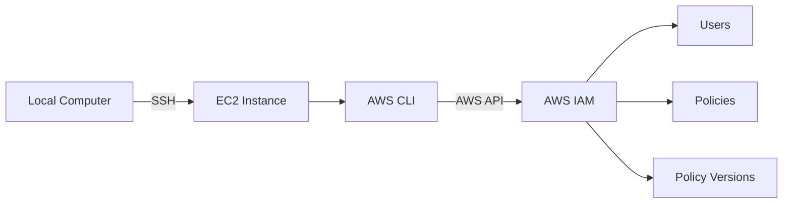
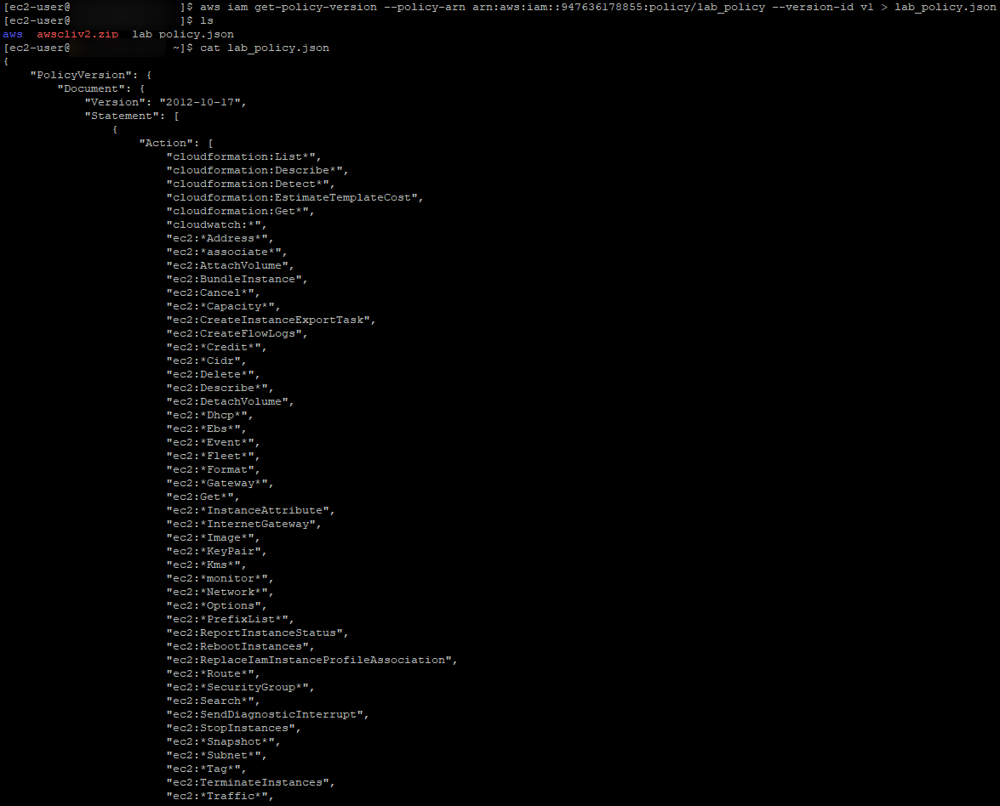
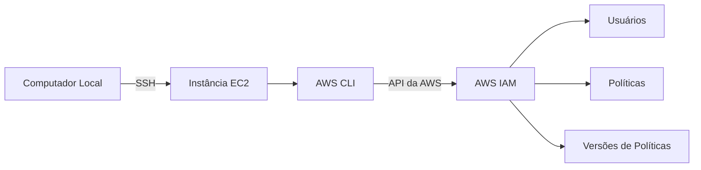

# Lab — AWS CLI, EC2, and IAM

[English](#english) · [Português](#português)

---

## English

## Objective

The objective of this lab was to practice installing and configuring the **AWS Command Line Interface (AWS CLI)** on an EC2 instance.

At the end of the lab, the AWS CLI was configured to access the AWS account used during the lab and was used to query **AWS Identity and Access Management (IAM)** resources, including users and policies.

The `lab_policy` policy was also retrieved through the AWS CLI using its default version, and the result was saved to a JSON file.

## Architecture

The infrastructure used in this lab consisted of an EC2 instance accessed remotely through SSH.

The AWS CLI was installed and configured on the instance to make API calls to the AWS account. The CLI was then used to query IAM information, including users, policies, and policy versions.

The architecture can be represented as follows:



## Services and Resources Used

* **Amazon EC2** — instance used to run the AWS CLI
* **AWS CLI** — command-line tool used to interact with AWS services
* **AWS IAM** — service used to query users and policies
* **SSH** — protocol used for remote access to the EC2 instance

## Steps Performed

### 1. Connecting to the EC2 Instance

An SSH connection was established to the EC2 instance provided by the lab.

After authentication, the instance terminal was accessed and the commands required to perform the activities were executed.


### 2. Installing the AWS CLI

The AWS CLI was installed directly on the EC2 instance.

First, the installer was downloaded using `curl`:

```bash
curl "https://awscli.amazonaws.com/awscli-exe-linux-x86_64.zip" -o "awscliv2.zip"
```

The downloaded file was then extracted:

```bash
unzip -u awscliv2.zip
```

The installation was performed with:

```bash
sudo ./aws/install
```

After installation, the following command was used to verify that the AWS CLI was available on the instance:

```bash
aws --version
```

The `aws help` command was also used to verify the tool and access its documentation directly from the terminal:

```bash
aws help
```

### 3. Reviewing IAM Configuration

Before using the AWS CLI to perform the queries, some IAM configurations were reviewed in the AWS Management Console.

The information reviewed included:

* the IAM user used in the lab;
* the `lab_policy` policy;
* the default policy version;
* the credentials later used to configure the AWS CLI.

The credentials used during the lab were not included in this documentation or repository.

### 4. Configuring the AWS CLI

After installation, the AWS CLI was configured to access the AWS account used in the lab.

The following command was executed to start the configuration:

```bash
aws configure
```

The following parameters were provided:

```text
AWS Access Key ID
AWS Secret Access Key
Default region name: us-west-2
Default output format: json
```

The credentials used in this step were not included in the documentation or repository.

### 5. Querying IAM Users

After configuring the AWS CLI, an IAM access test was performed using:

```bash
aws iam list-users
```

The command returns the IAM users available in the AWS account in JSON format.

The result confirmed that the AWS CLI was correctly configured and could query the IAM service.


### 6. Querying IAM Policies

Next, customer-managed policies were queried using:

```bash
aws iam list-policies --scope Local
```

The `--scope Local` parameter was used to filter customer-managed policies.

The `lab_policy` policy was identified in the results.

The returned information included:

* `PolicyName`
* `Arn`
* `DefaultVersionId`

The `DefaultVersionId` property identifies the default version of the policy and was used in the next step.


### 7. Retrieving the `lab_policy` Version

After identifying the `lab_policy` policy and its default version, the `get-policy-version` command was used to retrieve the policy document in JSON format.

The command used was:

```bash
aws iam get-policy-version \
  --policy-arn arn:aws:iam::<AWS_ACCOUNT_ID>:policy/lab_policy \
  --version-id v1
```

The default version identified during the lab was `v1`.

The command returned the information for the policy version, including the JSON document corresponding to `lab_policy`.



### 8. Saving the Policy in JSON Format

To save the command output to a file, the `>` redirection operator was used:

```bash
aws iam get-policy-version \
  --policy-arn arn:aws:iam::<AWS_ACCOUNT_ID>:policy/lab_policy \
  --version-id v1 \
  > lab_policy.json
```

The `>` operator redirects the command output to the `lab_policy.json` file.

After execution, the file could be viewed using:

```bash
cat lab_policy.json
```

This allowed the response returned by the AWS CLI to be stored locally as a JSON file on the EC2 instance.

## Result

At the end of the lab, it was possible to install and configure the AWS CLI on an EC2 instance and use it to interact with AWS IAM.

User and policy queries were performed, along with the retrieval of the `lab_policy` policy version through the command line.

The lab also provided practical experience with using the AWS CLI to perform operations that could otherwise be performed through the AWS Management Console.

---

## Português

## Objetivo

Este laboratório teve como objetivo praticar a instalação e configuração da **AWS Command Line Interface (AWS CLI)** em uma instância EC2.

Ao final, a AWS CLI foi configurada para acessar a conta AWS utilizada no laboratório e utilizada para consultar recursos do **AWS Identity and Access Management (IAM)**, incluindo usuários e políticas.

Também foi realizada a recuperação da política `lab_policy` por meio da AWS CLI, utilizando sua versão padrão e salvando o resultado em um arquivo JSON.

## Arquitetura

A infraestrutura utilizada neste laboratório consistiu em uma instância EC2 acessada remotamente por meio de SSH.

A AWS CLI foi instalada e configurada na instância para realizar chamadas à conta AWS. Em seguida, a CLI foi utilizada para consultar informações do IAM, incluindo usuários, políticas e versões de políticas.

A arquitetura pode ser representada da seguinte forma:



## Serviços e Recursos Utilizados

* **Amazon EC2** — instância utilizada para executar a AWS CLI
* **AWS CLI** — ferramenta utilizada para interagir com os serviços da AWS por linha de comando
* **AWS IAM** — serviço utilizado para consultar usuários e políticas
* **SSH** — protocolo utilizado para acesso remoto à instância EC2

## Etapas Realizadas

### 1. Conexão com a Instância EC2

Foi estabelecida uma conexão SSH com a instância EC2 disponibilizada pelo laboratório.

Após a autenticação, foi possível acessar o terminal da instância e executar os comandos necessários para a realização das atividades.


### 2. Instalação da AWS CLI

A AWS CLI foi instalada diretamente na instância EC2.

Primeiramente, o instalador foi baixado utilizando o `curl`:

```bash
curl "https://awscli.amazonaws.com/awscli-exe-linux-x86_64.zip" -o "awscliv2.zip"
```

Em seguida, o arquivo foi descompactado:

```bash
unzip -u awscliv2.zip
```

A instalação foi realizada com:

```bash
sudo ./aws/install
```

Após a instalação, foi utilizado o comando abaixo para verificar se a AWS CLI estava disponível na instância:

```bash
aws --version
```

Também foi utilizado o comando `aws help` para verificar o funcionamento da ferramenta e consultar sua documentação diretamente pelo terminal:

```bash
aws help
```

### 3. Observação da Configuração do IAM

Antes de utilizar a AWS CLI para realizar as consultas, foram observadas algumas configurações do IAM no AWS Management Console.

Entre as informações verificadas estavam:

* o usuário IAM utilizado no laboratório;
* a política `lab_policy`;
* a versão padrão da política;
* as credenciais utilizadas posteriormente na configuração da AWS CLI.

As credenciais utilizadas durante o laboratório não foram incluídas nesta documentação ou no repositório.

### 4. Configuração da AWS CLI

Após a instalação, a AWS CLI foi configurada para acessar a conta AWS utilizada no laboratório.

Para iniciar a configuração, foi executado:

```bash
aws configure
```

Foram informados os seguintes parâmetros:

```text
AWS Access Key ID
AWS Secret Access Key
Default region name: us-west-2
Default output format: json
```

As credenciais utilizadas nesta etapa não foram incluídas na documentação ou no repositório.

### 5. Consulta de Usuários do IAM

Após a configuração da AWS CLI, foi realizado um teste de acesso ao IAM utilizando o comando:

```bash
aws iam list-users
```

O comando retorna os usuários IAM existentes na conta AWS em formato JSON.

O resultado confirmou que a AWS CLI estava corretamente configurada e conseguia realizar consultas ao serviço IAM.


### 6. Consulta das Políticas IAM

Em seguida, foi realizada uma consulta às políticas gerenciadas pelo cliente utilizando:

```bash
aws iam list-policies --scope Local
```

O parâmetro `--scope Local` foi utilizado para filtrar as políticas gerenciadas pelo cliente.

No resultado, foi localizada a política `lab_policy`.

Entre as informações retornadas estavam:

* `PolicyName`
* `Arn`
* `DefaultVersionId`

A propriedade `DefaultVersionId` identifica a versão padrão da política e foi utilizada na etapa seguinte.


### 7. Recuperação da Versão da `lab_policy`

Após identificar a política `lab_policy` e sua versão padrão, foi utilizado o comando `get-policy-version` para recuperar o documento da política em formato JSON.

O comando utilizado foi:

```bash
aws iam get-policy-version \
  --policy-arn arn:aws:iam::<AWS_ACCOUNT_ID>:policy/lab_policy \
  --version-id v1
```

A versão padrão identificada durante o laboratório foi `v1`.

O comando retornou as informações da versão da política, incluindo o documento JSON correspondente à `lab_policy`.


### 8. Salvamento da Policy em Formato JSON

Para salvar o resultado do comando em um arquivo, foi utilizado o operador `>`:

```bash
aws iam get-policy-version \
  --policy-arn arn:aws:iam::<AWS_ACCOUNT_ID>:policy/lab_policy \
  --version-id v1 \
  > lab_policy.json
```

O operador `>` redireciona a saída do comando para o arquivo `lab_policy.json`.

Após a execução, o arquivo pôde ser consultado com:

```bash
cat lab_policy.json
```

Dessa forma, a resposta obtida pela AWS CLI foi armazenada localmente em um arquivo JSON dentro da instância EC2.

## Resultado

Ao final do laboratório, foi possível instalar e configurar a AWS CLI em uma instância EC2 e utilizá-la para interagir com o AWS IAM.

Foram realizadas consultas de usuários e políticas, além da recuperação da versão da política `lab_policy` por meio da linha de comando.

O laboratório também proporcionou experiência prática com a utilização da AWS CLI para realizar operações que normalmente poderiam ser executadas por meio do AWS Management Console.
