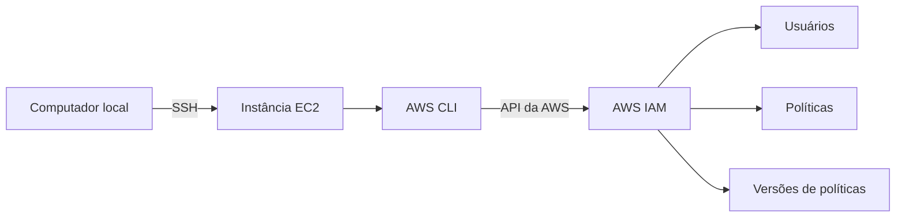
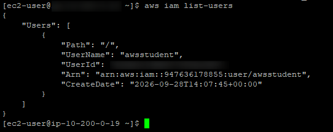
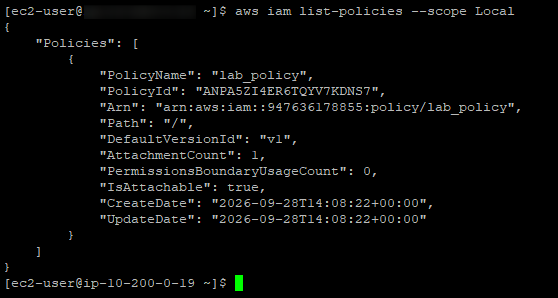

# Lab — AWS CLI, EC2 e IAM

## Objetivo

Este laboratório teve como objetivo praticar a instalação e configuração da **AWS Command Line Interface (AWS CLI)** em uma instância EC2.

Ao final, a AWS CLI foi configurada para acessar a conta AWS utilizada no laboratório e utilizada para consultar recursos do **AWS Identity and Access Management (IAM)**, incluindo usuários e políticas.

Também foi realizada a recuperação da política `lab_policy` por meio da AWS CLI, utilizando sua versão padrão e salvando o resultado em um arquivo JSON.

## Arquitetura

A infraestrutura utilizada neste laboratório consiste em uma instância EC2 acessada remotamente por meio de SSH.

A partir da instância, a AWS CLI foi instalada e configurada para realizar chamadas à conta AWS. Em seguida, a CLI foi utilizada para consultar informações do IAM, como usuários, políticas e versões de políticas.

A estrutura pode ser representada da seguinte forma:



## Serviços utilizados

- **Amazon EC2** — instância utilizada para executar a AWS CLI
- **AWS CLI** — ferramenta utilizada para interagir com os serviços da AWS por linha de comando
- **AWS IAM** — serviço utilizado para consultar usuários e políticas
- **SSH** — protocolo utilizado para acesso remoto à instância EC2

## Etapas realizadas

### 1. Conexão com a instância EC2

Foi estabelecida uma conexão SSH com a instância EC2 disponibilizada pelo laboratório.

Após a autenticação, foi possível acessar o terminal da instância e executar os comandos necessários para a realização das atividades.


### 2. Instalação da AWS CLI

A AWS CLI foi instalada diretamente na instância EC2.

Primeiramente, o instalador foi baixado utilizando o `curl`:

```bash
curl "https://awscli.amazonaws.com/awscli-exe-linux-x86_64.zip" -o "awscliv2.zip"
```

Em seguida, o arquivo foi descompactado:

```bash
unzip -u awscliv2.zip
```

A instalação foi realizada com:

```bash
sudo ./aws/install
```

Após a instalação, foi utilizado o comando abaixo para verificar se a AWS CLI estava disponível na instância:

```bash
aws --version
```

Também foi utilizado o comando `aws help` para verificar o funcionamento da ferramenta e consultar sua documentação diretamente pelo terminal:

```bash
aws help
```

### 3. Observação da configuração do IAM

Antes de utilizar a AWS CLI para realizar as consultas, foram observadas algumas configurações do IAM no AWS Management Console.

Entre as informações verificadas estavam:

- o usuário IAM utilizado no laboratório;
- a política `lab_policy`;
- a versão padrão da política;
- as credenciais utilizadas posteriormente na configuração da AWS CLI.

As credenciais utilizadas durante o laboratório não foram incluídas nesta documentação ou no repositório.

### 4. Configuração da AWS CLI

Após a instalação, a AWS CLI foi configurada para acessar a conta AWS utilizada no laboratório.

Para iniciar a configuração, foi executado:

```bash
aws configure
```

Foram informados os seguintes parâmetros:

```text
AWS Access Key ID
AWS Secret Access Key
Default region name: us-west-2
Default output format: json
```

As credenciais utilizadas nesta etapa não foram incluídas na documentação ou no repositório.

### 5. Consulta de usuários do IAM

Após a configuração da AWS CLI, foi realizado um teste de acesso ao IAM utilizando o comando:

```bash
aws iam list-users
```

O comando retorna os usuários IAM existentes na conta AWS em formato JSON.

O resultado confirmou que a AWS CLI estava corretamente configurada e conseguia realizar consultas ao serviço IAM.



### 6. Consulta das políticas IAM

Em seguida, foi realizada uma consulta às políticas gerenciadas pelo cliente utilizando:

```bash
aws iam list-policies --scope Local
```

O parâmetro `--scope Local` foi utilizado para filtrar as políticas gerenciadas pelo cliente.

No resultado, foi localizada a política `lab_policy`.

Entre as informações retornadas estavam:

- `PolicyName`
- `Arn`
- `DefaultVersionId`

A propriedade `DefaultVersionId` identifica a versão padrão da política e foi utilizada na etapa seguinte.



### 7. Recuperação da versão da `lab_policy`

Após identificar a política `lab_policy` e sua versão padrão, foi utilizado o comando `get-policy-version` para recuperar o documento da política em formato JSON.

O comando utilizado foi:

```bash
aws iam get-policy-version \
  --policy-arn arn:aws:iam::<AWS_ACCOUNT_ID>:policy/lab_policy \
  --version-id v1
```

A versão padrão identificada durante o laboratório foi `v1`.

O comando retornou as informações da versão da política, incluindo o documento JSON correspondente à `lab_policy`.


### 8. Salvamento da policy em formato JSON

Para salvar o resultado do comando em um arquivo, foi utilizado o operador `>`:

```bash
aws iam get-policy-version \
  --policy-arn arn:aws:iam::<AWS_ACCOUNT_ID>:policy/lab_policy \
  --version-id v1 \
  > lab_policy.json
```

O operador `>` redireciona a saída do comando para o arquivo `lab_policy.json`.

Após a execução, o arquivo pôde ser consultado com:

```bash
cat lab_policy.json
```

Dessa forma, a resposta obtida pela AWS CLI foi armazenada localmente em um arquivo JSON dentro da instância EC2.

## Resultado

Ao final do laboratório, foi possível instalar e configurar a AWS CLI em uma instância EC2 e utilizá-la para interagir com o AWS IAM.

Foram realizadas consultas de usuários e políticas, além da recuperação da versão da política `lab_policy` por meio da linha de comando.

O laboratório também demonstrou, na prática, como utilizar a AWS CLI para realizar operações que normalmente poderiam ser executadas por meio do AWS Management Console.
