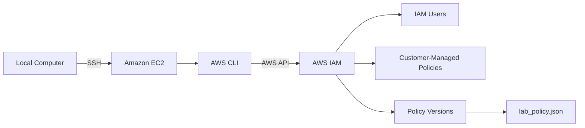
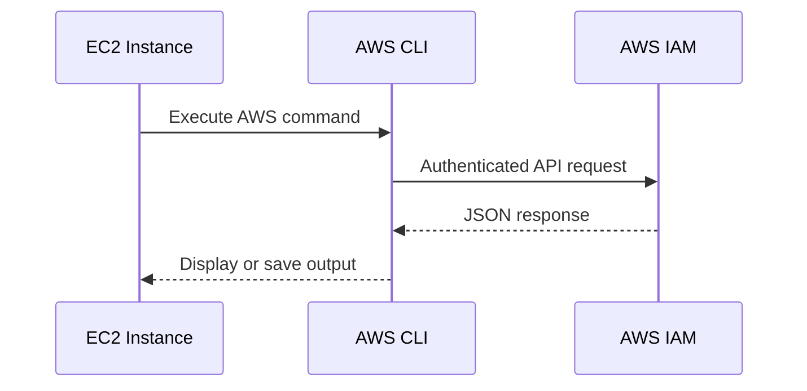
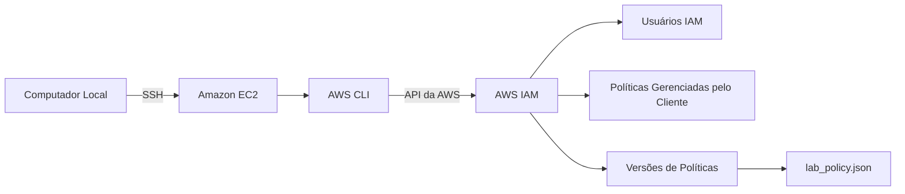
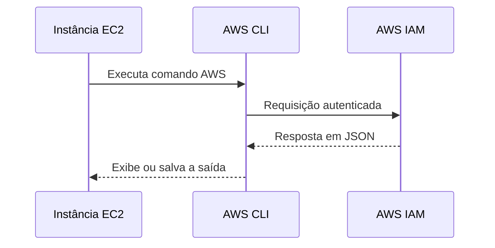

# Lab — AWS CLI, EC2, and IAM

[English](#english) · [Português](#português)

---

## English

## Objective

Practice using the **AWS Command Line Interface (AWS CLI)** from an Amazon EC2 instance to interact with AWS IAM resources.

The lab covered CLI installation and configuration, authenticated API requests, IAM resource queries, policy inspection, and saving AWS CLI output as a JSON file.

## Architecture

The EC2 instance acted as the command-line environment, using the AWS CLI to communicate with AWS IAM through AWS APIs.



## Access Model

| Component         | Role                                                |
| ----------------- | --------------------------------------------------- |
| Local computer    | Remote access to the EC2 instance                   |
| Amazon EC2        | Environment used to run AWS CLI commands            |
| AWS CLI           | Command-line interface for AWS API requests         |
| IAM               | Target service queried during the lab               |
| `lab_policy`      | Customer-managed policy inspected through the CLI   |
| `lab_policy.json` | Local JSON file containing the retrieved CLI output |

The AWS credentials used during the lab were not included in the repository or documentation.

## Services & Resources

| Service / Resource | Purpose                                        |
| ------------------ | ---------------------------------------------- |
| Amazon EC2         | Hosts the CLI environment                      |
| AWS CLI            | Executes authenticated AWS API commands        |
| AWS IAM            | Provides users, policies, and policy versions  |
| SSH                | Provides remote access to EC2                  |
| JSON               | Format used for AWS CLI output and policy data |

## Implementation

### 1. Remote Access

An SSH connection was established with the EC2 instance provided by the lab.


### 2. AWS CLI Installation

The AWS CLI was installed on the EC2 instance and verified after installation.

```bash
curl "https://awscli.amazonaws.com/awscli-exe-linux-x86_64.zip" -o "awscliv2.zip"
unzip -u awscliv2.zip
sudo ./aws/install
```

The installation was validated with:

```bash
aws --version
```

The CLI help system was also accessed directly from the terminal:

```bash
aws help
```

### 3. IAM and CLI Configuration

The IAM configuration used by the lab was reviewed before configuring the CLI, including the IAM user, the `lab_policy` policy, and its default version.

The AWS CLI was then configured with:

```bash
aws configure
```

The configuration included:

| Parameter         | Value                   |
| ----------------- | ----------------------- |
| Access Key ID     | Lab-provided credential |
| Secret Access Key | Lab-provided credential |
| Default region    | `us-west-2`             |
| Output format     | `json`                  |

Credentials were intentionally omitted from the documentation.

### 4. Querying IAM Users

The CLI was used to perform an authenticated IAM request:

```bash
aws iam list-users
```

The command returned the IAM users available to the configured AWS account in JSON format.


### 5. Querying Customer-Managed Policies

Customer-managed policies were queried with:

```bash
aws iam list-policies --scope Local
```

The `--scope Local` parameter limits the result to policies managed within the AWS account.

The `lab_policy` policy was identified from the returned data.

Relevant properties included:

* `PolicyName`
* `Arn`
* `DefaultVersionId`


### 6. Inspecting the Policy Version

The default version of `lab_policy` was retrieved using:

```bash
aws iam get-policy-version \
  --policy-arn arn:aws:iam::<AWS_ACCOUNT_ID>:policy/lab_policy \
  --version-id v1
```

The returned data included the policy document in JSON format.


### 7. Exporting CLI Output

The policy response was redirected to a local JSON file:

```bash
aws iam get-policy-version \
  --policy-arn arn:aws:iam::<AWS_ACCOUNT_ID>:policy/lab_policy \
  --version-id v1 \
  > lab_policy.json
```

The resulting file was inspected with:

```bash
cat lab_policy.json
```

This demonstrated how AWS CLI output can be captured and reused as a local JSON artifact.

## Validation

The lab validated the complete CLI-to-IAM workflow:



The successful queries confirmed that:

* The AWS CLI was correctly installed.
* The CLI was configured with valid lab credentials.
* Authenticated IAM API requests could be performed.
* IAM users and customer-managed policies could be queried.
* A policy version could be retrieved and exported as JSON.

## Result

The AWS CLI was successfully installed and configured on an EC2 instance and used to interact with AWS IAM.

The lab demonstrated practical use of the CLI for **authenticated AWS API requests, IAM resource discovery, policy inspection, and JSON output handling**.

## Key Takeaways

* Installing and configuring the AWS CLI on Linux.
* Using EC2 as a remote administrative environment.
* Understanding the relationship between AWS CLI commands and AWS APIs.
* Querying IAM resources from the command line.
* Inspecting customer-managed policy versions.
* Working with JSON-formatted AWS responses.
* Redirecting CLI output to local files.

---

## Português

## Objetivo

Praticar a utilização da **AWS Command Line Interface (AWS CLI)** a partir de uma instância Amazon EC2 para interagir com recursos do AWS IAM.

O laboratório abordou a instalação e configuração da CLI, execução de requisições autenticadas à API da AWS, consultas de recursos do IAM, inspeção de políticas e salvamento das respostas da CLI em um arquivo JSON.

## Arquitetura

A instância EC2 foi utilizada como ambiente de linha de comando, executando a AWS CLI para se comunicar com o AWS IAM por meio das APIs da AWS.



## Modelo de Acesso

| Componente        | Função                                                      |
| ----------------- | ----------------------------------------------------------- |
| Computador local  | Acesso remoto à instância EC2                               |
| Amazon EC2        | Ambiente utilizado para executar a AWS CLI                  |
| AWS CLI           | Interface de linha de comando para requisições à API da AWS |
| IAM               | Serviço consultado durante o laboratório                    |
| `lab_policy`      | Política gerenciada pelo cliente inspecionada pela CLI      |
| `lab_policy.json` | Arquivo JSON contendo a saída recuperada pela CLI           |

As credenciais utilizadas durante o laboratório não foram incluídas no repositório ou na documentação.

## Serviços e Recursos

| Serviço / Recurso | Finalidade                                                           |
| ----------------- | -------------------------------------------------------------------- |
| Amazon EC2        | Hospeda o ambiente da CLI                                            |
| AWS CLI           | Executa comandos autenticados da API da AWS                          |
| AWS IAM           | Fornece usuários, políticas e versões de políticas                   |
| SSH               | Fornece acesso remoto à EC2                                          |
| JSON              | Formato utilizado nas respostas da AWS CLI e nos dados das políticas |

## Implementação

### 1. Acesso Remoto

Foi estabelecida uma conexão SSH com a instância EC2 disponibilizada pelo laboratório.


### 2. Instalação da AWS CLI

A AWS CLI foi instalada na instância EC2 e sua instalação foi validada posteriormente.

```bash
curl "https://awscli.amazonaws.com/awscli-exe-linux-x86_64.zip" -o "awscliv2.zip"
unzip -u awscliv2.zip
sudo ./aws/install
```

A instalação foi validada com:

```bash
aws --version
```

Também foi utilizado o sistema de ajuda da CLI diretamente pelo terminal:

```bash
aws help
```

### 3. Configuração do IAM e da CLI

Antes da configuração da CLI, foram observados os recursos IAM utilizados pelo laboratório, incluindo o usuário IAM, a política `lab_policy` e sua versão padrão.

Em seguida, a AWS CLI foi configurada com:

```bash
aws configure
```

A configuração utilizada foi:

| Parâmetro         | Valor                                 |
| ----------------- | ------------------------------------- |
| Access Key ID     | Credencial fornecida pelo laboratório |
| Secret Access Key | Credencial fornecida pelo laboratório |
| Default region    | `us-west-2`                           |
| Output format     | `json`                                |

As credenciais foram omitidas da documentação.

### 4. Consulta de Usuários IAM

A CLI foi utilizada para realizar uma requisição autenticada ao IAM:

```bash
aws iam list-users
```

O comando retornou os usuários IAM disponíveis para a conta AWS configurada em formato JSON.


### 5. Consulta de Políticas Gerenciadas pelo Cliente

As políticas gerenciadas pelo cliente foram consultadas com:

```bash
aws iam list-policies --scope Local
```

O parâmetro `--scope Local` limita o resultado às políticas gerenciadas dentro da própria conta AWS.

A política `lab_policy` foi identificada no resultado.

Entre as propriedades relevantes estavam:

* `PolicyName`
* `Arn`
* `DefaultVersionId`


### 6. Inspeção da Versão da Política

A versão padrão da `lab_policy` foi recuperada utilizando:

```bash
aws iam get-policy-version \
  --policy-arn arn:aws:iam::<AWS_ACCOUNT_ID>:policy/lab_policy \
  --version-id v1
```

A resposta retornou o documento da política em formato JSON.


### 7. Exportação da Saída da CLI

A resposta da política foi redirecionada para um arquivo JSON local:

```bash
aws iam get-policy-version \
  --policy-arn arn:aws:iam::<AWS_ACCOUNT_ID>:policy/lab_policy \
  --version-id v1 \
  > lab_policy.json
```

O arquivo resultante foi consultado com:

```bash
cat lab_policy.json
```

Essa etapa demonstrou como a saída da AWS CLI pode ser capturada e reutilizada como um artefato JSON local.

## Validação

O laboratório validou o fluxo completo entre a CLI e o IAM:



Os testes confirmaram que:

* A AWS CLI foi instalada corretamente.
* A CLI foi configurada com credenciais válidas do laboratório.
* Foi possível realizar requisições autenticadas ao IAM.
* Usuários e políticas gerenciadas pelo cliente puderam ser consultados.
* Uma versão de política pôde ser recuperada e exportada em JSON.

## Resultado

A AWS CLI foi instalada e configurada com sucesso em uma instância EC2 e utilizada para interagir com o AWS IAM.

O laboratório demonstrou o uso prático da CLI para **requisições autenticadas à API da AWS, descoberta de recursos IAM, inspeção de políticas e manipulação de saídas em JSON**.

## Principais Aprendizados

* Instalação e configuração da AWS CLI em Linux.
* Utilização da EC2 como ambiente remoto de administração.
* Relação entre comandos da AWS CLI e as APIs da AWS.
* Consulta de recursos IAM pela linha de comando.
* Inspeção de versões de políticas gerenciadas pelo cliente.
* Manipulação de respostas AWS em formato JSON.
* Redirecionamento da saída da CLI para arquivos locais.
