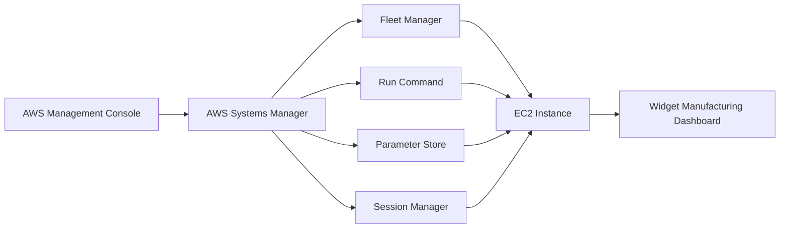
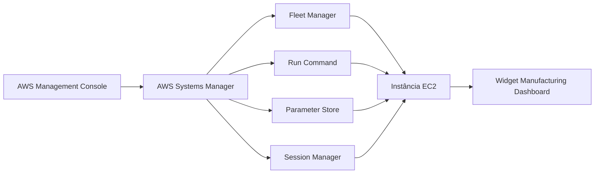

# Lab — AWS Systems Manager

[English](#english) · [Português](#português)

---

## English

## Objective

The objective of this lab was to practice using **AWS Systems Manager** to manage and interact with an Amazon EC2 instance without relying on traditional remote access through SSH.

During the lab, Systems Manager capabilities were used to collect instance inventory information, execute commands remotely, manage application settings through Parameter Store, and access the instance through Session Manager.

The lab also demonstrated how Systems Manager can be used to manage an application running on an EC2 instance through centralized management capabilities.

## Architecture

The infrastructure used in this lab consisted of an EC2 instance running inside a VPC and managed through AWS Systems Manager.

Systems Manager was used to perform inventory collection, execute commands through Run Command, manage an application parameter through Parameter Store, and establish an interactive session through Session Manager.

The architecture can be represented as follows:



## Services and Resources Used

* **Amazon EC2** — instance managed through AWS Systems Manager
* **AWS Systems Manager** — service used to centrally manage and interact with the EC2 instance
* **Fleet Manager** — capability used to collect and review instance inventory information
* **Run Command** — capability used to execute commands on the managed instance
* **Parameter Store** — capability used to store an application configuration parameter
* **Session Manager** — capability used to access the instance through a browser-based shell
* **Amazon VPC** — network environment containing the EC2 instance

## Steps Performed

### 1. Creating an Inventory Association

The first task was to configure **Inventory** in AWS Systems Manager.

An inventory association named `Inventory-Association` was created for the managed EC2 instance.

The association was configured to collect information about software and settings installed on the instance.


After the inventory association was created, the instance's inventory information was accessed through Fleet Manager.

The Inventory tab displayed information about applications installed on the instance and other available inventory types.


This allowed the instance configuration and installed applications to be reviewed through Systems Manager without connecting to the instance through SSH.

### 2. Installing the Dashboard Application with Run Command

The second task was to use **Run Command** to install the Widget Manufacturing Dashboard application on the managed EC2 instance.

A pre-configured Systems Manager document was selected to install the application.

The command was configured to run against the managed instance, and the option to store command output in an S3 bucket was left disabled.

The Run Command operation installed the components required by the application, including:

* Apache web server
* PHP
* AWS SDK
* Widget Manufacturing Dashboard application

After the command completed successfully, the application's public IP address was used to access the dashboard through a web browser.


The dashboard was successfully installed and made available through the web server running on the EC2 instance.

This demonstrated how Run Command can be used to perform application installation and configuration tasks without requiring an SSH connection to the instance.

### 3. Managing Application Settings with Parameter Store

The third task was to use **Parameter Store** to manage an application setting.

A parameter named:

```text
/dashboard/show-beta-features
```

was created with the following configuration:

```text
Description: Display beta features
Type: String
Value: True
```

The parameter was used by the Widget Manufacturing Dashboard to determine whether an additional beta feature should be displayed.

After creating the parameter, the application page was refreshed.

The dashboard then displayed the additional chart associated with the beta feature.


This demonstrated how Parameter Store can be used to manage application configuration without directly modifying the application running on the EC2 instance.

### 4. Accessing the Instance with Session Manager

The final task was to access the EC2 instance through **Session Manager**.

A new Session Manager session was started for the managed instance, providing a browser-based command-line interface.

The following command was used to list the application files stored in the web server directory:

```bash
ls /var/www/html
```

The instance was also queried through the AWS CLI from inside the Session Manager session.

The AWS Region was obtained from the EC2 instance metadata:

```bash
# Get region
AZ=`curl -s http://169.254.169.254/latest/meta-data/placement/availability-zone`
export AWS_DEFAULT_REGION=${AZ::-1}
```

The following command was then used to retrieve information about the EC2 instances:

```bash
# List information about EC2 instances
aws ec2 describe-instances
```

The command returned information about the EC2 instance in JSON format.


This demonstrated that the instance could be accessed and managed through Session Manager without establishing an SSH connection.

## Result

At the end of the lab, it was possible to use AWS Systems Manager to manage and interact with an EC2 instance through multiple capabilities.

The lab included:

* creating an inventory association and reviewing instance information;
* installing an application using Run Command;
* managing an application setting using Parameter Store;
* accessing the instance through Session Manager;
* executing Linux and AWS CLI commands through the Session Manager shell.

The lab provided practical experience with centralized EC2 management through AWS Systems Manager and demonstrated alternatives to traditional SSH-based instance administration.

---

## Português

## Objetivo

Este laboratório teve como objetivo praticar a utilização do **AWS Systems Manager** para gerenciar e interagir com uma instância Amazon EC2 sem depender do acesso remoto tradicional por SSH.

Durante o laboratório, foram utilizadas funcionalidades do Systems Manager para coletar informações de inventário da instância, executar comandos remotamente, gerenciar configurações da aplicação por meio do Parameter Store e acessar a instância através do Session Manager.

O laboratório também demonstrou como o Systems Manager pode ser utilizado para gerenciar uma aplicação executada em uma instância EC2 por meio de recursos de gerenciamento centralizado.

## Arquitetura

A infraestrutura utilizada neste laboratório consistiu em uma instância EC2 executada dentro de uma VPC e gerenciada por meio do AWS Systems Manager.

O Systems Manager foi utilizado para realizar a coleta de informações de inventário, executar comandos por meio do Run Command, gerenciar um parâmetro da aplicação através do Parameter Store e estabelecer uma sessão interativa por meio do Session Manager.

A arquitetura pode ser representada da seguinte forma:



## Serviços e Recursos Utilizados

* **Amazon EC2** — instância gerenciada por meio do AWS Systems Manager
* **AWS Systems Manager** — serviço utilizado para gerenciar e interagir centralmente com a instância EC2
* **Fleet Manager** — funcionalidade utilizada para coletar e consultar informações de inventário da instância
* **Run Command** — funcionalidade utilizada para executar comandos na instância gerenciada
* **Parameter Store** — funcionalidade utilizada para armazenar um parâmetro de configuração da aplicação
* **Session Manager** — funcionalidade utilizada para acessar a instância por meio de um shell baseado no navegador
* **Amazon VPC** — ambiente de rede no qual a instância EC2 estava localizada

## Etapas Realizadas

### 1. Criação da Associação de Inventário

A primeira etapa consistiu em configurar o **Inventory** no AWS Systems Manager.

Foi criada uma associação de inventário denominada `Inventory-Association` para a instância EC2 gerenciada.

A associação foi configurada para coletar informações sobre os softwares e configurações da instância.


Após a criação da associação de inventário, as informações da instância foram acessadas por meio do Fleet Manager.

Na aba Inventory, foram exibidas informações sobre as aplicações instaladas na instância e sobre os demais tipos de inventário disponíveis.


Dessa forma, foi possível consultar a configuração da instância e as aplicações instaladas por meio do Systems Manager sem a necessidade de estabelecer uma conexão SSH com a instância.

### 2. Instalação da Aplicação de Dashboard com Run Command

A segunda etapa consistiu na utilização do **Run Command** para instalar a aplicação Widget Manufacturing Dashboard na instância EC2 gerenciada.

Foi selecionado um documento pré-configurado do Systems Manager para realizar a instalação da aplicação.

O comando foi configurado para ser executado na instância gerenciada, mantendo desabilitada a opção de armazenar a saída do comando em um bucket S3.

A execução do Run Command instalou os componentes necessários para a aplicação, incluindo:

* servidor web Apache;
* PHP;
* AWS SDK;
* aplicação Widget Manufacturing Dashboard.

Após a conclusão bem-sucedida do comando, o endereço IP público da aplicação foi utilizado para acessar o dashboard por meio de um navegador.


A aplicação foi instalada com sucesso e disponibilizada por meio do servidor web executado na instância EC2.

Essa etapa demonstrou como o Run Command pode ser utilizado para realizar tarefas de instalação e configuração de aplicações sem a necessidade de uma conexão SSH com a instância.

### 3. Gerenciamento das Configurações da Aplicação com Parameter Store

A terceira etapa consistiu na utilização do **Parameter Store** para gerenciar uma configuração da aplicação.

Foi criado o seguinte parâmetro:

```text
/dashboard/show-beta-features
```

com a seguinte configuração:

```text
Description: Display beta features
Type: String
Value: True
```

O parâmetro foi utilizado pelo Widget Manufacturing Dashboard para determinar se uma funcionalidade adicional em versão beta deveria ser exibida.

Após a criação do parâmetro, a página da aplicação foi atualizada.

O dashboard passou então a exibir o gráfico adicional associado à funcionalidade beta.


Essa etapa demonstrou como o Parameter Store pode ser utilizado para gerenciar configurações de uma aplicação sem modificar diretamente a aplicação executada na instância EC2.

### 4. Acesso à Instância com Session Manager

A última etapa consistiu em acessar a instância EC2 por meio do **Session Manager**.

Foi iniciada uma nova sessão do Session Manager para a instância gerenciada, disponibilizando uma interface de linha de comando diretamente pelo navegador.

O seguinte comando foi utilizado para listar os arquivos da aplicação armazenados no diretório do servidor web:

```bash
ls /var/www/html
```

Também foi realizada uma consulta à instância utilizando a AWS CLI a partir da sessão do Session Manager.

A região da instância foi obtida por meio dos metadados da instância EC2:

```bash
# Get region
AZ=`curl -s http://169.254.169.254/latest/meta-data/placement/availability-zone`
export AWS_DEFAULT_REGION=${AZ::-1}
```

Em seguida, foi utilizado o comando abaixo para obter informações sobre as instâncias EC2:

```bash
# List information about EC2 instances
aws ec2 describe-instances
```

O comando retornou informações sobre a instância EC2 em formato JSON.


Essa etapa demonstrou que a instância pode ser acessada e administrada por meio do Session Manager sem a necessidade de estabelecer uma conexão SSH.

## Resultado

Ao final do laboratório, foi possível utilizar o AWS Systems Manager para gerenciar e interagir com uma instância EC2 por meio de diferentes funcionalidades.

O laboratório incluiu:

* criação de uma associação de inventário e consulta das informações da instância;
* instalação de uma aplicação utilizando o Run Command;
* gerenciamento de uma configuração da aplicação utilizando o Parameter Store;
* acesso à instância por meio do Session Manager;
* execução de comandos Linux e AWS CLI através do shell do Session Manager.

O laboratório proporcionou experiência prática com o gerenciamento centralizado de instâncias EC2 por meio do AWS Systems Manager e demonstrou alternativas à administração tradicional de instâncias baseada em SSH.
