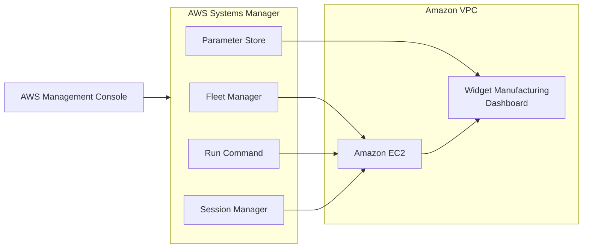
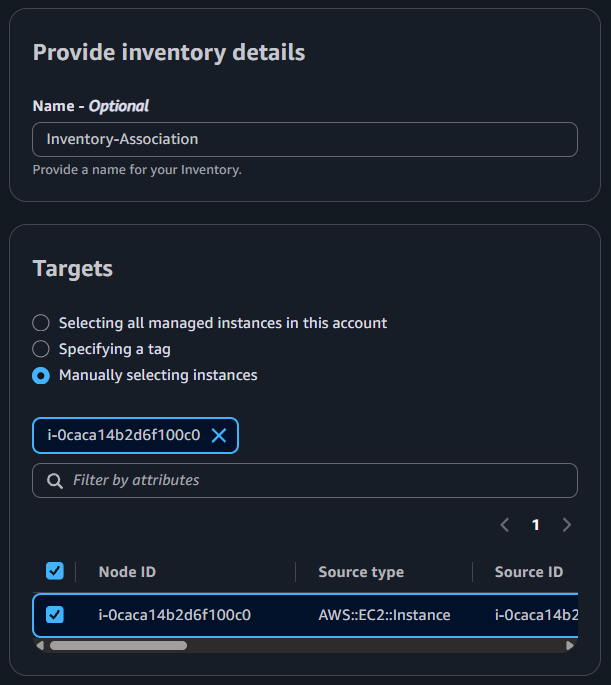
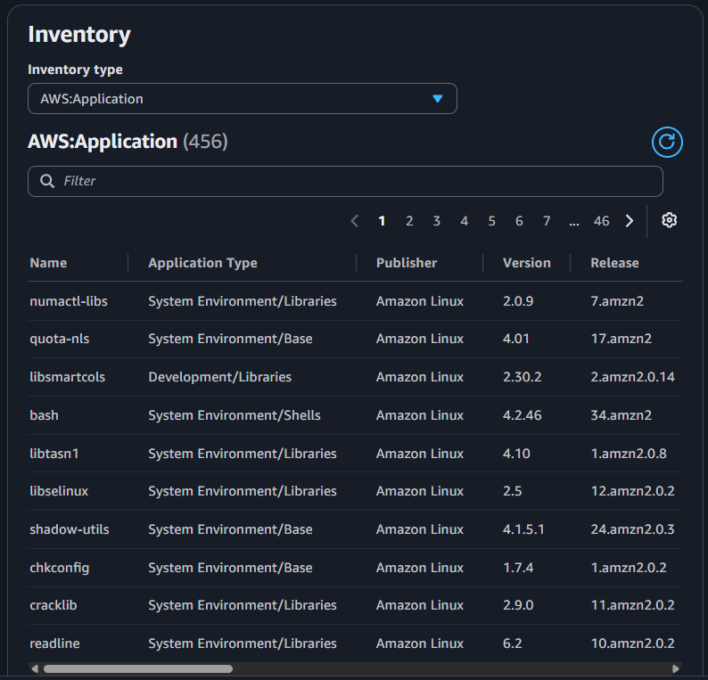
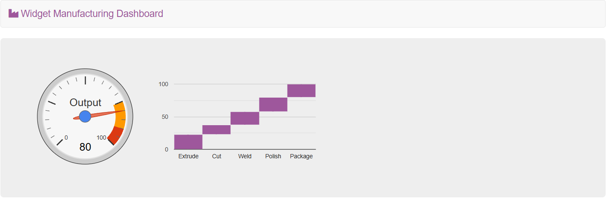
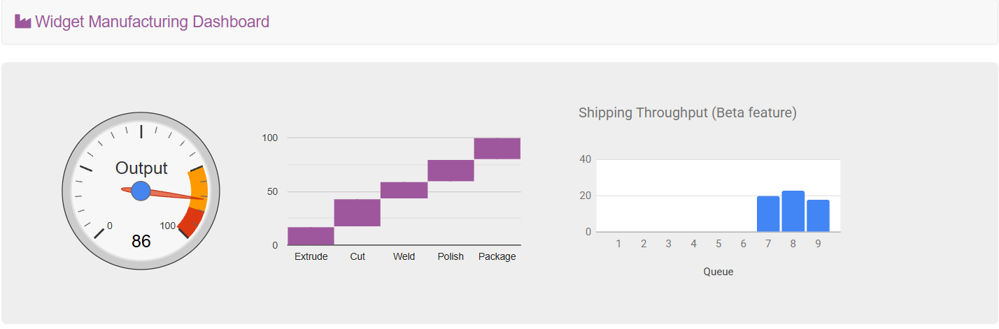
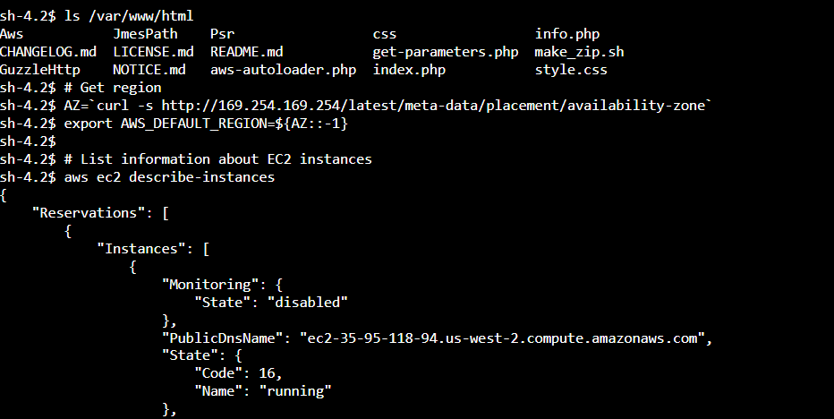
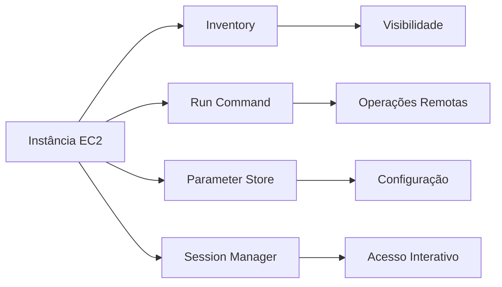

# Lab — AWS Systems Manager

[English](#english) · [Português](#português)

---

## English

## Objective

Practice using **AWS Systems Manager** to manage an Amazon EC2 instance without relying on traditional SSH access.

The lab explored multiple Systems Manager capabilities for **instance inventory, remote command execution, application configuration, and interactive access**, while deploying and configuring the Widget Manufacturing Dashboard.

## Architecture

The EC2 instance was managed through Systems Manager capabilities instead of requiring direct SSH access.



### Management Model

| Capability                     | Purpose                                      |
| ------------------------------ | -------------------------------------------- |
| Fleet Manager / Inventory      | Collect and inspect instance information     |
| Run Command                    | Execute administrative commands remotely     |
| Parameter Store                | Manage application configuration             |
| Session Manager                | Provide interactive shell access without SSH |
| EC2                            | Managed compute resource                     |
| Widget Manufacturing Dashboard | Application deployed during the lab          |

This model demonstrates centralized management of an EC2 instance through AWS Systems Manager rather than depending exclusively on network-based remote access.

## Services & Resources

| Service / Resource             | Purpose                                        |
| ------------------------------ | ---------------------------------------------- |
| Amazon EC2                     | Managed compute instance                       |
| AWS Systems Manager            | Central management service                     |
| Fleet Manager / Inventory      | Instance and software inventory                |
| Run Command                    | Remote command execution                       |
| Parameter Store                | Application configuration                      |
| Session Manager                | Interactive instance access                    |
| Amazon VPC                     | Network environment                            |
| Widget Manufacturing Dashboard | Application used to validate the configuration |

## Implementation

### 1. Instance Inventory

An Inventory association named `Inventory-Association` was created for the managed EC2 instance.

The association was configured to collect information about installed software and instance configuration.



The collected information was then reviewed through Fleet Manager, including installed applications and other available inventory data.



This provided visibility into the instance configuration without requiring an SSH connection.

### 2. Application Deployment with Run Command

**Run Command** was used to deploy the Widget Manufacturing Dashboard to the managed EC2 instance.

A pre-configured Systems Manager document was executed against the instance. The operation installed the application components, including:

* Apache web server.
* PHP.
* AWS SDK.
* Widget Manufacturing Dashboard.

The command completed successfully and the application became accessible through the instance's public IP address.



This demonstrated how Run Command can automate administrative and application deployment tasks on managed instances.

### 3. Application Configuration with Parameter Store

A Parameter Store entry was created to control an application feature:

```text
/dashboard/show-beta-features
```

Configuration:

| Parameter   | Value                 |
| ----------- | --------------------- |
| Description | Display beta features |
| Type        | String                |
| Value       | `True`                |

The dashboard consumed this parameter to determine whether the beta feature should be displayed.

After the parameter was created, the application was refreshed and the additional chart became visible.



This demonstrated how application configuration can be managed externally through Parameter Store instead of directly modifying application files.

### 4. Interactive Access with Session Manager

**Session Manager** was used to establish an interactive shell session with the EC2 instance.

The application files were inspected with:

```bash
ls /var/www/html
```

The AWS CLI was also used from inside the Session Manager session.

The instance Availability Zone metadata was used to determine the AWS Region:

```bash
AZ=`curl -s http://169.254.169.254/latest/meta-data/placement/availability-zone`
export AWS_DEFAULT_REGION=${AZ::-1}
```

The EC2 API was then queried with:

```bash
aws ec2 describe-instances
```

The command returned instance information in JSON format.



This validated that the instance could be administrated through Session Manager without establishing an SSH connection.

## Management Workflow

The lab demonstrated four complementary Systems Manager capabilities:


Together, these capabilities provide a management workflow covering **visibility, automation, configuration, and administrative access**.

## Validation

The final validation confirmed that:

* Instance inventory could be collected and reviewed.
* Commands could be executed remotely through Run Command.
* The dashboard could be deployed without an SSH session.
* Application behavior could be changed through Parameter Store.
* An interactive shell could be established through Session Manager.
* Linux and AWS CLI commands could be executed from the managed instance.

## Result

The EC2 instance was successfully managed through multiple **AWS Systems Manager** capabilities without relying on traditional SSH access.

The lab demonstrated practical use of Systems Manager for **inventory management, remote operations, application configuration, and secure interactive access**, while deploying and configuring a web application.

## Key Takeaways

* Managing EC2 instances through AWS Systems Manager.
* Collecting software and instance inventory.
* Executing remote administrative tasks with Run Command.
* Separating application configuration from application files with Parameter Store.
* Accessing EC2 through Session Manager without SSH.
* Using AWS CLI from a Systems Manager session.
* Understanding Systems Manager as a centralized operational management layer.

---

## Português

## Objetivo

Praticar a utilização do **AWS Systems Manager** para gerenciar uma instância Amazon EC2 sem depender do acesso tradicional por SSH.

O laboratório explorou diferentes funcionalidades do Systems Manager para **inventário da instância, execução remota de comandos, configuração de aplicações e acesso interativo**, além da implantação e configuração do Widget Manufacturing Dashboard.

## Arquitetura

A instância EC2 foi gerenciada por meio das funcionalidades do Systems Manager, sem depender de uma conexão SSH direta.


### Modelo de Gerenciamento

| Funcionalidade                 | Finalidade                                    |
| ------------------------------ | --------------------------------------------- |
| Fleet Manager / Inventory      | Coletar e consultar informações da instância  |
| Run Command                    | Executar comandos administrativos remotamente |
| Parameter Store                | Gerenciar configurações da aplicação          |
| Session Manager                | Fornecer acesso interativo sem SSH            |
| EC2                            | Recurso computacional gerenciado              |
| Widget Manufacturing Dashboard | Aplicação implantada durante o laboratório    |

Esse modelo demonstra o gerenciamento centralizado de uma instância EC2 por meio do AWS Systems Manager, reduzindo a dependência de acesso remoto baseado diretamente em rede.

## Serviços e Recursos

| Serviço / Recurso              | Finalidade                                      |
| ------------------------------ | ----------------------------------------------- |
| Amazon EC2                     | Instância computacional gerenciada              |
| AWS Systems Manager            | Serviço central de gerenciamento                |
| Fleet Manager / Inventory      | Inventário da instância e dos softwares         |
| Run Command                    | Execução remota de comandos                     |
| Parameter Store                | Configuração da aplicação                       |
| Session Manager                | Acesso interativo à instância                   |
| Amazon VPC                     | Ambiente de rede                                |
| Widget Manufacturing Dashboard | Aplicação utilizada para validar a configuração |

## Implementação

### 1. Inventário da Instância

Foi criada uma associação de Inventory denominada `Inventory-Association` para a instância EC2 gerenciada.

A associação foi configurada para coletar informações sobre os softwares instalados e a configuração da instância.


As informações coletadas foram posteriormente consultadas por meio do Fleet Manager, incluindo aplicações instaladas e outros dados de inventário disponíveis.


Isso permitiu obter visibilidade sobre a configuração da instância sem estabelecer uma conexão SSH.

### 2. Implantação da Aplicação com Run Command

O **Run Command** foi utilizado para instalar o Widget Manufacturing Dashboard na instância EC2 gerenciada.

Um documento pré-configurado do Systems Manager foi executado na instância. A operação instalou os componentes necessários, incluindo:

* Servidor web Apache.
* PHP.
* AWS SDK.
* Widget Manufacturing Dashboard.

O comando foi concluído com sucesso e a aplicação ficou disponível por meio do endereço IP público da instância.


Essa etapa demonstrou como o Run Command pode automatizar tarefas administrativas e de implantação de aplicações em instâncias gerenciadas.

### 3. Configuração da Aplicação com Parameter Store

Foi criado um parâmetro no Parameter Store para controlar uma funcionalidade da aplicação:

```text
/dashboard/show-beta-features
```

Configuração:

| Parâmetro   | Valor                 |
| ----------- | --------------------- |
| Description | Display beta features |
| Type        | String                |
| Value       | `True`                |

O dashboard utilizou esse parâmetro para determinar se a funcionalidade beta deveria ser exibida.

Após a criação do parâmetro, a aplicação foi atualizada e o gráfico adicional passou a ser exibido.


Essa etapa demonstrou como uma configuração da aplicação pode ser gerenciada externamente pelo Parameter Store sem alterar diretamente os arquivos da aplicação.

### 4. Acesso Interativo com Session Manager

O **Session Manager** foi utilizado para estabelecer uma sessão interativa com a instância EC2.

Os arquivos da aplicação foram consultados com:

```bash
ls /var/www/html
```

A AWS CLI também foi utilizada dentro da sessão do Session Manager.

Os metadados da Availability Zone da instância foram utilizados para determinar a região da AWS:

```bash
AZ=`curl -s http://169.254.169.254/latest/meta-data/placement/availability-zone`
export AWS_DEFAULT_REGION=${AZ::-1}
```

Em seguida, a API do EC2 foi consultada com:

```bash
aws ec2 describe-instances
```

O comando retornou informações sobre a instância em formato JSON.


Isso validou que a instância poderia ser administrada por meio do Session Manager sem estabelecer uma conexão SSH.

## Fluxo de Gerenciamento

O laboratório demonstrou quatro funcionalidades complementares do Systems Manager:



Em conjunto, essas funcionalidades fornecem um fluxo de gerenciamento que cobre **visibilidade, automação, configuração e acesso administrativo**.

## Validação

A validação final confirmou que:

* O inventário da instância pôde ser coletado e consultado.
* Comandos puderam ser executados remotamente pelo Run Command.
* O dashboard pôde ser implantado sem uma sessão SSH.
* O comportamento da aplicação pôde ser alterado através do Parameter Store.
* Uma sessão interativa pôde ser estabelecida pelo Session Manager.
* Comandos Linux e AWS CLI puderam ser executados dentro da instância gerenciada.

## Resultado

A instância EC2 foi gerenciada com sucesso por meio de diferentes funcionalidades do **AWS Systems Manager**, sem depender do acesso tradicional por SSH.

O laboratório demonstrou o uso prático do Systems Manager para **gerenciamento de inventário, operações remotas, configuração de aplicações e acesso interativo**, além da implantação e configuração de uma aplicação web.

## Principais Aprendizados

* Gerenciamento de instâncias EC2 utilizando AWS Systems Manager.
* Coleta de inventário de softwares e configurações.
* Execução de tarefas administrativas remotas com Run Command.
* Separação da configuração da aplicação dos arquivos da aplicação com Parameter Store.
* Acesso à EC2 através do Session Manager sem SSH.
* Utilização da AWS CLI dentro de uma sessão do Systems Manager.
* Compreensão do Systems Manager como uma camada centralizada de gerenciamento operacional.
