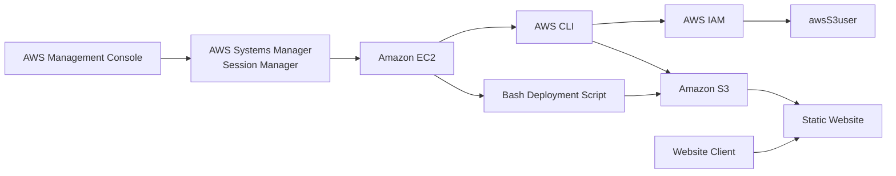
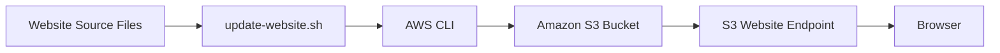
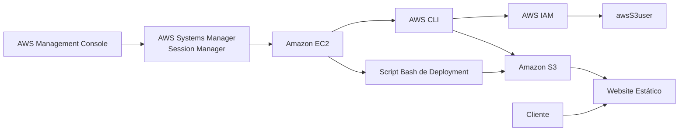
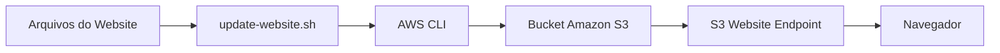

# Lab — Creating a Website on Amazon S3

[English](#english) · [Português](#português)

---

## English

## Objective

Practice deploying and updating a static website on **Amazon S3** using the **AWS CLI** from an Amazon EC2 instance.

The lab combined AWS CLI, IAM, S3 static website hosting, object permissions, and Bash scripting to create a repeatable website deployment workflow.

## Architecture

The EC2 instance served as the command-line environment. It was accessed through **AWS Systems Manager Session Manager** and used the AWS CLI to manage IAM and S3 resources.



### Deployment Model

| Component        | Role                               |
| ---------------- | ---------------------------------- |
| Amazon EC2       | CLI and deployment environment     |
| Session Manager  | Remote access without SSH          |
| AWS CLI          | IAM and S3 resource management     |
| IAM              | User and permission management     |
| Amazon S3        | Static website storage and hosting |
| Bash             | Repeatable website deployment      |
| Website endpoint | Access point for the deployed site |

## Services & Resources

| Service / Resource                  | Purpose                                              |
| ----------------------------------- | ---------------------------------------------------- |
| Amazon EC2                          | Provides the Linux environment used for deployment   |
| AWS Systems Manager Session Manager | Provides browser-based access to EC2                 |
| AWS CLI                             | Manages AWS resources from the command line          |
| AWS IAM                             | Creates and configures the S3 lab user               |
| Amazon S3                           | Stores and hosts the static website                  |
| S3 Static Website Hosting           | Publishes the website through an S3 website endpoint |
| S3 ACLs                             | Provides the public-read permissions used by the lab |
| Bash                                | Automates repeated website uploads                   |

## Implementation

### 1. CLI Environment

The Amazon Linux EC2 instance was accessed through **Systems Manager Session Manager**.

The `ec2-user` account was used as the working environment:

```bash id="r7s4q1"
sudo su -l ec2-user
pwd
```

The AWS CLI was already available on the instance and was configured for the lab environment:

```bash id="u2m9c8"
aws configure
```

The configuration used the `us-west-2` region and JSON as the default output format.

Credentials were intentionally omitted from the documentation.

### 2. S3 Bucket Creation

An S3 bucket was created in `us-west-2` using the AWS CLI:

```bash id="m5v2kd"
aws s3api create-bucket \
  --bucket laisrdrgs17 \
  --region us-west-2 \
  --create-bucket-configuration LocationConstraint=us-west-2
```

The bucket became the storage and hosting location for the static website.

### 3. IAM User and S3 Permissions

A dedicated IAM user named `awsS3user` was created for the lab.

The user was configured with the AWS-managed `AmazonS3FullAccess` policy to allow S3 management through the AWS Management Console.

```bash id="p8n4hz"
aws iam create-user --user-name awsS3user

aws iam attach-user-policy \
  --policy-arn arn:aws:iam::aws:policy/AmazonS3FullAccess \
  --user-name awsS3user
```

The `AmazonS3FullAccess` permission was used specifically to satisfy the lab exercise and is intentionally broader than a least-privilege production configuration.

### 4. Public Website Configuration

The S3 bucket was configured for the static website deployment used in the lab.

The relevant settings were:

| Setting                | Lab Configuration |
| ---------------------- | ----------------- |
| Static website hosting | Enabled           |
| Index document         | `index.html`      |
| Block Public Access    | Disabled          |
| Object Ownership       | ACLs enabled      |
| Object access          | Public read       |

These settings allowed the uploaded website objects to be accessed through the S3 website endpoint.

### 5. Website Files

The provided website archive was extracted on the EC2 instance:

```bash id="v0s6ye"
cd ~/sysops-activity-files
tar xvzf static-website-v2.tar.gz
cd static-website
ls
```

The website contained:

```text
css/
images/
index.html
```


### 6. Website Deployment

Static website hosting was configured with `index.html` as the entry point:

```bash id="a6q3wb"
aws s3 website s3://laisrdrgs17/ --index-document index.html
```

The website files were then uploaded recursively:

```bash id="c1n8yp"
aws s3 cp \
  /home/ec2-user/sysops-activity-files/static-website/ \
  s3://laisrdrgs17/ \
  --recursive \
  --acl public-read
```

The bucket contents were validated with:

```bash id="z4m7fx"
aws s3 ls s3://laisrdrgs17/
```

The resulting website was accessed through the S3 website endpoint.


### 7. Deployment Automation with Bash

A Bash script named `update-website.sh` was created to make subsequent website uploads repeatable.

```bash id="k9p3dt"
#!/bin/bash
aws s3 cp /home/ec2-user/sysops-activity-files/static-website/ \
  s3://laisrdrgs17/ \
  --recursive \
  --acl public-read
```

The script was made executable:

```bash id="x5r2vc"
chmod +x update-website.sh
```

It could then be executed with:

```bash id="n3q8la"
./update-website.sh
```

This converted the manual upload process into a simple repeatable deployment step.

### 8. Website Update

The local `index.html` file was modified to change the website's background colors.


The updated website was deployed by running:

```bash id="w6h1zs"
./update-website.sh
```

After refreshing the S3 website endpoint, the updated version of the Café website was displayed.

## Deployment Workflow

The complete workflow can be summarized as:



The Bash script provided a basic deployment automation layer between the local website source and the S3-hosted application.

## Validation

The deployment was validated by confirming that:

* The S3 bucket was created successfully.
* Website files were uploaded to the bucket.
* Static website hosting was enabled.
* The Café website was accessible through the S3 website endpoint.
* The deployment script successfully uploaded subsequent changes.
* A modification to `index.html` was reflected in the deployed website.

## Result

A static website was successfully deployed and updated on **Amazon S3 using the AWS CLI** from an EC2-based Linux environment.

The lab demonstrated an end-to-end workflow involving **IAM permissions, S3 configuration, static website hosting, object access control, AWS CLI operations, and Bash-based deployment automation**.

## Key Takeaways

* Managing Amazon S3 resources through the AWS CLI.
* Creating and configuring S3 static website hosting.
* Understanding the relationship between IAM permissions and AWS CLI operations.
* Working with S3 object permissions and ACLs in a lab environment.
* Deploying static website files to Amazon S3.
* Using Bash to make repetitive deployment tasks reproducible.
* Updating a deployed website through a simple CLI-based workflow.

---

## Português

## Objetivo

Praticar o deployment e a atualização de um website estático no **Amazon S3** utilizando a **AWS CLI** a partir de uma instância Amazon EC2.

O laboratório combinou AWS CLI, IAM, hospedagem de website estático no S3, permissões de objetos e scripting Bash para criar um fluxo repetível de deployment.

## Arquitetura

A instância EC2 foi utilizada como ambiente de linha de comando. O acesso foi realizado por meio do **AWS Systems Manager Session Manager**, enquanto a AWS CLI foi utilizada para gerenciar recursos do IAM e do S3.



### Modelo de Deployment

| Componente       | Função                                |
| ---------------- | ------------------------------------- |
| Amazon EC2       | Ambiente de CLI e deployment          |
| Session Manager  | Acesso remoto sem SSH                 |
| AWS CLI          | Gerenciamento de recursos IAM e S3    |
| IAM              | Gerenciamento de usuário e permissões |
| Amazon S3        | Armazenamento e hospedagem do website |
| Bash             | Deployment repetível do website       |
| Website endpoint | Ponto de acesso ao website publicado  |

## Serviços e Recursos

| Serviço / Recurso                   | Finalidade                                                          |
| ----------------------------------- | ------------------------------------------------------------------- |
| Amazon EC2                          | Fornece o ambiente Linux utilizado no deployment                    |
| AWS Systems Manager Session Manager | Fornece acesso baseado em navegador à EC2                           |
| AWS CLI                             | Gerencia recursos da AWS pela linha de comando                      |
| AWS IAM                             | Cria e configura o usuário do laboratório                           |
| Amazon S3                           | Armazena e hospeda o website estático                               |
| S3 Static Website Hosting           | Publica o website através de um endpoint do S3                      |
| S3 ACLs                             | Fornecem as permissões de leitura pública utilizadas no laboratório |
| Bash                                | Automatiza uploads repetitivos do website                           |

## Implementação

### 1. Ambiente de CLI

A instância Amazon Linux EC2 foi acessada por meio do **Systems Manager Session Manager**.

O usuário `ec2-user` foi utilizado como ambiente de trabalho:

```bash id="h4r8ny"
sudo su -l ec2-user
pwd
```

A AWS CLI já estava disponível na instância e foi configurada para o ambiente do laboratório:

```bash id="s7m2qx"
aws configure
```

A configuração utilizou a região `us-west-2` e JSON como formato de saída padrão.

As credenciais foram intencionalmente omitidas da documentação.

### 2. Criação do Bucket S3

Um bucket S3 foi criado na região `us-west-2` utilizando a AWS CLI:

```bash id="d5k9pv"
aws s3api create-bucket \
  --bucket laisrdrgs17 \
  --region us-west-2 \
  --create-bucket-configuration LocationConstraint=us-west-2
```

O bucket passou a ser utilizado como local de armazenamento e hospedagem do website estático.

### 3. Usuário IAM e Permissões do S3

Foi criado um usuário IAM dedicado denominado `awsS3user`.

O usuário recebeu a política gerenciada pela AWS `AmazonS3FullAccess` para permitir o gerenciamento de recursos S3 pelo AWS Management Console.

```bash id="q3w7mb"
aws iam create-user --user-name awsS3user

aws iam attach-user-policy \
  --policy-arn arn:aws:iam::aws:policy/AmazonS3FullAccess \
  --user-name awsS3user
```

A permissão `AmazonS3FullAccess` foi utilizada especificamente para atender ao exercício do laboratório e é mais ampla do que uma configuração de menor privilégio recomendada para produção.

### 4. Configuração do Website Público

O bucket S3 foi configurado para o deployment do website estático utilizado no laboratório.

As principais configurações foram:

| Configuração           | Configuração do Laboratório |
| ---------------------- | --------------------------- |
| Static website hosting | Habilitado                  |
| Index document         | `index.html`                |
| Block Public Access    | Desabilitado                |
| Object Ownership       | ACLs habilitadas            |
| Acesso aos objetos     | Leitura pública             |

Essas configurações permitiram que os objetos enviados fossem acessados por meio do endpoint de website do S3.

### 5. Arquivos do Website

O arquivo contendo os arquivos fornecidos pelo laboratório foi extraído na instância EC2:

```bash id="n8c4tz"
cd ~/sysops-activity-files
tar xvzf static-website-v2.tar.gz
cd static-website
ls
```

O website continha:

```text
css/
images/
index.html
```


### 6. Deployment do Website

A hospedagem de website estático foi configurada utilizando `index.html` como documento principal:

```bash id="b6m1zr"
aws s3 website s3://laisrdrgs17/ --index-document index.html
```

Os arquivos foram então enviados recursivamente para o bucket:

```bash id="t2q7wx"
aws s3 cp \
  /home/ec2-user/sysops-activity-files/static-website/ \
  s3://laisrdrgs17/ \
  --recursive \
  --acl public-read
```

O conteúdo do bucket foi validado com:

```bash id="y5n3kc"
aws s3 ls s3://laisrdrgs17/
```

O website resultante foi acessado através do endpoint de website do S3.


### 7. Automação do Deployment com Bash

Foi criado um script Bash chamado `update-website.sh` para tornar os uploads posteriores repetíveis.

```bash id="p4x8vs"
#!/bin/bash
aws s3 cp /home/ec2-user/sysops-activity-files/static-website/ \
  s3://laisrdrgs17/ \
  --recursive \
  --acl public-read
```

O script foi tornado executável:

```bash id="r9k2fd"
chmod +x update-website.sh
```

Em seguida, pôde ser executado com:

```bash id="w3c6hm"
./update-website.sh
```

Isso transformou o processo manual de upload em uma etapa simples e repetível de deployment.

### 8. Atualização do Website

O arquivo local `index.html` foi modificado para alterar as cores de fundo do website.


O website atualizado foi publicado executando:

```bash id="z8v1qn"
./update-website.sh
```

Após atualizar a página do endpoint do website S3, a nova versão do Café website foi exibida.

## Fluxo de Deployment

O fluxo completo pode ser representado da seguinte forma:



O script Bash forneceu uma camada básica de automação entre os arquivos locais do website e a aplicação hospedada no S3.

## Validação

O deployment foi validado confirmando que:

* O bucket S3 foi criado corretamente.
* Os arquivos do website foram enviados para o bucket.
* A hospedagem de website estático foi habilitada.
* O Café website ficou acessível através do endpoint do S3.
* O script de deployment conseguiu enviar alterações posteriores.
* Uma alteração no `index.html` foi refletida no website publicado.

## Resultado

Um website estático foi publicado e atualizado com sucesso no **Amazon S3 utilizando a AWS CLI** a partir de um ambiente Linux baseado em EC2.

O laboratório demonstrou um fluxo completo envolvendo **permissões IAM, configuração do S3, hospedagem de website estático, controle de acesso aos objetos, operações com AWS CLI e automação de deployment com Bash**.

## Principais Aprendizados

* Gerenciamento de recursos Amazon S3 utilizando a AWS CLI.
* Configuração de hospedagem de websites estáticos no S3.
* Relação entre permissões IAM e operações realizadas pela AWS CLI.
* Utilização de permissões e ACLs de objetos S3 em um ambiente de laboratório.
* Deployment de arquivos de website estático no Amazon S3.
* Utilização de Bash para tornar tarefas repetitivas de deployment reproduzíveis.
* Atualização de um website publicado através de um fluxo simples baseado em CLI.
