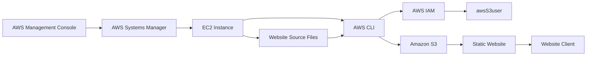
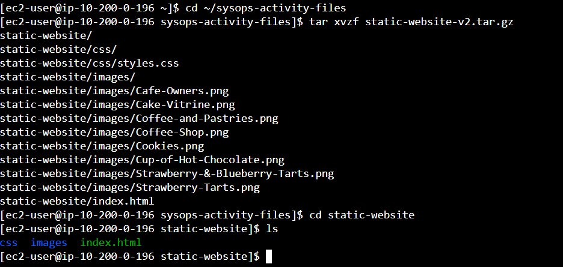
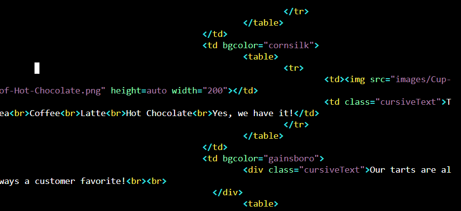
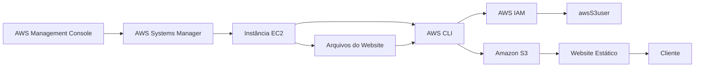

# Lab — Creating a Website on Amazon S3

[English](#english) · [Português](#português)

---

## English

## Objective

The objective of this lab was to practice using the **AWS Command Line Interface (AWS CLI)** from an Amazon EC2 instance to create and configure an Amazon S3 bucket and deploy a static website.

During the lab, AWS CLI commands were used to create an S3 bucket, create and configure an IAM user with full access to Amazon S3, configure the bucket for static website hosting, upload website files, and create a Bash script to make future website updates repeatable.

## Architecture

The lab used an Amazon Linux EC2 instance as the command-line environment and an Amazon S3 bucket to store and host the static website.

The EC2 instance was accessed through **AWS Systems Manager Session Manager**. From the EC2 instance, the AWS CLI was used to manage IAM and Amazon S3 resources.

The website files were uploaded to the S3 bucket and made available through the S3 website endpoint.



## Services and Resources Used

* **Amazon EC2** — Linux instance used as the command-line environment
* **AWS Systems Manager Session Manager** — used to access the EC2 instance through a browser-based shell
* **AWS CLI** — used to manage IAM and Amazon S3 resources
* **AWS IAM** — used to create and configure the `awsS3user` user
* **Amazon S3** — used to store the website files and host the static website
* **S3 Static Website Hosting** — used to make the website available through the S3 website endpoint
* **S3 Bucket ACLs** — used to grant public read access to uploaded website objects
* **Bash** — used to create a script for updating the website

## Steps Performed

### 1. Connecting to the EC2 Instance with Session Manager

The first task was to connect to the Amazon Linux EC2 instance through **AWS Systems Manager Session Manager**.

A browser-based Session Manager session was started using the `InstanceSessionUrl` provided by the lab environment.

After connecting to the instance, the user and home directory were changed to `ec2-user`:

```bash
sudo su -l ec2-user
```

The current working directory was then verified:

```bash
pwd
```

This provided the command-line environment used throughout the lab.

### 2. Configuring the AWS CLI

The AWS CLI was already installed on the Amazon Linux instance.

The `aws configure` command was used to configure the AWS CLI with the credentials provided by the lab environment:

```bash
aws configure
```

The following configuration values were entered:

```text
AWS Access Key ID: AccessKey
AWS Secret Access Key: SecretKey
Default region name: us-west-2
Default output format: json
```

The credentials used during the lab were not included in this documentation or repository.

### 3. Creating an S3 Bucket with the AWS CLI

An Amazon S3 bucket was created using the AWS CLI in the `us-west-2` Region:

```bash
aws s3api create-bucket --bucket laisrdrgs17 --region us-west-2 --create-bucket-configuration LocationConstraint=us-west-2
```

The command returned a JSON response containing the location of the newly created bucket.

The bucket was then used to store the static website files.

### 4. Creating and Configuring an IAM User

A new IAM user named `awsS3user` was created using the AWS CLI:

```bash
aws iam create-user --user-name awsS3user
```

A console login profile was then created:

```bash
aws iam create-login-profile --user-name awsS3user --password <lab-password>
```

The AWS account ID provided by the lab environment was used to sign in to the AWS Management Console as the new IAM user.

To identify AWS managed policies related to Amazon S3, the following command was executed:

```bash
aws iam list-policies --query "Policies[?contains(PolicyName,'S3')]"
```

The `AmazonS3FullAccess` policy was then attached to the `awsS3user` user:

```bash
aws iam attach-user-policy --policy-arn arn:aws:iam::aws:policy/AmazonS3FullAccess --user-name awsS3user
```

This allowed the newly created IAM user to access and manage Amazon S3 resources through the AWS Management Console.

### 5. Adjusting S3 Bucket Permissions

The S3 bucket permissions were then configured so that the website could be served publicly.

In the Amazon S3 console, **Block all public access** was disabled.

The bucket's **Object Ownership** configuration was also modified to enable ACLs.

The following settings were configured:

```text
Block all public access: Disabled
Object Ownership: ACLs enabled
```

These settings allowed the website objects to use ACL-based public read permissions.

### 6. Extracting the Website Files

The website files provided by the lab were stored in the `static-website-v2.tar.gz` archive.

The archive was extracted using:

```bash
cd ~/sysops-activity-files
tar xvzf static-website-v2.tar.gz
cd static-website
```

The contents of the directory were then verified:

```bash
ls
```

The extracted files included:

```text
css
images
index.html
```



The `index.html` file contained the main page of the Café website, while the `css` and `images` directories contained the resources required by the page.

### 7. Deploying the Website to Amazon S3

The S3 bucket was configured for static website hosting with `index.html` as the index document:

```bash
aws s3 website s3://laisrdrgs17/ --index-document index.html
```

The website files were then uploaded recursively to the bucket:

```bash
aws s3 cp /home/ec2-user/sysops-activity-files/static-website/ s3://laisrdrgs17/ --recursive --acl public-read
```

The `--recursive` option uploaded the complete website directory structure, while `--acl public-read` granted public read access to the uploaded objects.

The bucket contents were verified using:

```bash
aws s3 ls s3://laisrdrgs17/
```

The S3 **Bucket website endpoint** was then used to access the deployed website.


The Café website was successfully displayed in the browser.

### 8. Creating a Script to Update the Website

The next task was to create a Bash script to repeat the website upload process whenever the local website files were modified.

The command history was reviewed to identify the S3 upload command:

```bash
history
```

A new script file was created in the EC2 user's home directory:

```bash
cd ~
touch update-website.sh
```

The file was opened using the `vi` editor:

```bash
vi update-website.sh
```

The script was configured with the Bash interpreter declaration and the S3 upload command:

```bash
#!/bin/bash
aws s3 cp /home/ec2-user/sysops-activity-files/static-website/ s3://laisrdrgs17/ --recursive --acl public-read
```

The file was made executable:

```bash
chmod +x update-website.sh
```

The script could then be executed with:

```bash
./update-website.sh
```

This created a simple way to repeat the website upload process.

### 9. Modifying the Website Locally

To test the update script, the local `index.html` file was modified using the `vi` editor:

```bash
vi sysops-activity-files/static-website/index.html
```

The background colors defined in the HTML were changed as follows:

```text
aquamarine → gainsboro
orange → cornsilk
aquamarine → gainsboro
```

The edited HTML file was then saved.



After the modification, the updated website files were uploaded again by executing:

```bash
./update-website.sh
```

The Café website could then be refreshed in the browser to display the updated version.

This demonstrated how the Bash script could be reused to upload updated website files.

## Result

The lab was completed by deploying and updating a static website on Amazon S3 using the AWS CLI from an Amazon EC2 instance.

The lab included:

* accessing an Amazon Linux EC2 instance through AWS Systems Manager Session Manager;
* configuring the AWS CLI with the credentials provided by the lab environment;
* creating an Amazon S3 bucket in the `us-west-2` Region;
* creating an IAM user with full access to Amazon S3;
* configuring S3 public access and object ACL settings;
* extracting the static website files;
* configuring S3 static website hosting;
* uploading the website files through the AWS CLI;
* accessing the Café website through the S3 website endpoint;
* creating a Bash script to repeat the website upload process;
* modifying the website source code and uploading the updated version to Amazon S3.

---

## Português

## Objetivo

O objetivo deste laboratório foi praticar a utilização da **AWS Command Line Interface (AWS CLI)** a partir de uma instância Amazon EC2 para criar e configurar um bucket Amazon S3 e realizar o deploy de um website estático.

Durante o laboratório, foram utilizados comandos da AWS CLI para criar um bucket S3, criar e configurar um usuário IAM com acesso completo ao Amazon S3, configurar o bucket para hospedagem de website estático, realizar o upload dos arquivos do website e criar um script Bash para tornar as futuras atualizações do website repetíveis.

## Arquitetura

O laboratório utilizou uma instância EC2 com Amazon Linux como ambiente de linha de comando e um bucket Amazon S3 para armazenar e hospedar o website estático.

A instância EC2 foi acessada por meio do **AWS Systems Manager Session Manager**. A partir da instância EC2, a AWS CLI foi utilizada para gerenciar recursos do IAM e do Amazon S3.

Os arquivos do website foram enviados para o bucket S3 e disponibilizados por meio do endpoint de website do S3.



## Serviços e Recursos Utilizados

* **Amazon EC2** — instância Linux utilizada como ambiente de linha de comando
* **AWS Systems Manager Session Manager** — utilizado para acessar a instância EC2 por meio de um shell no navegador
* **AWS CLI** — utilizada para gerenciar recursos do IAM e do Amazon S3
* **AWS IAM** — utilizado para criar e configurar o usuário `awsS3user`
* **Amazon S3** — utilizado para armazenar os arquivos e hospedar o website estático
* **S3 Static Website Hosting** — utilizado para disponibilizar o website por meio do endpoint de website do S3
* **S3 Bucket ACLs** — utilizadas para conceder acesso público de leitura aos objetos enviados
* **Bash** — utilizado para criar um script de atualização do website

## Etapas Realizadas

### 1. Acesso à Instância EC2 com Session Manager

A primeira etapa consistiu em acessar a instância Amazon Linux por meio do **AWS Systems Manager Session Manager**.

Foi iniciada uma sessão baseada no navegador utilizando o `InstanceSessionUrl` fornecido pelo ambiente do laboratório.

Após a conexão com a instância, o usuário e o diretório inicial foram alterados para `ec2-user`:

```bash
sudo su -l ec2-user
```

Em seguida, o diretório atual foi verificado:

```bash
pwd
```

Esse ambiente de linha de comando foi utilizado durante as demais etapas do laboratório.

### 2. Configuração da AWS CLI

A AWS CLI já estava instalada na instância Amazon Linux.

O comando `aws configure` foi utilizado para configurar a AWS CLI com as credenciais fornecidas pelo ambiente do laboratório:

```bash
aws configure
```

Foram configurados os seguintes valores:

```text
AWS Access Key ID: AccessKey
AWS Secret Access Key: SecretKey
Default region name: us-west-2
Default output format: json
```

As credenciais utilizadas durante o laboratório não foram incluídas nesta documentação ou no repositório.

### 3. Criação do Bucket S3 com a AWS CLI

Foi criado um bucket Amazon S3 utilizando a AWS CLI na região `us-west-2`:

```bash
aws s3api create-bucket --bucket laisrdrgs17 --region us-west-2 --create-bucket-configuration LocationConstraint=us-west-2
```

O comando retornou uma resposta em formato JSON contendo a localização do bucket criado.

O bucket passou a ser utilizado para armazenar os arquivos do website estático.

### 4. Criação e Configuração de um Usuário IAM

Foi criado um novo usuário IAM denominado `awsS3user` utilizando a AWS CLI:

```bash
aws iam create-user --user-name awsS3user
```

Em seguida, foi criado um perfil de login:

```bash
aws iam create-login-profile --user-name awsS3user --password <senha-do-lab>
```

O Account ID fornecido pelo ambiente do laboratório foi utilizado para realizar o login no AWS Management Console como o novo usuário IAM.

Para identificar as políticas gerenciadas pela AWS relacionadas ao Amazon S3, foi executado:

```bash
aws iam list-policies --query "Policies[?contains(PolicyName,'S3')]"
```

A política `AmazonS3FullAccess` foi então associada ao usuário `awsS3user`:

```bash
aws iam attach-user-policy --policy-arn arn:aws:iam::aws:policy/AmazonS3FullAccess --user-name awsS3user
```

Dessa forma, o usuário IAM criado passou a ter acesso e permissão para gerenciar os recursos do Amazon S3 utilizados no laboratório.

### 5. Ajuste das Permissões do Bucket S3

Em seguida, foram ajustadas as configurações de acesso do bucket para permitir que o website fosse disponibilizado publicamente.

No console do Amazon S3, a opção **Block all public access** foi desabilitada.

A configuração de **Object Ownership** também foi modificada para habilitar ACLs.

As seguintes configurações foram utilizadas:

```text
Block all public access: Disabled
Object Ownership: ACLs enabled
```

Essas configurações permitiram que os objetos do website utilizassem ACLs para conceder acesso público de leitura.

### 6. Extração dos Arquivos do Website

Os arquivos do website fornecidos pelo laboratório estavam armazenados no arquivo `static-website-v2.tar.gz`.

O arquivo foi extraído utilizando:

```bash
cd ~/sysops-activity-files
tar xvzf static-website-v2.tar.gz
cd static-website
```

Em seguida, o conteúdo do diretório foi verificado:

```bash
ls
```

Os arquivos extraídos incluíam:

```text
css
images
index.html
```


O arquivo `index.html` continha a página principal do website Café, enquanto os diretórios `css` e `images` continham os recursos necessários para a página.

### 7. Deploy do Website no Amazon S3

O bucket S3 foi configurado para hospedagem de website estático, utilizando `index.html` como documento principal:

```bash
aws s3 website s3://laisrdrgs17/ --index-document index.html
```

Em seguida, os arquivos do website foram enviados recursivamente para o bucket:

```bash
aws s3 cp /home/ec2-user/sysops-activity-files/static-website/ s3://laisrdrgs17/ --recursive --acl public-read
```

A opção `--recursive` permitiu enviar toda a estrutura de diretórios do website, enquanto `--acl public-read` concedeu acesso público de leitura aos objetos enviados.

O conteúdo do bucket foi verificado utilizando:

```bash
aws s3 ls s3://laisrdrgs17/
```

O **Bucket website endpoint** do S3 foi então utilizado para acessar o website publicado.


O Café website foi exibido com sucesso no navegador.

### 8. Criação de um Script para Atualização do Website

A etapa seguinte consistiu na criação de um script Bash para repetir o processo de upload sempre que os arquivos locais do website fossem modificados.

O histórico de comandos foi consultado para identificar o comando de upload para o S3:

```bash
history
```

Um novo arquivo de script foi criado no diretório inicial do usuário:

```bash
cd ~
touch update-website.sh
```

Em seguida, o arquivo foi aberto utilizando o editor `vi`:

```bash
vi update-website.sh
```

O script foi configurado com a declaração do interpretador Bash e o comando de upload para o S3:

```bash
#!/bin/bash
aws s3 cp /home/ec2-user/sysops-activity-files/static-website/ s3://laisrdrgs17/ --recursive --acl public-read
```

O arquivo foi marcado como executável:

```bash
chmod +x update-website.sh
```

O script pôde então ser executado utilizando:

```bash
./update-website.sh
```

Dessa forma, foi criado um meio simples de repetir o processo de upload do website.

### 9. Modificação Local do Website

Para testar o script de atualização, o arquivo local `index.html` foi modificado utilizando o editor `vi`:

```bash
vi sysops-activity-files/static-website/index.html
```

As cores de fundo definidas no HTML foram alteradas da seguinte forma:

```text
aquamarine → gainsboro
orange → cornsilk
aquamarine → gainsboro
```

O arquivo HTML modificado foi então salvo.


Após a alteração, os arquivos atualizados foram enviados novamente executando:

```bash
./update-website.sh
```

O Café website pôde então ser atualizado no navegador para exibir a nova versão.

Essa etapa demonstrou como o script Bash poderia ser reutilizado para realizar o upload dos arquivos atualizados do website.

## Resultado

O laboratório foi concluído com o deployment e a atualização de um website estático no Amazon S3 utilizando a AWS CLI a partir de uma instância Amazon EC2.

O laboratório incluiu:

* acesso a uma instância Amazon Linux EC2 por meio do AWS Systems Manager Session Manager;
* configuração da AWS CLI com as credenciais fornecidas pelo ambiente do laboratório;
* criação de um bucket Amazon S3 na região `us-west-2`;
* criação de um usuário IAM com acesso completo ao Amazon S3;
* configuração do acesso público e das ACLs dos objetos do bucket;
* extração dos arquivos do website estático;
* configuração da hospedagem de website estático no Amazon S3;
* upload dos arquivos do website utilizando a AWS CLI;
* acesso ao Café website por meio do endpoint de website do S3;
* criação de um script Bash para repetir o processo de upload;
* modificação do código-fonte do website e upload da versão atualizada para o Amazon S3.
