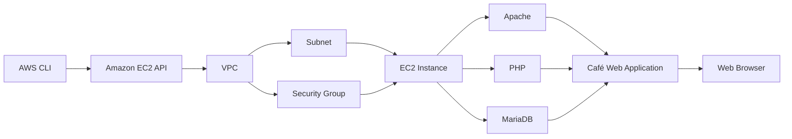
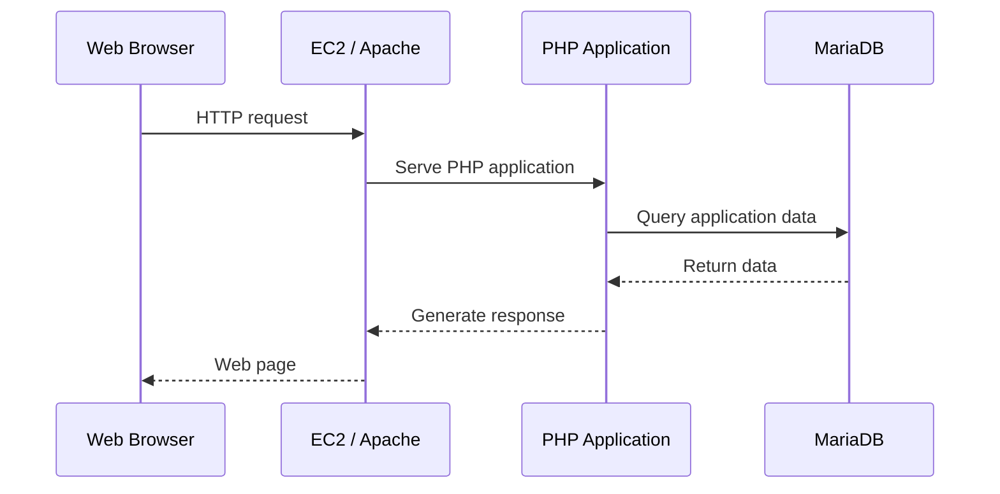
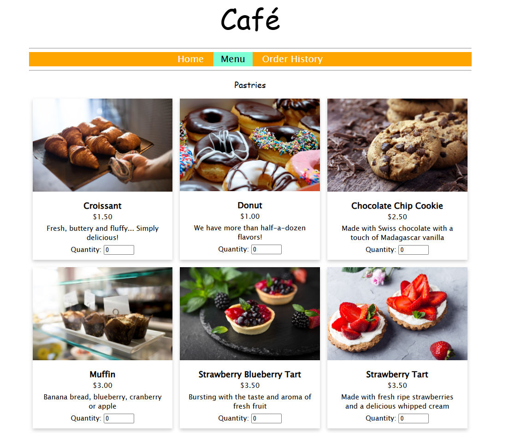
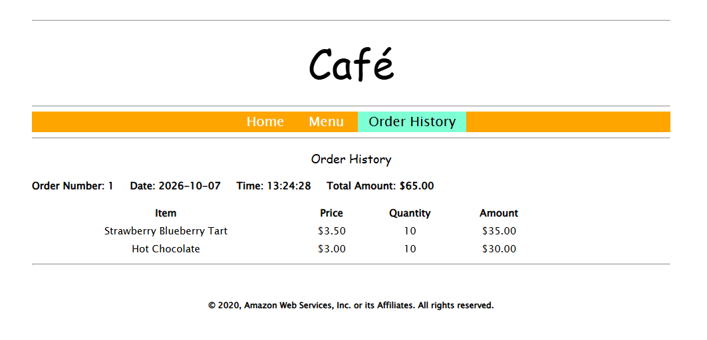

# Lab — Troubleshooting the Creation of an EC2 Instance

[English](#english) · [Português](#português)

---

# English

## Objective

Deploy a **Café Web Application** on Amazon EC2 using the AWS CLI and troubleshoot intentional infrastructure issues during the deployment.

The application uses a **LAMP stack**:

* Linux
* Apache
* MariaDB
* PHP

The main focus was to practice a structured troubleshooting process: **identify the symptom, collect evidence, determine the root cause, apply the correction, and validate the result**.

---

## Architecture



---

## Services & Technologies

| Category         | Technologies                 |
| ---------------- | ---------------------------- |
| Cloud            | AWS                          |
| Compute          | Amazon EC2                   |
| Networking       | VPC, Subnet, Security Groups |
| CLI              | AWS CLI                      |
| Operating System | Linux                        |
| Web Server       | Apache                       |
| Application      | PHP                          |
| Database         | MariaDB                      |
| Troubleshooting  | Bash, `nmap`, cloud-init     |

---

## Implementation & Troubleshooting

### 1. EC2 Deployment

The EC2 instance was provisioned through an AWS CLI deployment script containing the configuration required for the Café Web Application.

The deployment process included:

* AMI selection.
* VPC and subnet configuration.
* Security Group configuration.
* EC2 instance creation.
* LAMP stack installation.
* Application initialization.

The script intentionally contained configuration issues that had to be investigated before the application could be successfully deployed.

---

### 2. Troubleshooting the AMI / Region Configuration

The first deployment attempt failed with:

```text
InvalidAMIID.NotFound
```

The AWS CLI environment was configured for `us-west-2`, while the deployment script attempted to launch the instance using `us-east-1`.

The AMI was then checked across the relevant regions, confirming that it was available in `us-west-2`.

**Root Cause**

The script referenced the AMI from the wrong AWS Region.

**Correction**

```bash
--region us-west-2 \
```

A Bash line-continuation issue was also corrected so that the `aws ec2 run-instances` command was interpreted as a single command.

**Result**

The EC2 deployment could proceed successfully after the region configuration was corrected.

---

### 3. Troubleshooting HTTP Connectivity

After the EC2 instance was created, the application was still not accessible through the browser.

Network connectivity was investigated using:

```bash
nmap -Pn <PUBLIC-IP>
```

The scan showed that SSH was available, while the expected HTTP service was not accessible on TCP port `80`.

The Security Group configuration was then inspected and revealed that the deployment script was allowing TCP port `8080` instead of TCP port `80`.

**Root Cause**

The HTTP ingress configuration in the Security Group used the wrong port.

**Correction**

```bash
--port 80 \
```

The required resources were recreated with the corrected configuration.

**Result**

HTTP connectivity was restored and the web application became accessible.

---

## Validation

The final deployment successfully connected the infrastructure, application, and database layers:



The final environment included:

| Layer          | Result                                   |
| -------------- | ---------------------------------------- |
| EC2            | Instance successfully deployed.          |
| Web Server     | Apache running.                          |
| Application    | Café Web Application accessible.         |
| Runtime        | PHP functioning.                         |
| Database       | MariaDB integrated with the application. |
| Networking     | HTTP available on TCP 80.                |
| Security Group | Correct inbound HTTP configuration.      |

### Café Menu



### Order History



---

## Key Takeaways

This lab strengthened practical troubleshooting skills across multiple cloud layers:

* Validating **AMI availability and AWS Regions**.
* Investigating **Security Group ingress rules**.
* Using `nmap` to diagnose network connectivity.
* Troubleshooting Bash scripts and command execution.
* Connecting infrastructure configuration with application behavior.
* Using evidence to identify **root causes**.
* Validating a correction from the infrastructure layer through to the application layer.

---

# Português

## Objetivo

Realizar o deploy de uma **Café Web Application** em uma instância Amazon EC2 utilizando a AWS CLI e solucionar problemas de infraestrutura inseridos intencionalmente durante o processo.

A aplicação utiliza uma **stack LAMP**:

* Linux
* Apache
* MariaDB
* PHP

O principal objetivo foi praticar um processo estruturado de troubleshooting: **identificar o sintoma, coletar evidências, determinar a causa raiz, aplicar a correção e validar o resultado**.

---

## Arquitetura


---

## Serviços & Tecnologias

| Categoria           | Tecnologias                  |
| ------------------- | ---------------------------- |
| Cloud               | AWS                          |
| Computação          | Amazon EC2                   |
| Networking          | VPC, Subnet, Security Groups |
| CLI                 | AWS CLI                      |
| Sistema Operacional | Linux                        |
| Web Server          | Apache                       |
| Aplicação           | PHP                          |
| Banco de Dados      | MariaDB                      |
| Troubleshooting     | Bash, `nmap`, cloud-init     |

---

## Implementação & Troubleshooting

### 1. Deploy da Instância EC2

A instância EC2 foi provisionada por meio de um script de deployment executado com a AWS CLI, contendo as configurações necessárias para a Café Web Application.

O processo envolveu:

* Seleção da AMI.
* Configuração da VPC e subnet.
* Configuração do Security Group.
* Criação da instância EC2.
* Instalação da stack LAMP.
* Inicialização da aplicação.

O script continha problemas de configuração intencionais que precisaram ser investigados antes da conclusão do deploy.

---

### 2. Troubleshooting da Configuração de AMI e Região

A primeira tentativa de deployment falhou com:

```text
InvalidAMIID.NotFound
```

O ambiente da AWS CLI estava configurado para `us-west-2`, enquanto o script de deployment tentava executar a criação da instância utilizando `us-east-1`.

A AMI foi então verificada nas regiões envolvidas, confirmando que estava disponível em `us-west-2`.

**Causa Raiz**

O script estava referenciando a AMI na Região AWS incorreta.

**Correção**

```bash
--region us-west-2 \
```

Também foi corrigido um problema de continuação de linha do Bash para garantir que o comando `aws ec2 run-instances` fosse interpretado como um único comando.

**Resultado**

Após a correção da região, o processo de criação da instância EC2 pôde prosseguir normalmente.

---

### 3. Troubleshooting da Conectividade HTTP

Após a criação da instância EC2, a aplicação ainda não estava acessível pelo navegador.

A conectividade de rede foi investigada utilizando:

```bash
nmap -Pn <PUBLIC-IP>
```

O resultado mostrou que o SSH estava disponível, enquanto o serviço HTTP esperado não estava acessível pela porta TCP `80`.

A configuração do Security Group foi então analisada e revelou que o script estava permitindo a porta TCP `8080` em vez da porta TCP `80`.

**Causa Raiz**

A configuração de entrada HTTP do Security Group utilizava a porta incorreta.

**Correção**

```bash
--port 80 \
```

Os recursos necessários foram recriados utilizando a configuração corrigida.

**Resultado**

A conectividade HTTP foi restaurada e a aplicação web ficou acessível.

---

## Validação

O deployment final conectou com sucesso as camadas de infraestrutura, aplicação e banco de dados:


O ambiente final apresentou:

| Camada         | Resultado                               |
| -------------- | --------------------------------------- |
| EC2            | Instância criada com sucesso.           |
| Web Server     | Apache em execução.                     |
| Aplicação      | Café Web Application acessível.         |
| Runtime        | PHP funcionando.                        |
| Banco de Dados | MariaDB integrado à aplicação.          |
| Networking     | HTTP disponível na porta TCP 80.        |
| Security Group | Configuração de entrada HTTP corrigida. |

### Café Menu


### Histórico de Pedidos


---

## Principais Aprendizados

Este laboratório fortaleceu habilidades práticas de troubleshooting em diferentes camadas da Cloud:

* Validação de **AMI e Regiões AWS**.
* Investigação de **regras de entrada em Security Groups**.
* Utilização do `nmap` para diagnóstico de conectividade.
* Troubleshooting de scripts Bash e execução de comandos.
* Relação entre configuração de infraestrutura e comportamento da aplicação.
* Utilização de evidências para identificar a **causa raiz**.
* Validação de uma correção desde a camada de infraestrutura até a aplicação.
