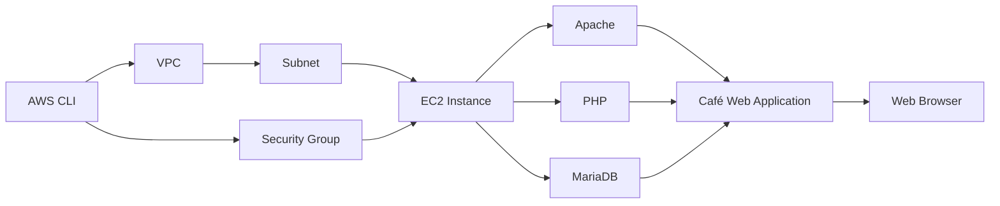

# Troubleshooting the Creation of an EC2 Instance

[English](#english) | [Português](#português)

---

# English

## Objective

The goal of this lab was to deploy a **Café Web Application** on an Amazon EC2 instance using the AWS CLI and troubleshoot intentional configuration issues during the deployment.

The application uses a **LAMP stack**:

* Linux
* Apache
* MariaDB
* PHP

The main focus was not only deploying the environment, but also understanding how to **identify, investigate, and resolve cloud infrastructure problems**.

---

## Architecture



---

## AWS Services & Technologies

| Category        | Technologies                 |
| --------------- | ---------------------------- |
| Cloud           | AWS                          |
| Compute         | Amazon EC2                   |
| Networking      | VPC, Subnet, Security Groups |
| CLI             | AWS CLI                      |
| OS              | Linux                        |
| Web Server      | Apache                       |
| Application     | PHP                          |
| Database        | MariaDB                      |
| Troubleshooting | Bash, `nmap`, cloud-init     |

---

## Troubleshooting

### 1. AMI / Region Mismatch

The initial deployment failed with:

```text
InvalidAMIID.NotFound
```

The AWS CLI was configured for `us-west-2`, while the deployment script attempted to use `us-east-1`.

The AMI was verified in both regions, confirming that the image was available in `us-west-2`.

**Root Cause:** the AMI was being referenced in the wrong AWS Region.

**Solution:**

```bash
--region us-west-2 \
```

The Bash line continuation was also corrected to ensure the command was interpreted as a single `aws ec2 run-instances` command.

---

### 2. HTTP Port Misconfiguration

After the EC2 instance was successfully created, the application was not accessible through the browser.

Network connectivity was investigated using:

```bash
nmap -Pn <PUBLIC-IP>
```

The results showed SSH available, while HTTP traffic was not exposed on the expected TCP port.

The Security Group configuration revealed that the script was allowing TCP `8080` instead of TCP `80`.

**Root Cause:** incorrect HTTP ingress rule in the Security Group.

**Solution:**

```bash
--port 80 \
```

After correcting the rule and recreating the required resources, the application became accessible.

---

## Validation

The deployment was successfully completed and the Café Web Application was accessible through the EC2 instance.

The final environment included:

* EC2 instance running the LAMP stack
* Apache serving the application
* PHP application functionality
* MariaDB database
* Correct HTTP Security Group configuration
* Successful database-backed application functionality

### Café Application


### Order History


---

## Key Takeaways

This lab strengthened practical troubleshooting skills across multiple AWS layers:

* Validating **AMI availability and Regions**
* Understanding **Security Group ingress rules**
* Using `nmap` to investigate network connectivity
* Troubleshooting Bash scripts and command execution
* Understanding the relationship between **EC2, networking, and application services**
* Using evidence to identify the **root cause** instead of relying on assumptions

---

# Português

## Objetivo

O objetivo deste laboratório foi realizar o deploy de uma **Café Web Application** em uma instância Amazon EC2 utilizando a AWS CLI e solucionar problemas de configuração inseridos intencionalmente durante o processo.

A aplicação utiliza uma arquitetura baseada em **LAMP**:

* Linux
* Apache
* MariaDB
* PHP

O foco principal não foi apenas realizar o deploy, mas desenvolver a capacidade de **identificar, investigar e solucionar problemas de infraestrutura em Cloud**.

---

## Arquitetura


---

## Serviços AWS & Tecnologias

| Categoria           | Tecnologias                  |
| ------------------- | ---------------------------- |
| Cloud               | AWS                          |
| Computação          | Amazon EC2                   |
| Networking          | VPC, Subnet, Security Groups |
| CLI                 | AWS CLI                      |
| Sistema Operacional | Linux                        |
| Web Server          | Apache                       |
| Aplicação           | PHP                          |
| Banco de Dados      | MariaDB                      |
| Troubleshooting     | Bash, `nmap`, cloud-init     |

---

## Troubleshooting

### 1. Incompatibilidade entre AMI e Região

O primeiro deploy falhou com:

```text
InvalidAMIID.NotFound
```

A AWS CLI estava configurada para `us-west-2`, enquanto o script de deployment tentava utilizar a região `us-east-1`.

A AMI foi verificada nas duas regiões, confirmando que estava disponível em `us-west-2`.

**Causa:** a AMI estava sendo utilizada na Região AWS incorreta.

**Solução:**

```bash
--region us-west-2 \
```

Também foi corrigida a continuação de linha do Bash para garantir que o comando fosse interpretado corretamente como um único comando `aws ec2 run-instances`.

---

### 2. Configuração Incorreta da Porta HTTP

Após a criação da instância EC2, a aplicação não estava acessível pelo navegador.

A conectividade de rede foi investigada utilizando:

```bash
nmap -Pn <PUBLIC-IP>
```

Os resultados mostraram o SSH disponível, enquanto o tráfego HTTP não estava exposto na porta TCP esperada.

A configuração do Security Group revelou que o script estava permitindo a porta TCP `8080` em vez da porta TCP `80`.

**Causa:** regra de entrada HTTP incorreta no Security Group.

**Solução:**

```bash
--port 80 \
```

Após a correção da regra e a recriação dos recursos necessários, a aplicação ficou acessível.

---

## Validação

O deployment foi concluído com sucesso e a Café Web Application ficou acessível através da instância EC2.

O ambiente final incluiu:

* Instância EC2 executando a stack LAMP
* Apache servindo a aplicação
* Funcionalidade da aplicação em PHP
* Banco de dados MariaDB
* Configuração correta de HTTP no Security Group
* Funcionamento da aplicação integrada ao banco de dados

### Café Application


### Histórico de Pedidos


---

## Principais Aprendizados

Este laboratório fortaleceu habilidades práticas de troubleshooting em diferentes camadas da AWS:

* Validação de **AMI e Regiões**
* Compreensão de **regras de entrada em Security Groups**
* Utilização do `nmap` para investigação de conectividade
* Troubleshooting de scripts Bash e execução de comandos
* Compreensão da relação entre **EC2, networking e serviços da aplicação**
* Utilização de evidências para identificar a **causa raiz** dos problemas
